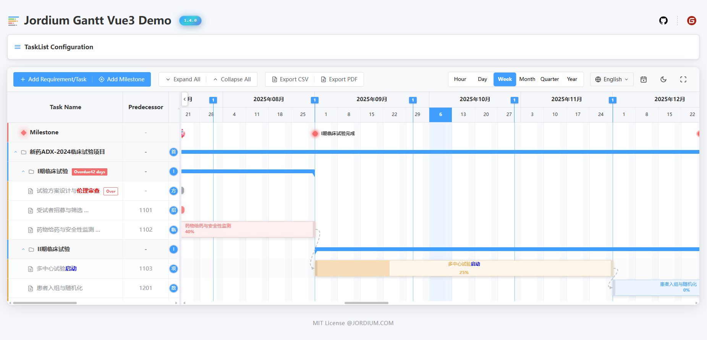
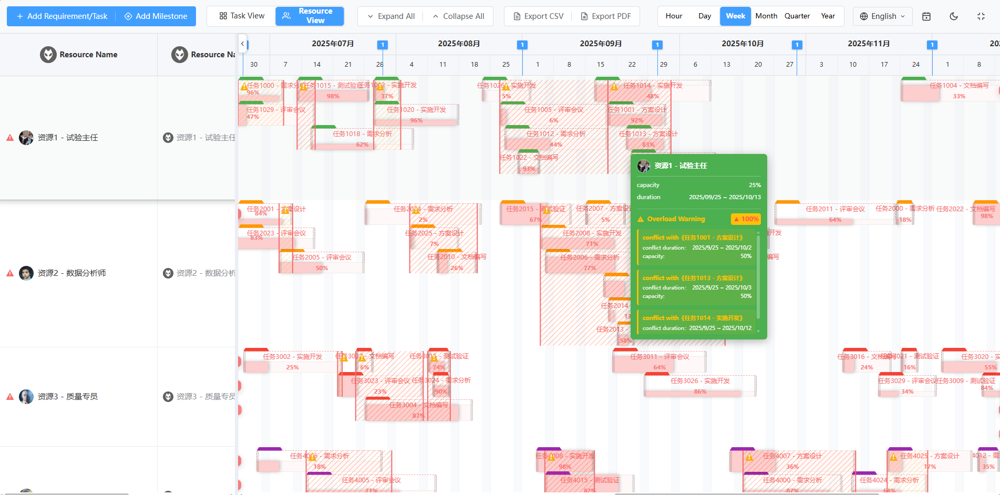
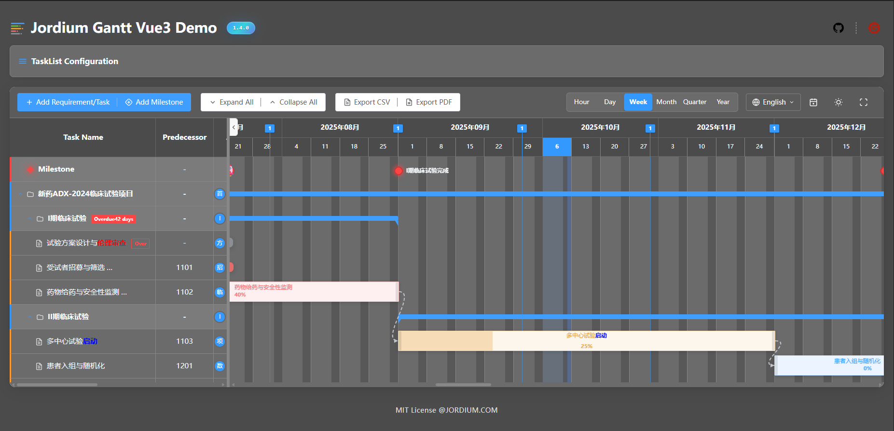
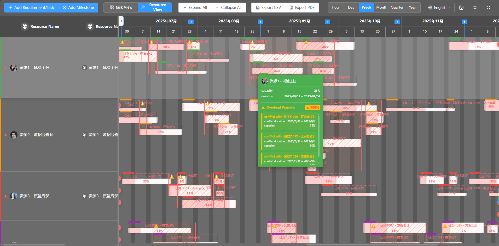

#  jordium-gantt-vue3

<p align="center">
  <a href="https://www.npmjs.com/package/jordium-gantt-vue3">
    
  </a>
  <a href="https://www.npmjs.com/package/jordium-gantt-vue3">
    
  </a>
  <a href="https://opensource.org/licenses/MIT">
    
  </a>
  <a href="https://vuejs.org/">
    =3.5.13-4FC08D?style=flat-square&logo=vue.js&logoColor=white" alt="Vue.js">
  </a>
  <a href="https://www.typescriptlang.org/">
    =5.8.3-3178C6?style=flat-square&logo=typescript&logoColor=white" alt="TypeScript">
  </a>
  <a href="https://nodejs.org/">
    =16.0.0-339933?style=flat-square&logo=node.js&logoColor=white" alt="Nodejs">
  </a>
</p>

<p align="center">
  <a href="./README.md">中文</a> | 
  <a href="./README-EN.md">English</a> | 
  <a href="./CHANGELOG.md">Release Notes</a>
</p>

<p align="center">A modern Vue 3 Gantt chart component library providing complete solutions for project management and task scheduling</p>

<!-- <p align="center">
  <a href="https://gitee.com/activity/2025opensource?ident=IOUNZP" target="_blank">
    
  </a>
</p> -->

<p align="center">
  <a href="https://jordium.gitee.io/jordium-gantt-vue3/">
    <strong>📱 Gitee Live Demo</strong>
  </a>
  &nbsp;&nbsp;|&nbsp;&nbsp;
  <a href="https://nelson820125.github.io/jordium-gantt-vue3/">
    <strong>📱 Github Live Demo</strong>
  </a>
  &nbsp;&nbsp;|&nbsp;&nbsp;
  <a href="https://github.com/nelson820125/jordium-gantt-vue3">
    <strong>📦 GitHub</strong>
  </a>
  &nbsp;&nbsp;|&nbsp;&nbsp;
  <a href="https://www.npmjs.com/package/jordium-gantt-vue3">
    <strong>📚 npm</strong>
  </a>
</p>

---

## ✨ Introduction

jordium-gantt-vue3 is a modern Gantt chart component built with Vue 3 and TypeScript, designed specifically for project management and task scheduling scenarios. It provides rich interactive features, flexible configuration options, and elegant visual effects.

### Core Features

- 📊 **Feature Complete** - Task management, milestones, dependencies, progress tracking
- 🎨 **Theme System** - Built-in light/dark themes with customizable styles
- 🖱️ **Smooth Interaction** - Drag & resize, zoom, double-click edit, context menu
- 🌍 **Internationalization** - Built-in Chinese/English with extensible language support
- ⚡ **High Performance** - Virtual scrolling, lazy loading for handling massive data
- 💎 **Type Safe** - Full TypeScript support

### Preview

#### Light Theme





#### Dark Theme





---

## 📦 Installation

Install using your preferred package manager:

```bash
# npm
npm install jordium-gantt-vue3

# yarn
yarn add jordium-gantt-vue3

# pnpm
pnpm add jordium-gantt-vue3
```

---

## 🚀 Quick Start

### Import Component

Import the `GanttChart` component and styles:

```vue
<script setup lang="ts">
import { GanttChart } from 'jordium-gantt-vue3'
import 'jordium-gantt-vue3/dist/assets/jordium-gantt-vue3.css'
</script>
```

> **Tip**: The style file only needs to be imported once in your project. It's recommended to import it in `main.ts` or the root component.

### First Example

Create your first Gantt chart:

```vue
<template>
  <div style="height: 600px;">
    <GanttChart :tasks="tasks" :milestones="milestones" />
  </div>
</template>

<script setup lang="ts">
import { ref } from 'vue'
import { GanttChart } from 'jordium-gantt-vue3'
import 'jordium-gantt-vue3/dist/assets/jordium-gantt-vue3.css'

const tasks = ref([
  {
    id: 1,
    name: 'Project Kickoff',
    startDate: '2025-01-01',
    endDate: '2025-01-10',
    progress: 100,
  },
  {
    id: 2,
    name: 'Requirements Analysis',
    startDate: '2025-01-11',
    endDate: '2025-01-20',
    progress: 80,
    predecessor: [1],
  },
  {
    id: 3,
    name: 'System Design',
    startDate: '2025-01-21',
    endDate: '2025-02-05',
    progress: 50,
    predecessor: [2],
  },
])

const milestones = ref([
  {
    id: 101,
    name: 'Project Approval',
    date: '2025-01-01',
    type: 'milestone',
  },
])
</script>
```

🎯 **[Try Live Demo on Github →](https://nelson820125.github.io/jordium-gantt-vue3/)**
<span><strong>Recommended: <a href="https://dovee.cc/a.php?anaxjgyz1ozZq2B">DOVE</a> VPN for fast and stable access.</strong></span> <span style="color:red;">(Note: Please use VPN services legally)</span>

## 🌞 NPM Package Usage Example

Please refer to the npm-demo folder in the project.
It is a standalone project that can be opened and run independently using your IDE.
Before running, make sure to install the Element Plus library and the jordium-gantt-vue3 plugin package.

```bash
# npm
npm install element-plus
npm install jordium-gantt-vue3
npm run dev
```

---

## 📖 Component Guide

### GanttChart Component

`GanttChart` is the core entry point of the library, providing complete Gantt chart functionality.

#### Basic Props

| Prop                        | Type      | Default | Description                                                               |
| --------------------------- | --------- | ------- | ------------------------------------------------------------------------- |
| `tasks`                     | `Task[]`  | `[]`    | Array of task data                                                        |
| `milestones`                | `Task[]`  | `[]`    | Array of milestone data (Note: Type is Task[], must set type='milestone') |
| `resources`  | `Resource[]` | `[]` | Array of resource data (used in resource planning view) |
| `viewMode`  | `'task' \| 'resource'` | `'task'` | View mode: 'task' for task planning view \| 'resource' for resource planning view |
| `showToolbar`               | `boolean` | `true`  | Whether to show the toolbar                                               |
| `useDefaultDrawer`          | `boolean` | `true`  | Whether to use the built-in task edit drawer (TaskDrawer)                 |
| `useDefaultMilestoneDialog` | `boolean` | `true`  | Whether to use the built-in milestone edit dialog (MilestoneDialog)       |
| `autoSortByStartDate`       | `boolean` | `false` | Whether to automatically sort tasks by start date                         |
| `allowDragAndResize`        | `boolean`                                                                             | `true`  | Whether to allow dragging and resizing tasks/milestones                   |
| `enableTaskRowMove`         | `boolean`                                                                             | `false` | Whether to allow dragging and dropping TaskRow                            |
| `enableTaskListContextMenu` | `boolean`                                                                             | `true`  | Whether to enable TaskList (TaskRow) context menu. When `true`: uses built-in menu if `task-list-context-menu` slot is not declared, uses custom menu if slot is declared; when `false`: context menu is completely disabled           |
| `enableTaskBarContextMenu`  | `boolean`                                                                             | `true`  | Whether to enable TaskBar context menu. When `true`: uses built-in menu if `task-bar-context-menu` slot is not declared, uses custom menu if slot is declared; when `false`: context menu is completely disabled                      |
| `assigneeOptions`           | `Array<{ key?: string \| number; value: string \| number; label: string }>`          | `[]`    | Assignee dropdown options in task edit drawer          |
| `locale`  | `'zh-CN' \| 'en-US'`                                                                      | `'zh-CN'` | Language setting (reactive). Component's internal language will follow changes                |
| `theme`  | `'light' \| 'dark'`                                                                       | `'light'` | Theme mode (reactive). Component's theme will follow changes                    |
| `timeScale`  | `'hour' \| 'day' \| 'week' \| 'month' \| 'quarter' \| 'year'`                             | `'week'` | Time scale (reactive). Timeline scale will follow changes                  |
| `fullscreen`  | `boolean`                                                                                 | `false` | Fullscreen state control (reactive). Component's fullscreen state will follow changes            |
| `expandAll`  | `boolean`                                                                                 | `true` | Expand/collapse all tasks (reactive). All tasks' expand state will follow changes  |
| `enableLinkAnchor`  | `boolean`                                                                                 | `true` | Whether to enable Link Anchor，Default: true  |
| `pendingTaskBackgroundColor`  | `string`                                                                                 | `'#409eff'` | Background color for pending tasks' TaskBar. Supports hex color values (e.g., `'#409eff'`). **Priority**: Higher than system default, lower than Task object's `barColor` property  |
| `delayTaskBackgroundColor`  | `string`                                                                                 | `'#f56c6c'` | Background color for overdue tasks' TaskBar. Supports hex color values (e.g., `'#f56c6c'`). **Priority**: Higher than system default, lower than Task object's `barColor` property  |
| `completeTaskBackgroundColor`  | `string`                                                                                 | `'#909399'` | Background color for completed tasks' TaskBar. Supports hex color values (e.g., `'#909399'`). **Priority**: Higher than system default, lower than Task object's `barColor` property  |
| `ongoingTaskBackgroundColor`  | `string`                                                                                 | `'#e6a23c'` | Background color for ongoing tasks' TaskBar. Supports hex color values (e.g., `'#e6a23c'`). **Priority**: Higher than system default, lower than Task object's `barColor` property  |
| `showActualTaskbar`  | `boolean`                                                                                 | `false` | Whether to display actual TaskBar (shows actual execution progress below planned TaskBar)  |
| `enableTaskbarTooltip`  | `boolean`                                                                                 | `true` | Whether to enable TaskBar hover tooltip (shows task details on mouse hover)  |
| `showConflicts`  | `boolean`                                                                                 | `true` | Whether to display resource conflict visualization layer (shows diagonal stripe background for overload zones in resource view) |
| `showTaskbarTab`  | `boolean`                                                                                 | `true` | Whether to display resource tab on TaskBar (shows resource allocation label on TaskBar in resource view) | 

#### TaskListColumn Component Props

The `TaskListColumn` component is used to define task list columns in declarative mode (`taskListColumnRenderMode="declarative"`). Similar to Element Plus's `el-table-column` component.

| Prop       | Type                           | Default  | Description                                                                                                                                      |
| ---------- | ------------------------------ | -------- | ------------------------------------------------------------------------------------------------------------------------------------------------ |
| `prop`     | `string`                       | -        | Column property name, used to access task object fields. Examples: `'name'`, `'assignee'`, `'progress'`, etc.                                    |
| `label`    | `string`                       | -        | Column header display text                                                                                                                       |
| `width`    | `number \| string`             | -        | Column width. Number represents pixels (e.g., `200`), string supports percentage (e.g., `'20%'`)                                                 |
| `align`    | `'left' \| 'center' \| 'right'` | `'left'` | Column content alignment                                                                                                                         |
| `cssClass` | `string`                       | -        | Custom CSS class name for column styling                                                                                                         |

**Usage Example**:

```vue
<GanttChart 
  :tasks="tasks" 
  task-list-column-render-mode="declarative"
>
  <TaskListColumn prop="name" label="Task Name" width="300" />
  <TaskListColumn prop="assignee" label="Assignee" width="150" align="center" />
  <TaskListColumn prop="progress" label="Progress" width="100" align="center" />
  <TaskListColumn prop="startDate" label="Start Date" width="140" />
  <TaskListColumn prop="endDate" label="End Date" width="140" />
</GanttChart>
```

> **💡 Tips**:
> - The `TaskListColumn` component itself does not render any content, it only declares column configuration
> - Must be used inside the `GanttChart` component with `task-list-column-render-mode="declarative"` set
> - Column display order is determined by the declaration order of `TaskListColumn` components
> - For detailed column content customization and slot usage, see [Slots](#slots) section

#### TaskListContextMenu Component Props

The `TaskListContextMenu` component is used to declaratively define the context menu for TaskList (TaskRow). Takes effect when `enableTaskListContextMenu` is `true`.

| Prop       | Type                   | Default     | Description                                                                                                                                                                                                                      |
| ---------- | ---------------------- | ----------- | -------------------------------------------------------------------------------------------------------------------------------------------------------------------------------------------------------------------------------- |
| `taskType` | `string \| string[]`   | `undefined` | Specifies which task types should display this context menu. When not set, follows existing logic (all tasks show menu). When set, only specified types show menu. Supports single type (e.g., `'task'`) or multiple types (e.g., `['task', 'milestone']`) |

**Usage Examples**:

```vue
<GanttChart 
  :tasks="tasks" 
  :enable-task-list-context-menu="true"
>
  <!-- Default behavior: all tasks show this context menu -->
  <TaskListContextMenu>
    <template #default="scope">
      <div class="custom-menu">
        <div class="menu-item" @click="editTask(scope.row)">Edit</div>
        <div class="menu-item" @click="deleteTask(scope.row)">Delete</div>
      </div>
    </template>
  </TaskListContextMenu>
  
  <!-- Only show for tasks with type='task' -->
  <TaskListContextMenu task-type="task">
    <template #default="scope">
      <div class="custom-menu">
        <div class="menu-item">Task Specific Menu</div>
      </div>
    </template>
  </TaskListContextMenu>
  
  <!-- Show for multiple types -->
  <TaskListContextMenu :task-type="['task', 'milestone']">
    <template #default="scope">
      <div class="custom-menu">
        <div class="menu-item">Task and Milestone Menu</div>
      </div>
    </template>
  </TaskListContextMenu>
</GanttChart>
```

> **💡 Tips**:
> - The `TaskListContextMenu` component itself does not render any content, it only declares menu configuration
> - Must be used inside the `GanttChart` component with `enable-task-list-context-menu="true"` set
> - Menu positioning and visibility are automatically managed internally, users only need to focus on menu content HTML structure
> - Menu automatically closes when clicking outside or scrolling
> - For detailed slot usage, see [Slots](#slots) section

#### TaskBarContextMenu Component Props

The `TaskBarContextMenu` component is used to declaratively define the context menu for TaskBar (timeline task bars). Takes effect when `enableTaskBarContextMenu` is `true`.

| Prop       | Type                   | Default     | Description                                                                                                                                                                                                                      |
| ---------- | ---------------------- | ----------- | -------------------------------------------------------------------------------------------------------------------------------------------------------------------------------------------------------------------------------- |
| `taskType` | `string \| string[]`   | `undefined` | Specifies which task types should display this context menu. When not set, follows existing logic (all tasks show menu). When set, only specified types show menu. Supports single type (e.g., `'task'`) or multiple types (e.g., `['task', 'milestone']`) |

**Usage Examples**:

```vue
<GanttChart 
  :tasks="tasks" 
  :enable-task-bar-context-menu="true"
>
  <!-- Default behavior: all tasks show this context menu -->
  <TaskBarContextMenu>
    <template #default="scope">
      <div class="custom-menu">
        <div class="menu-item" @click="extendTask(scope.row)">Extend Task</div>
        <div class="menu-item" @click="moveTask(scope.row)">Move Task</div>
      </div>
    </template>
  </TaskBarContextMenu>
  
  <!-- Only show for tasks with type='task' -->
  <TaskBarContextMenu task-type="task">
    <template #default="scope">
      <div class="custom-menu">
        <div class="menu-item">Task Bar Specific Menu</div>
      </div>
    </template>
  </TaskBarContextMenu>
  
  <!-- Show for multiple types -->
  <TaskBarContextMenu :task-type="['task', 'story']">
    <template #default="scope">
      <div class="custom-menu">
        <div class="menu-item">Task and Story Menu</div>
      </div>
    </template>
  </TaskBarContextMenu>
</GanttChart>
```

> **💡 Tips**:
> - The `TaskBarContextMenu` component itself does not render any content, it only declares menu configuration
> - Must be used inside the `GanttChart` component with `enable-task-bar-context-menu="true"` set
> - Menu positioning and visibility are automatically managed internally, users only need to focus on menu content HTML structure
> - Menu automatically closes when clicking outside or scrolling
> - For detailed slot usage, see [Slots](#slots) section

#### Configuration Object Props

For complete configuration object documentation, see [⚙️ Configuration & Customization](#⚙️-configuration--customization) section.

| Prop             | Type                         | Default                                                                 | Description                  |
| ---------------- | ---------------------------- | ----------------------------------------------------------------------- | ---------------------------- |
| `toolbarConfig`  | `ToolbarConfig`              | `{}`                                                                    | Toolbar configuration        |
| `taskListConfig` | `TaskListConfig`             | `undefined`                                                             | Task list configuration      |
| `resourceListConfig`  | `ResourceListConfig`         | `undefined`                                                             | Resource list configuration  |
| `taskBarConfig`  | `TaskBarConfig`              | `undefined`                                                             | Task bar style configuration |
| `localeMessages` | `Partial<Messages['zh-CN']>` | `undefined`                                                             | Custom localization messages |
| `workingHours`   | `WorkingHours`               | `{ morning: { start: 8, end: 11 }, afternoon: { start: 13, end: 17 } }` | Working hours configuration  |

#### Callback Props

| Prop                 | Type                                 | Description                                                                          |
| -------------------- | ------------------------------------ | ------------------------------------------------------------------------------------ |
| `onTodayLocate`      | `() => void`                         | Toolbar "Today" button click callback                                                |
| `onExportCsv`        | `() => boolean \| void`              | Toolbar "Export CSV" button click callback, return `false` to prevent default export |
| `onExportPdf`        | `() => void`                         | Toolbar "Export PDF" button click callback                                           |
| `onLanguageChange`   | `(lang: 'zh-CN' \| 'en-US') => void` | Language switch callback                                                             |
| `onThemeChange`      | `(isDark: boolean) => void`          | Theme switch callback                                                                |
| `onFullscreenChange` | `(isFullscreen: boolean) => void`    | Fullscreen toggle callback                                                           |
| `onExpandAll`        | `() => void`                         | Toolbar "Expand All" button click callback                                           |
| `onCollapseAll`      | `() => void`                         | Toolbar "Collapse All" button click callback                                         |

#### Component Events

For complete event documentation, see:

- **Task-related events**: See [Task Management](#task-management) section below
- **Milestone-related events**: See [Milestone Management](#milestone-management) section below

**Event List Overview:**

| Event Name               | Parameters                        | Description                            |
| ------------------------ | --------------------------------- | -------------------------------------- |
| `add-task`               | -                                 | Clicked toolbar "Add Task" button      |
| `task-click`             | `(task: Task, event: MouseEvent)` | Clicked task                           |
| `task-double-click`      | `(task: Task)`                    | Double-clicked task                    |
| `task-added`             | `{ task: Task }`                  | Triggered after task added             |
| `task-updated`           | `{ task: Task }`                  | Triggered after task updated           |
| `task-deleted`           | `{ task: Task }`                  | Triggered after task deleted           |
| `taskbar-drag-end`       | `(task: Task)`                    | Task drag ended                        |
| `taskbar-resize-end`     | `(task: Task)`                    | Task resize ended                      |
| `predecessor-added`      | `{ targetTask, newTask }`         | Added predecessor task                 |
| `successor-added`        | `{ targetTask, newTask }`         | Added successor task                   |
| `timer-started`          | `(task: Task)`                    | Task timer started                     |
| `timer-stopped`          | `(task: Task)`                    | Task timer stopped                     |
| `add-milestone`          | -                                 | Clicked toolbar "Add Milestone" button |
| `milestone-saved`        | `(milestone: Task)`               | Milestone saved                        |
| `milestone-deleted`      | `{ milestoneId: number }`         | Milestone deleted                      |
| `milestone-icon-changed` | `{ milestoneId, icon }`           | Milestone icon changed                 |
| `milestone-drag-end`     | `(milestone: Task)`               | Milestone drag ended                   |
| `task-row-moved`     | `payload: { draggedTask: Task, targetTask: Task, position: 'after' \| 'child', oldParent: Task \| null, newParent: Task \| null }` | TaskRow drag ended (optional) |
| `taskbar-resource-change`  | `payload: { task: Task, oldResourceId: string \| number, newResourceId: string \| number }` | Task moved across resources (dragging task to another resource row in resource view) |

#### Example 1: Simplest Gantt Chart

```vue
<template>
  <div style="height: 600px;">
    <GanttChart :tasks="tasks" :assignee-options="assigneeOptions" />
  </div>
</template>

<script setup lang="ts">
import { ref } from 'vue'
import { GanttChart } from 'jordium-gantt-vue3'
import 'jordium-gantt-vue3/dist/assets/jordium-gantt-vue3.css'

const tasks = ref([
  {
    id: 1,
    name: 'Task 1',
    startDate: '2025-01-01',
    endDate: '2025-01-10',
    progress: 100,
  },
])

const assigneeOptions = ref([
  { value: 'alice', label: 'Alice' },
  { value: 'bob', label: 'Bob' },
  { value: 'charlie', label: 'Charlie' },
])
</script>
```

#### Example 2: Gantt Chart with Milestones

```vue
<template>
  <div style="height: 600px;">
    <GanttChart :tasks="tasks" :milestones="milestones" :assignee-options="assigneeOptions" />
  </div>
</template>

<script setup lang="ts">
import { ref } from 'vue'
import { GanttChart } from 'jordium-gantt-vue3'
import 'jordium-gantt-vue3/dist/assets/jordium-gantt-vue3.css'

const tasks = ref([
  {
    id: 1,
    name: 'Project Kickoff',
    startDate: '2025-01-01',
    endDate: '2025-01-10',
    progress: 100,
  },
])

const milestones = ref([
  {
    id: 101,
    name: 'Project Approval',
    startDate: '2025-01-01',
    type: 'milestone',
    icon: 'diamond',
  },
])

const assigneeOptions = ref([
  { value: 'alice', label: 'Alice' },
  { value: 'bob', label: 'Bob' },
  { value: 'charlie', label: 'Charlie' },
])
</script>
```

#### Example 3: Hide Toolbar, Custom Control Buttons with Event Binding

```vue
<template>
  <div>
    <!-- Custom toolbar -->
    <div class="custom-toolbar">
      <button @click="addTask">Add Task</button>
      <button @click="addMilestone">Add Milestone</button>
    </div>

    <!-- Gantt chart component with hidden built-in toolbar -->
    <div style="height: 600px;">
      <GanttChart
        :tasks="tasks"
        :milestones="milestones"
        :show-toolbar="false"
        :assignee-options="assigneeOptions"
        @task-added="handleTaskAdded"
        @milestone-saved="handleMilestoneSaved"
      />
    </div>
  </div>
</template>

<script setup lang="ts">
import { ref } from 'vue'
import { GanttChart } from 'jordium-gantt-vue3'
import 'jordium-gantt-vue3/dist/assets/jordium-gantt-vue3.css'

const tasks = ref([])
const milestones = ref([])

const assigneeOptions = ref([
  { value: 'alice', label: 'Alice' },
  { value: 'bob', label: 'Bob' },
  { value: 'charlie', label: 'Charlie' },
])

const addTask = () => {
  const newTask = {
    id: Date.now(),
    name: 'New Task',
    startDate: new Date().toISOString().split('T')[0],
    endDate: new Date().toISOString().split('T')[0],
    progress: 0,
  }
  tasks.value.push(newTask)
}

const addMilestone = () => {
  const newMilestone = {
    id: Date.now(),
    name: 'New Milestone',
    startDate: new Date().toISOString().split('T')[0],
    type: 'milestone',
  }
  milestones.value.push(newMilestone)
}

const handleTaskAdded = e => {
  console.log('Task added:', e.task)
}

const handleMilestoneSaved = milestone => {
  console.log('Milestone saved:', milestone)
}
</script>
```

#### Example 4: External Component State Control (TimeScale, Fullscreen, Expand/Collapse, Locale, Theme)

Control component state through reactive Props binding. Component state will automatically follow Props changes.

```vue
<template>
  <div>
    <!-- External control panel -->
    <div class="control-panel">
      <button @click="propsFullscreen = !propsFullscreen">Toggle Fullscreen</button>
      <button @click="propsExpandAll = !propsExpandAll">Expand/Collapse All</button>
      <button @click="propsLocale = 'zh-CN'">中文</button>
      <button @click="propsLocale = 'en-US'">English</button>
      <button @click="propsTimeScale = 'day'">Day View</button>
      <button @click="propsTimeScale = 'week'">Week View</button>
      <button @click="propsTimeScale = 'month'">Month View</button>
      <button @click="propsTheme = 'light'">Light Theme</button>
      <button @click="propsTheme = 'dark'">Dark Theme</button>
    </div>

    <!-- Gantt chart component -->
    <div style="height: 600px;">
      <GanttChart
        :tasks="tasks"
        :milestones="milestones"
        :locale="propsLocale"
        :theme="propsTheme"
        :time-scale="propsTimeScale"
        :fullscreen="propsFullscreen"
        :expand-all="propsExpandAll"
      />
    </div>
  </div>
</template>

<script setup lang="ts">
import { ref } from 'vue'
import { GanttChart } from 'jordium-gantt-vue3'
import 'jordium-gantt-vue3/dist/assets/jordium-gantt-vue3.css'

const tasks = ref([
  { id: 1, name: 'Task 1', startDate: '2025-01-01', endDate: '2025-01-10', progress: 50 },
  { id: 2, name: 'Task 2', startDate: '2025-01-05', endDate: '2025-01-15', progress: 30 },
])
const milestones = ref([])

// Props control variables
const propsLocale = ref<'zh-CN' | 'en-US'>('zh-CN')
const propsTheme = ref<'light' | 'dark'>('light')
const propsTimeScale = ref<'hour' | 'day' | 'week' | 'month' | 'quarter' | 'year'>('week')
const propsFullscreen = ref(false)
const propsExpandAll = ref(false)
</script>
```

---

### Task Management

Tasks are the core elements of the Gantt chart. The component provides complete CRUD operation support for tasks, including adding, editing, deleting tasks, and rich interactive events.

#### Task Data Structure

| Field              | Type       | Required | Default     | Description                                                                                                                                                                         |
| ------------------ | ---------- | -------- | ----------- | ----------------------------------------------------------------------------------------------------------------------------------------------------------------------------------- |
| `id`               | `number`   | ✅       | -           | Unique task identifier                                                                                                                                                              |
| `name`             | `string`   | ✅       | -           | Task name                                                                                                                                                                           |
| `startDate`        | `string`   | -        | -           | Start date, format: 'YYYY-MM-DD' or 'YYYY-MM-DD HH:mm'                                                                                                                              |
| `endDate`          | `string`   | -        | -           | End date, format: 'YYYY-MM-DD' or 'YYYY-MM-DD HH:mm'                                                                                                                                |
| `progress`         | `number`   | -        | `0`         | Task progress, range 0-100                                                                                                                                                          |
| `predecessor`      | `number[]` | -        | -           | Array of predecessor task IDs, standard format: `[1, 2, 3]`<br/>**Compatible formats**: Also supports string `'1,2,3'` or string array `['1', '2', '3']`, component will auto-parse |
| `assignee`         | `string` \| `string[]`    | -        | -           | Task assignee, used as the value binding for the assignee dropdown menu. Supports single assignee (string) or multiple assignees (string array)                                                                                                              |
| `assigneeName`     | `string` \| `string[]`    | -        | -           | Task assignee name, automatically obtained from the label in the bound `assigneeOptions` dataset; for custom display, you can set it in the `task-added` callback event of GanttChart. Supports single name (string) or multiple names (string array) |
| `avatar`           | `string` \| `string[]`    | -        | -           | Avatar URL of task assignee. Supports single avatar (string) or multiple avatars (string array)                                                                                                                                                         |
| `estimatedHours`   | `number`   | -        | -           | Estimated hours                                                                                                                                                                     |
| `actualHours`      | `number`   | -        | -           | Actual hours                                                                                                                                                                        |
| `parentId`         | `number`   | -        | -           | Parent task ID, used for task grouping                                                                                                                                              |
| `children`         | `Task[]`   | -        | -           | Array of child tasks                                                                                                                                                                |
| `collapsed`        | `boolean`  | -        | `false`     | Whether child tasks are collapsed                                                                                                                                                   |
| `isParent`         | `boolean`  | -        | -           | Whether this is a parent task                                                                                                                                                       |
| `type`             | `string`   | -        | -           | Task type, 'milestone' for milestone, 'milestone-group' for milestone group                                                                                                         |
| `description`      | `string`   | -        | -           | Task description                                                                                                                                                                    |
| `icon`             | `string`   | -        | `'diamond'` | Task icon (for milestones), options: 'diamond', 'flag', 'star', 'rocket', etc.                                                                                                      |
| `level`            | `number`   | -        | `0`         | Task level (auto-calculated)                                                                                                                                                        |
| `isTimerRunning`   | `boolean`  | -        | `false`     | Whether timer is running                                                                                                                                                            |
| `timerStartTime`   | `number`   | -        | -           | Timer start time (timestamp)                                                                                                                                                        |
| `timerEndTime`     | `number`   | -        | -           | Timer end time (timestamp)                                                                                                                                                          |
| `timerStartDesc`   | `string`   | -        | -           | Description filled when timer starts                                                                                                                                                |
| `timerElapsedTime` | `number`   | -        | `0`         | Elapsed time (milliseconds)                                                                                                                                                         |
| `isEditable`       | `boolean`  | -        | `true`      | Whether individual task is editable (draggable, resizable), overrides global `allowDragAndResize`                                                                                   |
| `[key: string]`    | `unknown`  | -        | -           | Supports custom property extensions, can add any additional fields                                                                                                                  |

> **Custom Property Extensions**: The Task interface supports adding arbitrary custom fields, such as: `priority`, `tags`, `status`, `department`, and other business-related fields.
>
> **Predecessor Field Notes**:
>
> - **Standard format** (recommended): `predecessor: [1, 2, 3]` - number array
>   **Compatible format 1**: `predecessor: '1,2,3'` - comma-separated string
> - **Compatible format 2**: `predecessor: ['1', '2', '3']` - string array
> - Component will automatically parse all formats into number array
> - No predecessors: use empty array `[]`, empty string `''`, or don't set this field

#### Task-Related Props

| Prop                  | Type             | Default     | Description                                                                                   |
| --------------------- | ---------------- | ----------- | --------------------------------------------------------------------------------------------- |
| `tasks`               | `Task[]`         | `[]`        | Array of task data                                                                            |
| `useDefaultDrawer`    | `boolean`        | `true`      | Whether to use built-in task edit drawer (TaskDrawer)                                         |
| `taskBarConfig`       | `TaskBarConfig`  | `{}`        | Task bar style configuration, see [TaskBarConfig Configuration](#taskbarconfig-configuration) |
| `taskListConfig`      | `TaskListConfig` | `undefined` | Task list configuration, see [TaskListConfig Configuration](#tasklistconfig-configuration)    |
| `autoSortByStartDate` | `boolean`        | `false`     | Whether to automatically sort tasks by start date                                             |
| `enableTaskRowMove`        | `boolean` | `false`  | Whether to alloww dragging and dropping TaskRow  |
| `assigneeOptions`           | `Array<{ key?: string \| number; value: string \| number; label: string }>`          | `[]`    | Assignee dropdown options in task edit drawer          |
| `taskListColumnRenderMode` | `'default' \| 'declarative'` | `'default'` | Task list column render mode. `'default'`: Use TaskListColumnConfig configuration (compatibility mode, will be gradually deprecated); `'declarative'`: Use TaskListColumn component for declarative column definition (recommended). See [TaskListColumn Declarative Column Definition](#tasklistcolumn-declarative-column-definition) |
| `taskListRowClassName` | `string \| ((task: Task) => string)` | `undefined` | Custom CSS class name for task rows. Can be a string or a function that returns a string. **Note**: Row height is managed internally by the component, custom height styles will not take effect |
| `taskListRowStyle` | `CSSProperties \| ((task: Task) => CSSProperties)` | `undefined` | Custom inline styles for task rows. Can be a style object or a function that returns a style object. **Note**: Row height and width are managed internally by the component, custom width/height styles will not take effect |

**Configuration Notes**:

- **Default mode**: `useDefaultDrawer=true` (default), double-click task to auto-open built-in TaskDrawer
- **Custom editor**: `useDefaultDrawer=false` disables built-in drawer, listen to `@task-double-click` event to open custom editor
- **Read-only mode**: `useDefaultDrawer=false` and don't listen to `@task-double-click` event, user double-click task has no response

#### Task Events

> **💡 Event-Driven Architecture**: Component adopts pure event-driven design. All user operations (add, edit, delete, drag, etc.) will trigger corresponding events for easy external listening and handling.

| Event Name           | Parameters                                | When Triggered                            | Description                                                                                                                                                                                              |
| -------------------- | ----------------------------------------- | ----------------------------------------- | -------------------------------------------------------------------------------------------------------------------------------------------------------------------------------------------------------- |
| `add-task`           | -                                         | When clicking toolbar "Add Task" button   | Can be used for custom add task logic. If `useDefaultDrawer=true`, component will auto-open built-in TaskDrawer                                                                                          |
| `task-click`         | `(task: Task, event: MouseEvent) => void` | When clicking task bar                    | Triggered on single-click task                                                                                                                                                                           |
| `task-double-click`  | `(task: Task) => void`                    | When double-clicking task bar             | Double-click task **always triggers**. When `useDefaultDrawer=true`, component will additionally open built-in editor; when `false`, won't open. Event triggering is independent of property value       |
| `task-added`         | `{ task: Task }`                          | After task added                          | Triggered after adding task via built-in TaskDrawer. **Note**: Component has auto-updated `tasks` data, external only needs to listen to this event for additional processing (like calling API to save) |
| `task-updated`       | `{ task: Task }`                          | After task updated                        | Triggered after updating task via built-in TaskDrawer or drag. **Note**: Component has auto-updated `tasks` data, external only needs to listen to this event for additional processing                  |
| `task-deleted`       | `{ task: Task }`                          | After task deleted                        | Triggered after deleting task via built-in TaskDrawer. **Note**: Component has auto-updated `tasks` data, external only needs to listen to this event for additional processing                          |
| `taskbar-drag-end`   | `(task: Task) => void`                    | When task bar drag ends                   | Task position changed, startDate and endDate updated. **Note**: Component has auto-updated `tasks` data                                                                                                  |
| `taskbar-resize-end` | `(task: Task) => void`                    | When task bar resize ends                 | Task duration changed, endDate updated. **Note**: Component has auto-updated `tasks` data                                                                                                                |
| `predecessor-added`  | `{ targetTask: Task, newTask: Task }`     | After adding predecessor via context menu | `targetTask` is the task to which predecessor is added, `newTask` is the newly created predecessor task                                                                                                  |
| `successor-added`    | `{ targetTask: Task, newTask: Task }`     | After adding successor via context menu   | `targetTask` is the original task, `newTask` is the newly created successor task (its predecessor already contains targetTask.id)                                                                        |
| `timer-started`      | `(task: Task) => void`                    | When task timer starts                    | Start recording task hours                                                                                                                                                                               |
| `timer-stopped`      | `(task: Task) => void`                    | When task timer stops                     | Stop recording task hours                                                                                                                                                                                |
| `task-row-moved`     | `payload: { draggedTask: Task, targetTask: Task, position: 'after' \| 'child', oldParent: Task \| null, newParent: Task \| null }` | TaskRow drag ended (optional) | Component has automatically completed data movement and TaskList/Timeline sync via object reference mutation. Listening to this event is completely optional, only for showing messages, calling API, etc. `position`: 'after'=same level, 'child'=as child |

**Data Synchronization Notes**:

- ✅ **Component auto-updates internally**: For all task CRUD operations, component will auto-update `props.tasks` data
- ✅ **Events are for notification only**: External event listeners are mainly for: showing messages, calling backend APIs, updating other related data, etc.
- ❌ **Avoid duplicate operations**: Don't modify `tasks` data again in event handlers, otherwise it will cause duplicate updates

#### Example 1: Basic Task Operations

```vue
<template>
  <div style="height: 600px;">
    <GanttChart
      :tasks="tasks"
      :assignee-options="assigneeOptions"
      @add-task="handleAddTask"
      @task-added="handleTaskAdded"
      @task-updated="handleTaskUpdated"
      @task-deleted="handleTaskDeleted"
      @task-click="handleTaskClick"
      @taskbar-drag-end="handleTaskDragEnd"
    />
  </div>
</template>

<script setup lang="ts">
import { ref } from 'vue'
import { GanttChart } from 'jordium-gantt-vue3'
import type { Task } from 'jordium-gantt-vue3'
import 'jordium-gantt-vue3/dist/assets/jordium-gantt-vue3.css'

const tasks = ref<Task[]>([
  {
    id: 1,
    name: 'Project Planning',
    startDate: '2025-01-01',
    endDate: '2025-01-10',
    progress: 100,
    assignee: 'Alice',
    estimatedHours: 40,
  },
  {
    id: 2,
    name: 'Requirements Analysis',
    startDate: '2025-01-11',
    endDate: '2025-01-20',
    progress: 60,
    assignee: 'Bob',
    predecessor: [1], // Depends on task 1
  },
])

const assigneeOptions = ref([
  { value: 'alice', label: 'Alice' },
  { value: 'bob', label: 'Bob' },
  { value: 'charlie', label: 'Charlie' },
])

// Toolbar "Add Task" button click event
const handleAddTask = () => {
  console.log('Preparing to add task...')
  // Component will auto-open TaskDrawer (if useDefaultDrawer=true)
  // Can also execute custom logic here, like showing messages
}

// Task add event (added via built-in drawer)
const handleTaskAdded = (e: { task: Task }) => {
  console.log('Task added:', e.task)
  // Note: Component has auto-added task to tasks array
  // Only need to call backend API to save here
  // await api.createTask(e.task)
}

// Task update event (updated via built-in drawer or drag)
const handleTaskUpdated = (e: { task: Task }) => {
  console.log('Task updated:', e.task)
  // Note: Component has auto-updated task data in tasks array
  // Only need to call backend API to update here
  // await api.updateTask(e.task.id, e.task)
}

// Task delete event
const handleTaskDeleted = (e: { task: Task }) => {
  console.log('Task deleted:', e.task)
  // Note: Component has auto-removed task from tasks array
  // Only need to call backend API to delete here
  // await api.deleteTask(e.task.id)
}

// Task click event
const handleTaskClick = (task: Task) => {
  console.log('Clicked task:', task.name)
}

// Task drag end event
const handleTaskDragEnd = (task: Task) => {
  console.log('Task drag completed, new dates:', task.startDate, 'to', task.endDate)
  // Can call backend API here to save new dates
}
</script>
```

#### Example 2: Task Dependencies (Predecessors/Successors)

Tasks can configure predecessors via the `predecessor` field, and the component will automatically draw dependency lines:

```vue
<template>
  <GanttChart
    :tasks="tasks"
    :assignee-options="assigneeOptions"
    @predecessor-added="handlePredecessorAdded"
    @successor-added="handleSuccessorAdded"
  />
</template>

<script setup lang="ts">
import { ref } from 'vue'
import { GanttChart } from 'jordium-gantt-vue3'
import type { Task } from 'jordium-gantt-vue3'
import 'jordium-gantt-vue3/dist/assets/jordium-gantt-vue3.css'

const tasks = ref<Task[]>([
  {
    id: 1,
    name: 'Requirements Analysis',
    startDate: '2025-01-01',
    endDate: '2025-01-10',
    progress: 100,
    predecessor: [], // No predecessors
  },
  {
    id: 2,
    name: 'System Design',
    startDate: '2025-01-11',
    endDate: '2025-01-20',
    progress: 80,
    predecessor: [1], // Depends on task 1 (Requirements Analysis)
  },
  {
    id: 3,
    name: 'Database Design',
    startDate: '2025-01-11',
    endDate: '2025-01-18',
    progress: 90,
    predecessor: [1], // Depends on task 1
  },
  {
    id: 4,
    name: 'Frontend Development',
    startDate: '2025-01-21',
    endDate: '2025-02-10',
    progress: 60,
    predecessor: [2], // Depends on task 2 (System Design)
  },
  {
    id: 5,
    name: 'Backend Development',
    startDate: '2025-01-19',
    endDate: '2025-02-08',
    progress: 70,
    predecessor: [2, 3], // Depends on both task 2 and 3
  },
  {
    id: 6,
    name: 'Integration Testing',
    startDate: '2025-02-11',
    endDate: '2025-02-20',
    progress: 30,
    predecessor: [4, 5], // Depends on frontend and backend development completion
  },
])

const assigneeOptions = ref([
  { value: 'alice', label: 'Alice' },
  { value: 'bob', label: 'Bob' },
  { value: 'charlie', label: 'Charlie' },
])

// Triggered when adding predecessor via context menu
const handlePredecessorAdded = (event: { targetTask: Task; newTask: Task }) => {
  console.log(`Task [${event.targetTask.name}] added predecessor [${event.newTask.name}]`)
  // Component will auto-update targetTask's predecessor array (append new task ID)
  // Can call backend API here to save dependency relationship
  // await api.addTaskDependency(event.targetTask.id, event.newTask.id)
}

// Triggered when adding successor via context menu
const handleSuccessorAdded = (event: { targetTask: Task; newTask: Task }) => {
  console.log(`Task [${event.targetTask.name}] added successor [${event.newTask.name}]`)
  // Component will auto-update newTask's predecessor array (add targetTask.id)
  // Can call backend API here to save dependency relationship
  // await api.addTaskDependency(event.newTask.id, event.targetTask.id)
}
</script>
```

**Dependency Relationship Notes**:

- **`predecessor` field supports multiple formats**:
  - Standard format (recommended): `[1, 2, 3]` - number array
  - Compatible format 1: `'1,2,3'` - comma-separated string
  - Compatible format 2: `['1', '2', '3']` - string array
  - Component will automatically parse all formats
- Predecessor task: Task that must be completed first (e.g., design must be done before development)
- Successor task: Task that depends on current task (current task is a predecessor for other tasks)
- Component will automatically draw dependency lines from predecessor tasks to dependent tasks
- Can add/delete predecessor and successor tasks via built-in context menu
- When deleting tasks via built-in menu, component will automatically clean up related dependency references
- No predecessors: use empty array `[]`, empty string `''`, or don't set `predecessor` field

#### Example 3: Hide Toolbar, Use Custom Buttons to Trigger Events

Suitable for scenarios requiring complete custom control bar:

```vue
<template>
  <div>
    <!-- Custom control bar -->
    <div class="custom-toolbar">
      <button @click="triggerAddTask">Add Task</button>
      <button @click="triggerAddMilestone">Add Milestone</button>
      <!-- Other custom buttons... -->
    </div>

    <!-- Gantt chart component with hidden built-in toolbar -->
    <GanttChart
      :tasks="tasks"
      :milestones="milestones"
      :show-toolbar="false"
      :use-default-drawer="true"
      :use-default-milestone-dialog="true"
      :assignee-options="assigneeOptions"
      @add-task="handleAddTask"
      @add-milestone="handleAddMilestone"
      @task-added="handleTaskAdded"
    />
  </div>
</template>

<script setup lang="ts">
import { ref } from 'vue'
import { GanttChart } from 'jordium-gantt-vue3'
import 'jordium-gantt-vue3/dist/assets/jordium-gantt-vue3.css'

const tasks = ref([])
const milestones = ref([])

const assigneeOptions = ref([
  { value: 'alice', label: 'Alice' },
  { value: 'bob', label: 'Bob' },
  { value: 'charlie', label: 'Charlie' },
])

// Custom button triggers event (component will respond and open built-in editor)
const triggerAddTask = () => {
  // Directly trigger component's add-task event
  // Since useDefaultDrawer=true, component will auto-open TaskDrawer
}

const triggerAddMilestone = () => {
  // Directly trigger component's add-milestone event
  // Since useDefaultMilestoneDialog=true, component will auto-open MilestoneDialog
}

// Listen to event handling logic
const handleAddTask = () => {
  console.log('Preparing to add task (triggered by custom button)')
}

const handleAddMilestone = () => {
  console.log('Preparing to add milestone (triggered by custom button)')
}

const handleTaskAdded = e => {
  console.log('Task added:', e.task)
  // Call API to save...
}
</script>
```

> **💡 Flexibility Design**:
>
> - Show toolbar + default editor: Simplest out-of-the-box approach
> - Hide toolbar + custom buttons + default editor: Custom control bar style while keeping default edit functionality
> - Hide toolbar + custom buttons + custom editor: Fully customize all interaction logic

#### Example 4: Task Row Drag and Drop Sorting

Allow users to adjust task hierarchy and order by dragging TaskRow:

```vue
<template>
  <div style="height: 600px;">
    <GanttChart
      :tasks="tasks"
      :enable-task-row-move="true"
      :assignee-options="assigneeOptions"
      @task-row-moved="handleTaskRowMoved"
    />
  </div>
</template>

<script setup lang="ts">
import { ref } from 'vue'
import { GanttChart } from 'jordium-gantt-vue3'
import type { Task } from 'jordium-gantt-vue3'
import 'jordium-gantt-vue3/dist/assets/jordium-gantt-vue3.css'

const tasks = ref<Task[]>([
  {
    id: 1,
    name: 'Project Planning',
    startDate: '2025-01-01',
    endDate: '2025-01-10',
    progress: 100,
  },
  {
    id: 2,
    name: 'Requirements Analysis',
    startDate: '2025-01-11',
    endDate: '2025-01-20',
    progress: 60,
    parentId: 1,
  },
  {
    id: 3,
    name: 'System Design',
    startDate: '2025-01-21',
    endDate: '2025-01-30',
    progress: 40,
  },
])

const assigneeOptions = ref([
  { value: 'alice', label: 'Alice' },
  { value: 'bob', label: 'Bob' },
  { value: 'charlie', label: 'Charlie' },
])

// Task row drag completed event (optional)
const handleTaskRowMoved = async (payload: {
  draggedTask: Task
  targetTask: Task
  position: 'after' | 'child'
  oldParent: Task | null
  newParent: Task | null
}) => {
  const { draggedTask, targetTask, position, oldParent, newParent } = payload
  
  // Component has automatically completed task move, parentId update and TaskList/Timeline sync
  // Listening to this event is completely optional, only for:
  
  // 1. Show custom notification message
  const oldParentName = oldParent?.name || 'Root'
  const newParentName = newParent?.name || 'Root'
  const positionText = position === 'after' ? 'after target task' : 'as child of target task'
  showMessage(`Task [${draggedTask.name}] moved from [${oldParentName}] to [${newParentName}] (${positionText})`, 'success')
  
  // 2. Call backend API to save new task hierarchy
  try {
    await api.updateTaskHierarchy({
      taskId: draggedTask.id,
      targetTaskId: targetTask.id,
      position: position,
      oldParentId: oldParent?.id,
      newParentId: newParent?.id,
    })
  } catch (error) {
    console.error('Save task hierarchy failed:', error)
    showMessage('Save failed, please refresh page', 'error')
  }
  
  // 3. Trigger other business logic (like updating related data, recording operation logs, etc.)
  // ...
}
</script>
```

**Drag and Drop Sorting Notes**:

- **Enable Dragging**: Set `enable-task-row-move="true"` to enable task row dragging (default is `false`)
- **Dragging Algorithms** (automatically executed by component):
  - **Algorithm 1 (Place After)**: When target task has no children, dragged task will be placed after target task (same level), `position='after'`
  - **Algorithm 2 (As Child)**: When target task has children, dragged task will become first child of target task, `position='child'`
- **Visual Feedback**:
  - Semi-transparent following element displayed while dragging
  - Blue border hint shown when hovering over valid target tasks
  - Tasks without children show blue bottom border
  - Tasks with children show blue border on all sides
- **Auto Sync**: Component internally mutates `props.tasks` via object reference, automatically completing task move, `parentId` update, `children` array adjustment, and TaskList/Timeline synchronization
- **Event Listening (Optional)**:
  - `task-row-moved` event is completely optional, only used for showing messages, calling API to save, recording logs, etc.
  - No need to manually update `tasks.value`, component has automatically completed data synchronization
- **Event Parameters**:
  - `draggedTask`: The dragged task
  - `targetTask`: The target task
  - `position`: Drop position ('after' or 'child')
  - `oldParent`: Original parent task (null means root)
  - `newParent`: New parent task (null means root)
- **Constraints**:
  - Cannot drag onto itself
  - Cannot drag onto its own child tasks (avoid circular reference)
  - Milestones and milestone groups cannot be dragged

### Resource Management 

Resource management is used to manage human resources or equipment in a project, supporting task allocation, resource load analysis, and conflict detection in resource view. Switch to resource planning view using the `viewMode="resource"` prop.

> **Core Features**:
> - 📊 **Resource View**: Display task allocation by resource dimension
> - 🎯 **Load Analysis**: Real-time display of resource utilization and overload status
> - ⚠️ **Conflict Detection**: Automatically detect resource time conflicts (e.g., Task A:40% + Task B:40% + Task C:30% = 110% overload)
> - 🎨 **Visualization**: Diagonal stripe background marks conflict zones, resource tabs show utilization percentage
> - 🔄 **Cross-Resource Move**: Support dragging tasks to different resource rows for reallocation
>
> **View Limitations**:
> - ❌ **Task Links Disabled**: Resource view does not display predecessor/successor relationship lines between tasks, as resource view focuses on resource allocation rather than task dependencies
> - ❌ **No Actual TaskBar**: `showActualTaskbar` prop has no effect in resource view, actual execution progress bar will not be displayed

#### Resource Data Structure

| Field           | Type                | Required | Default | Description                                                                                                 |
| --------------- | ------------------- | -------- | ------- | ----------------------------------------------------------------------------------------------------------- |
| `id`            | `string \| number`  | ✅       | -       | Unique resource identifier                                                                                  |
| `name`          | `string`            | ✅       | -       | Resource name (e.g., person name, device name)                                                              |
| `type`          | `string`            | -        | -       | Resource type (e.g., 'developer', 'designer', 'device')                                                     |
| `avatar`        | `string`            | -        | -       | Resource avatar URL                                                                                         |
| `description`   | `string`            | -        | -       | Resource description                                                                                        |
| `department`    | `string`            | -        | -       | Department                                                                                                  |
| `skills`        | `string[]`          | -        | -       | Skill tags array (e.g., `['Vue', 'React', 'TypeScript']`)                                                  |
| `capacity`      | `number`            | -        | -       | Resource capacity/utilization (0-100), can represent overall load level                                     |
| `color`         | `string`            | -        | -       | Custom resource row left border color (e.g., `'#ff5733'`), uses default color scheme if not set            |
| `tasks`         | `Task[]`            | -        | `[]`    | Array of tasks assigned to this resource, **each task needs `resources` field to mark resource utilization** |
| `[key: string]` | `unknown`           | -        | -       | Support custom property extension, can add any additional fields                                            |

> **Custom Property Extension**: Resource interface supports adding any custom fields, e.g., `email`, `phone`, `location`, `workHours`, etc.
>
> **Task-Resource Association**:
>
> - Each Resource contains a `tasks` array storing tasks assigned to that resource
> - Each Task should include a `resources` field marking which resources are used and their utilization percentage
> - Resource utilization format: `task.resources = [{ id: 'resource1', capacity: 60 }, { id: 'resource2', capacity: 40 }]`
> - `capacity` range: 20-100, representing the percentage of resource used by that task
> - Conflict detection: When multiple tasks' `capacity` sum > 100% for the same resource in the same time period, a conflict warning is displayed

**Resource Data Example**:

```typescript
import type { Resource, Task } from 'jordium-gantt-vue3'

const resources: Resource[] = [
  {
    id: 'dev-001',
    name: 'Zhang San',
    type: 'developer',
    avatar: '/avatars/zhangsan.jpg',
    department: 'R&D',
    skills: ['Vue', 'TypeScript', 'Node.js'],
    capacity: 85, // Overall load level
    color: '#409eff',
    tasks: [
      {
        id: 1,
        name: 'Frontend Development',
        startDate: '2026-02-01',
        endDate: '2026-02-10',
        progress: 50,
        resources: [
          { id: 'dev-001', capacity: 60 }, // This task uses 60% of Zhang San's time
          { id: 'dev-002', capacity: 40 }  // Also uses 40% of Li Si's time
        ]
      },
      {
        id: 2,
        name: 'Code Review',
        startDate: '2026-02-05',
        endDate: '2026-02-08',
        progress: 0,
        resources: [
          { id: 'dev-001', capacity: 40 } // This task uses 40% of Zhang San's time
        ]
      }
      // Note: If two tasks overlap, Zhang San's total utilization on Feb 5-8 is 100% (60%+40%), at threshold
    ]
  },
  {
    id: 'dev-002',
    name: 'Li Si',
    type: 'developer',
    avatar: '/avatars/lisi.jpg',
    department: 'R&D',
    skills: ['React', 'TypeScript'],
    tasks: []
  }
]
```

**Resource Conflict Detection Example**:

```typescript
// Scenario: Zhang San is assigned 3 tasks in the same time period
const resource = {
  id: 'dev-001',
  name: 'Zhang San',
  tasks: [
    {
      id: 1,
      name: 'Task A',
      startDate: '2026-02-10',
      endDate: '2026-02-15',
      resources: [{ id: 'dev-001', capacity: 40 }] // Uses 40%
    },
    {
      id: 2,
      name: 'Task B',
      startDate: '2026-02-10',
      endDate: '2026-02-20',
      resources: [{ id: 'dev-001', capacity: 40 }] // Uses 40%
    },
    {
      id: 3,
      name: 'Task C',
      startDate: '2026-02-12',
      endDate: '2026-02-18',
      resources: [{ id: 'dev-001', capacity: 30 }] // Uses 30%
    }
  ]
}

// Conflict Analysis:
// - Feb 10-11: A(40%) + B(40%) = 80%, not overloaded
// - Feb 12-15: A(40%) + B(40%) + C(30%) = 110%, overloaded! Shows conflict warning
// - Feb 16-18: B(40%) + C(30%) = 70%, not overloaded
// - Feb 19-20: B(40%), not overloaded
```

#### Resource-Related Props

| Prop                  | Type                   | Default      | Description                                                                                              |
| --------------------- | ---------------------- | ------------ | -------------------------------------------------------------------------------------------------------- |
| `resources`           | `Resource[]`           | `[]`         | Array of resource data                                                                                   |
| `viewMode`            | `'task' \| 'resource'` | `'task'`     | View mode: 'task' for task planning view, 'resource' for resource planning view                         |
| `resourceListConfig`  | `ResourceListConfig`   | `undefined`  | Resource list configuration, similar to TaskListConfig, for configuring resource list columns, width etc |
| `showConflicts`       | `boolean`              | `true`       | Whether to display resource conflict visualization layer (diagonal stripe background in resource view)   |
| `showTaskbarTab`      | `boolean`              | `true`       | Whether to display resource tab on TaskBar (resource utilization label on TaskBar in resource view)     |

#### Resource Events

| Event Name                 | Parameters                                                                                   | Trigger Timing                 | Description                                                                                        |
| -------------------------- | -------------------------------------------------------------------------------------------- | ------------------------------ | -------------------------------------------------------------------------------------------------- |
| `taskbar-resource-change`  | `payload: { task: Task, oldResourceId: string \| number, newResourceId: string \| number }` | When task drag across resources | Triggered when dragging task to another resource row in resource view, component auto-updates task's `resources` field |

**Data Sync Notes**:

- ✅ **Auto Update**: Resource-related operations (like task cross-resource move) are automatically updated by the component in `props.resources` and task's `resources` field
- ✅ **Events for Notification**: External event listeners are mainly used for: showing messages, calling backend APIs, updating other related data, etc.
- ❌ **Avoid Duplicate Operations**: Do not modify data again in event handlers, as this causes duplicate updates

#### Example: Basic Resource View Usage

```vue
<template>
  <div style="height: 600px;">
    <GanttChart
      :resources="resources"
      view-mode="resource"
      :show-conflicts="true"
      :show-taskbar-tab="true"
      @taskbar-resource-change="handleTaskbarResourceChange"
    />
  </div>
</template>

<script setup lang="ts">
import { ref } from 'vue'
import { GanttChart } from 'jordium-gantt-vue3'
import type { Resource } from 'jordium-gantt-vue3'
import 'jordium-gantt-vue3/dist/assets/jordium-gantt-vue3.css'

const resources = ref<Resource[]>([
  {
    id: 'dev-001',
    name: 'Zhang San',
    type: 'developer',
    department: 'R&D',
    tasks: [
      {
        id: 1,
        name: 'Frontend Development',
        startDate: '2026-02-01',
        endDate: '2026-02-10',
        progress: 50,
        resources: [{ id: 'dev-001', capacity: 60 }]
      }
    ]
  }
])

const handleTaskbarResourceChange = (payload: any) => {
  console.log('Task resource changed:', payload)
  // Call backend API to save resource allocation change
  // api.updateTaskResource(payload.task.id, payload.newResourceId)
}
</script>
```

### Milestone Management

Milestones are used to mark important time points in a project, such as project kickoff, phase completion, product release, etc. The component provides flexible milestone editing configuration, using the built-in MilestoneDialog by default, and also supports fully custom editing behavior.

> **Note**: Milestones and tasks are independent data collections with no direct association. Milestones are managed independently through the `milestones` prop.

#### Milestone Data Structure

| Field         | Type     | Required | Default       | Description                                                                 |
| ------------- | -------- | -------- | ------------- | --------------------------------------------------------------------------- |
| `id`          | `number` | ✅       | -             | Unique milestone identifier                                                 |
| `name`        | `string` | ✅       | -             | Milestone name                                                              |
| `startDate`   | `string` | ✅       | -             | Milestone date, format: 'YYYY-MM-DD' or 'YYYY-MM-DD HH:mm'                  |
| `endDate`     | `string` | -        | -             | End date (usually not needed for milestones, auto-set to same as startDate) |
| `assignee`    | `string` | -        | -             | Assignee                                                                    |
| `type`        | `string` | ✅       | `'milestone'` | Type identifier, must be set to 'milestone'                                 |
| `icon`        | `string` | -        | `'diamond'`   | Milestone icon, options: 'diamond', 'flag', 'star', 'rocket', etc.          |
| `description` | `string` | -        | -             | Milestone description                                                       |

> **Note**: The `milestones` prop type is `Task[]`, ensure each milestone object's `type` field is set to `'milestone'`.

#### Milestone-Related Props

| Prop                        | Type      | Default | Description                                                       |
| --------------------------- | --------- | ------- | ----------------------------------------------------------------- |
| `milestones`                | `Task[]`  | `[]`    | Array of milestone data (type is Task[], ensure type='milestone') |
| `useDefaultMilestoneDialog` | `boolean` | `true`  | Whether to use built-in milestone edit dialog (MilestoneDialog)   |

**Configuration Notes**:

- **Default mode**: `useDefaultMilestoneDialog=true` (default), double-click milestone to auto-open built-in MilestoneDialog
- **Disable editor**: `useDefaultMilestoneDialog=false`, double-click milestone has no response (component doesn't open any editor)
- **Custom editor**: Can listen to `onMilestoneDoubleClick` callback or related events to implement custom editing logic

> **💡 Differences Between Milestones and Tasks**:
>
> - Milestone data is managed independently via `milestones` prop, separate from `tasks`
> - Milestone object's `type` field must be set to `'milestone'`
> - Milestones don't support child tasks, dependency relationships, and other complex structures
> - Milestones are mainly used to mark key time points

#### Milestone Callbacks (Backward Compatible)

> **⚠️ Deprecated**: Please use the new event-driven API (see "Milestone Events" section below)

#### Milestone Events

> **💡 Event-Driven Architecture**: Milestone management adopts event-driven design. Using event API is recommended over callback functions.

| Event Name               | Parameters                              | When Triggered                               | Description                                                                                                                                                                                                             |
| ------------------------ | --------------------------------------- | -------------------------------------------- | ----------------------------------------------------------------------------------------------------------------------------------------------------------------------------------------------------------------------- |
| `add-milestone`          | -                                       | When clicking toolbar "Add Milestone" button | Can be used for custom add milestone logic. If `useDefaultMilestoneDialog=true`, component will auto-open built-in MilestoneDialog                                                                                      |
| `milestone-saved`        | `(milestone: Task) => void`             | After milestone saved (add or edit)          | Triggered after saving milestone via built-in MilestoneDialog. **Note**: Component has auto-updated `milestones` data, external only needs to listen to this event for additional processing (like calling API to save) |
| `milestone-deleted`      | `{ milestoneId: number }`               | After milestone deleted                      | Triggered after deleting milestone via built-in MilestoneDialog. **Note**: Component has auto-updated `milestones` data, external only needs to listen to this event for additional processing                          |
| `milestone-icon-changed` | `{ milestoneId: number, icon: string }` | After milestone icon changed                 | Triggered after modifying icon via built-in MilestoneDialog                                                                                                                                                             |
| `milestone-drag-end`     | `(milestone: Task) => void`             | When milestone drag ends                     | Milestone date updated. **Note**: Component has auto-updated `milestones` data                                                                                                                                          |

**Data Synchronization Notes**:

- ✅ **Component auto-updates internally**: For all milestone CRUD operations, component will auto-update `props.milestones` data
- ✅ **Events are for notification only**: External event listeners are mainly for: showing messages, calling backend APIs, updating other related data, etc.
- ❌ **Avoid duplicate operations**: Don't modify `milestones` data again in event handlers, otherwise it will cause duplicate updates

#### Example 1: Using Event-Driven API (Recommended)

Using the new event API, component auto-manages data, more concise:

```vue
<template>
  <div style="height: 600px;">
    <GanttChart
      :milestones="milestones"
      @add-milestone="handleAddMilestone"
      @milestone-saved="handleMilestoneSaved"
      @milestone-deleted="handleMilestoneDeleted"
      @milestone-icon-changed="handleMilestoneIconChanged"
      @milestone-drag-end="handleMilestoneDrag"
    />
  </div>
</template>

<script setup lang="ts">
import { ref } from 'vue'
import { GanttChart } from 'jordium-gantt-vue3'
import type { Task } from 'jordium-gantt-vue3'
import 'jordium-gantt-vue3/dist/assets/jordium-gantt-vue3.css'

const milestones = ref<Task[]>([
  {
    id: 101,
    name: 'Project Kickoff',
    startDate: '2025-01-01',
    type: 'milestone',
    icon: 'diamond',
    assignee: 'Project Manager',
    description: 'Official project kickoff',
  },
  {
    id: 102,
    name: 'Requirements Review',
    startDate: '2025-01-15',
    type: 'milestone',
    icon: 'flag',
  },
])

// Toolbar "Add Milestone" button click event
const handleAddMilestone = () => {
  console.log('Preparing to add milestone...')
  // Component will auto-open MilestoneDialog (if useDefaultMilestoneDialog=true)
}

// Milestone save event (add or edit)
const handleMilestoneSaved = (milestone: Task) => {
  console.log('Milestone saved:', milestone)
  // Note: Component has auto-updated milestones array
  // Only need to call backend API to save here
  // await api.saveMilestone(milestone)
}

// Milestone delete event
const handleMilestoneDeleted = (e: { milestoneId: number }) => {
  console.log('Milestone deleted, ID:', e.milestoneId)
  // Note: Component has auto-removed from milestones array
  // Only need to call backend API to delete here
  // await api.deleteMilestone(e.milestoneId)
}

// Milestone icon change event
const handleMilestoneIconChanged = (e: { milestoneId: number; icon: string }) => {
  console.log('Milestone icon changed:', e.milestoneId, '->', e.icon)
  // Component has auto-updated icon, can call API to save here
  // await api.updateMilestoneIcon(e.milestoneId, e.icon)
}

// Milestone drag end event
const handleMilestoneDrag = (milestone: Task) => {
  console.log('Milestone drag completed, new date:', milestone.startDate)
  // Component has auto-updated date, can call API to save here
  // await api.updateMilestoneDate(milestone.id, milestone.startDate)
}
</script>
```

#### Example 2: Using Custom Milestone Edit Dialog

If you need to fully customize the milestone editing interface, you can disable the built-in dialog and use your own component:

```vue
<template>
  <div style="height: 600px;">
    <GanttChart
      :milestones="milestones"
      :use-default-milestone-dialog="false"
      @add-milestone="handleAddMilestone"
      @milestone-saved="handleMilestoneSaved"
      @milestone-deleted="handleMilestoneDeleted"
      @milestone-drag-end="handleMilestoneDrag"
    />

    <!-- Custom Milestone Edit Dialog -->
    <CustomMilestoneDialog
      v-model:visible="customDialogVisible"
      :milestone="editingMilestone"
      :is-new="isNewMilestone"
      @save="handleCustomDialogSave"
      @delete="handleCustomDialogDelete"
    />
  </div>
</template>

<script setup lang="ts">
import { ref } from 'vue'
import { GanttChart } from 'jordium-gantt-vue3'
import 'jordium-gantt-vue3/dist/assets/jordium-gantt-vue3.css'
import CustomMilestoneDialog from './CustomMilestoneDialog.vue'
import type { Task } from 'jordium-gantt-vue3'

const milestones = ref<Task[]>([
  {
    id: 101,
    name: 'Project Kickoff',
    startDate: '2025-01-01',
    type: 'milestone',
    icon: 'diamond',
    assignee: 'Project Manager',
    description: 'Official project kickoff',
  },
])

const customDialogVisible = ref(false)
const editingMilestone = ref<Task | null>(null)
const isNewMilestone = ref(false)

// Click toolbar "Add Milestone" button
const handleAddMilestone = () => {
  editingMilestone.value = null
  isNewMilestone.value = true
  customDialogVisible.value = true
}

// Open custom dialog when double-clicking milestone
// Note: Need to listen to Timeline component milestone double-click event
// or trigger edit via external button/list item
const openEditDialog = (milestone: Task) => {
  editingMilestone.value = { ...milestone }
  isNewMilestone.value = false
  customDialogVisible.value = true
}

// Custom dialog save event
const handleCustomDialogSave = (milestone: Task) => {
  if (isNewMilestone.value) {
    // Add milestone
    const newMilestone = {
      ...milestone,
      id: Date.now(), // Generate new ID
      type: 'milestone',
    }
    milestones.value.push(newMilestone)

    // Call backend API to save
    // await api.createMilestone(newMilestone)
  } else {
    // Update existing milestone
    const index = milestones.value.findIndex(m => m.id === milestone.id)
    if (index !== -1) {
      milestones.value[index] = { ...milestone }
    }

    // Call backend API to update
    // await api.updateMilestone(milestone)
  }

  customDialogVisible.value = false
}

// Custom dialog delete event
const handleCustomDialogDelete = (milestoneId: number) => {
  const index = milestones.value.findIndex(m => m.id === milestoneId)
  if (index !== -1) {
    milestones.value.splice(index, 1)
  }

  // Call backend API to delete
  // await api.deleteMilestone(milestoneId)

  customDialogVisible.value = false
}

// Following event handlers are still valid (for drag operations, etc.)
const handleMilestoneSaved = (milestone: Task) => {
  console.log('Milestone saved (via other method):', milestone)
}

const handleMilestoneDeleted = (e: { milestoneId: number }) => {
  console.log('Milestone deleted (via other method):', e.milestoneId)
}

const handleMilestoneDrag = (milestone: Task) => {
  console.log('Milestone drag completed:', milestone.startDate)
  // Call API to update date
  // await api.updateMilestoneDate(milestone.id, milestone.startDate)
}
</script>
```

**Custom Dialog Component Example** (`CustomMilestoneDialog.vue` - Using Element Plus)：

> **Note**: The following examplesUsing Element Plus UI framework. You can also use other UI frameworks (such as Ant Design Vue, Naive UI, etc.) or native HTML implementation.

```vue
<template>
  <el-dialog
    v-model="dialogVisible"
    :title="isNew ? 'Add milestone' : 'Edit Milestone'"
    width="500px"
    @close="handleClose"
  >
    <el-form :model="form" label-width="100px">
      <el-form-item label="Milestone Name">
        <el-input v-model="form.name" placeholder="Please enter milestone name" />
      </el-form-item>

      <el-form-item label="Date">
        <el-date-picker
          v-model="form.startDate"
          type="date"
          placeholder="Select date"
          value-format="YYYY-MM-DD"
        />
      </el-form-item>

      <el-form-item label="Assignee">
        <el-input v-model="form.assignee" placeholder="Please enter assignee" />
      </el-form-item>

      <el-form-item label="Icon">
        <el-select v-model="form.icon" placeholder="Select icon">
          <el-option label="Diamond" value="diamond" />
          <el-option label="Flag" value="flag" />
          <el-option label="Star" value="star" />
          <el-option label="Rocket" value="rocket" />
        </el-select>
      </el-form-item>

      <el-form-item label="Description">
        <el-input
          v-model="form.description"
          type="textarea"
          :rows="3"
          placeholder="Please enter description"
        />
      </el-form-item>
    </el-form>

    <template #footer>
      <div class="dialog-footer">
        <el-button v-if="!isNew" type="danger" @click="handleDelete"> Delete </el-button>
        <el-button @click="handleClose">Cancel</el-button>
        <el-button type="primary" @click="handleSave">Save</el-button>
      </div>
    </template>
  </el-dialog>
</template>

<script setup lang="ts">
import { ref, watch } from 'vue'
import type { Task } from 'jordium-gantt-vue3'

interface Props {
  visible: boolean
  milestone: Task | null
  isNew: boolean
}

const props = defineProps<Props>()
const emit = defineEmits<{
  'update:visible': [value: boolean]
  save: [milestone: Task]
  delete: [milestoneId: number]
}>()

const dialogVisible = ref(false)
const form = ref({
  id: 0,
  name: '',
  startDate: '',
  assignee: '',
  icon: 'diamond',
  description: '',
  type: 'milestone',
})

watch(
  () => props.visible,
  val => {
    dialogVisible.value = val
    if (val) {
      if (props.milestone) {
        // Edit mode, fill data
        form.value = { ...props.milestone }
      } else {
        // Add mode, reset form
        form.value = {
          id: 0,
          name: '',
          startDate: new Date().toISOString().split('T')[0],
          assignee: '',
          icon: 'diamond',
          description: '',
          type: 'milestone',
        }
      }
    }
  }
)

watch(dialogVisible, val => {
  emit('update:visible', val)
})

const handleClose = () => {
  dialogVisible.value = false
}

const handleSave = () => {
  if (!form.value.name || !form.value.startDate) {
    alert('Please fill required fields')
    return
  }
  emit('save', { ...form.value })
}

const handleDelete = () => {
  if (confirm('Are you sure to delete this milestone?')) {
    emit('delete', form.value.id)
  }
}
</script>
```

> **💡 Custom Dialog Notes**:
>
> - Set `use-default-milestone-dialog="false"` to disable built-in dialog
> - Listen to `@add-milestone` event to open custom dialog
> - Need to manually manage `milestones` array CRUD operations
> - Can still listen to other events (like `@milestone-drag-end`) to handle drag operations
> - Suitable for scenarios requiring complex form validation, special UI design, or additional fields

---

## ⚙️ Configuration & Customization

This section details the configuration options and extension capabilities of the GanttChart component, including Component Configuration, Theme & Internationalization, and Custom Extensions.

### Task Type Definition

Task type (`type` field) is used to distinguish different types of tasks, and the component internally executes different logic based on the type.

#### Built-in Task Types

| Type    | Description   | Default |
| ------- | ------------- | ------- |
| `story` | User Story    | -       |
| `task`  | Regular Task  | ✅      |
| `bug`   | Bug/Issue     | -       |

#### Feature Differences

Different task types have different functional characteristics in the component:

| Feature              | story | task | bug |
| -------------------- | ----- | ---- | --- |
| Can be parent task   | ✅    | ✅   | ❌  |
| Can be predecessor   | ❌    | ✅   | ❌  |
| Timer support        | ❌    | ✅   | ✅  |
| Auto parent task     | ✅    | ❌   | ❌  |
| Special delete hint  | ✅    | ❌   | ❌  |

#### Important Notes

> ⚠️ **Important**
>
> 1. Task type values are used for internal component logic, **do not modify** these enum values arbitrarily
> 2. When customizing TaskDrawer, you must maintain these three enum values: `story`, `task`, `bug`
> 3. For additional business labels, use custom property fields such as: `customType`, `category`, `label`, etc.

**Example: Using Custom Labels**

```typescript
const tasks = ref([
  {
    id: 1,
    name: 'Requirements Analysis',
    type: 'task', // Keep built-in component type
    customType: 'requirement', // Custom business type
    category: 'analysis', // Custom category
    startDate: '2025-01-01',
    endDate: '2025-01-10',
  },
])
```

### Component Configuration

#### ToolbarConfig (Toolbar Configuration)

Customize the toolbar functional buttons and time scale options.

**Type Definition:**

| Field                 | Type              | Default                                               | Description                                                                                                  |
| --------------------- | ----------------- | ----------------------------------------------------- | ------------------------------------------------------------------------------------------------------------ |
| `showAddTask`         | `boolean`         | `true`                                                | Show "Add Task" button                                                                                       |
| `showAddMilestone`    | `boolean`         | `true`                                                | Show "Add Milestone" button                                                                                  |
| `showTodayLocate`     | `boolean`         | `true`                                                | Show "Locate to Today" button                                                                                |
| `showExportCsv`       | `boolean`         | `true`                                                | Show "Export CSV" button                                                                                     |
| `showExportPdf`       | `boolean`         | `true`                                                | Show "Export PDF" button                                                                                     |
| `showLanguage`        | `boolean`         | `true`                                                | Show "Language Switch" button (Chinese/English)                                                              |
| `showTheme`           | `boolean`         | `true`                                                | Show "Theme Switch" button (Light/Dark)                                                                      |
| `showFullscreen`      | `boolean`         | `true`                                                | Show "Fullscreen" button                                                                                     |
| `showTimeScale`       | `boolean`         | `true`                                                | Show time scale button group (controls entire group visibility)                                              |
| `timeScaleDimensions` | `TimelineScale[]` | `['hour', 'day', 'week', 'month', 'quarter', 'year']` | Set time scale dimensions to display, options: `'hour'`, `'day'`, `'week'`, `'month'`, `'quarter'`, `'year'` |
| `defaultTimeScale`    | `TimelineScale`   | `'week'`                                              | Default selected time scale                                                                                  |
| `showExpandCollapse`  | `boolean`         | `true`                                                | Show "Expand All/Collapse All" button (for parent-child task tree structure)                                 |

**TimelineScale Type Description:**

```typescript
type TimelineScale = 'hour' | 'day' | 'week' | 'month' | 'quarter' | 'year'

// Can also use constant form
import { TimelineScale } from 'jordium-gantt-vue3'

TimelineScale.HOUR // 'hour' - Hour view
TimelineScale.DAY // 'day' - Day view
TimelineScale.WEEK // 'week' - Week view
TimelineScale.MONTH // 'month' - Month view
TimelineScale.QUARTER // 'quarter' - Quarter view
TimelineScale.YEAR // 'year' - Year view
```

**Example 1: Complete Configuration (Show All Features)**

```vue
<template>
  <GanttChart :tasks="tasks" :toolbar-config="toolbarConfig" />
</template>

<script setup lang="ts">
import { GanttChart } from 'jordium-gantt-vue3'
import 'jordium-gantt-vue3/dist/assets/jordium-gantt-vue3.css'
import type { ToolbarConfig } from 'jordium-gantt-vue3'

const toolbarConfig: ToolbarConfig = {
  showAddTask: true, // Show add task button
  showAddMilestone: true, // Show add milestone button
  showTodayLocate: true, // Show locate to today button
  showExportCsv: true, // Show export CSV button
  showExportPdf: true, // Show export PDF button
  showLanguage: true, // Show language switch button
  showTheme: true, // Show theme switch button
  showFullscreen: true, // Show fullscreen button
  showTimeScale: true, // Show time scale button group
  timeScaleDimensions: [
    // Show all time scale dimensions
    'hour',
    'day',
    'week',
    'month',
    'quarter',
    'year',
  ],
  defaultTimeScale: 'week', // Default week view
  showExpandCollapse: true, // Show expand/collapse button
}
</script>
```

**Example 2: Simplified Configuration (Show Common Features Only)**

```vue
<script setup lang="ts">
import type { ToolbarConfig } from 'jordium-gantt-vue3'

const toolbarConfig: ToolbarConfig = {
  showAddTask: true, // Keep add task
  showAddMilestone: true, // Keep add milestone
  showTodayLocate: true, // Keep locate today
  showExportCsv: false, // Hide export CSV
  showExportPdf: false, // Hide export PDF
  showLanguage: false, // Hide language switch (fixed to one language)
  showTheme: true, // Keep theme switch
  showFullscreen: true, // Keep fullscreen
  showTimeScale: true, // Show time scale
  timeScaleDimensions: [
    // Only show day/week/month scales
    'day',
    'week',
    'month',
  ],
  defaultTimeScale: 'week', // Default week view
  showExpandCollapse: true, // Keep expand/collapse
}
</script>
```

**Example 3: Using TimelineScale Constants**

```vue
<script setup lang="ts">
import { TimelineScale } from 'jordium-gantt-vue3'
import type { ToolbarConfig } from 'jordium-gantt-vue3'

const toolbarConfig: ToolbarConfig = {
  showTimeScale: true,
  timeScaleDimensions: [
    TimelineScale.DAY,
    TimelineScale.WEEK,
    TimelineScale.MONTH,
    TimelineScale.QUARTER,
  ],
  defaultTimeScale: TimelineScale.MONTH, // Default month view
}
</script>
```

**Example 4: Minimal Configuration (Suitable for Embedded Use)**

```vue
<script setup lang="ts">
import type { ToolbarConfig } from 'jordium-gantt-vue3'

const toolbarConfig: ToolbarConfig = {
  showAddTask: false, // Hide all edit buttons
  showAddMilestone: false,
  showTodayLocate: true, // Only keep navigation features
  showExportCsv: false,
  showExportPdf: false,
  showLanguage: false,
  showTheme: false,
  showFullscreen: false,
  showTimeScale: true, // Keep time scale switch
  timeScaleDimensions: ['week', 'month'],
  defaultTimeScale: 'month',
  showExpandCollapse: false, // Hide expand/collapse
}
</script>
```

> **💡 Configuration Recommendations**：
>
> - **Default configuration**：When not passed, all buttons are shown by default
> - **Show as needed**: Hide unnecessary feature buttons based on business requirements
> - **Time scale**：`timeScaleDimensions` controls which time dimensions to display, recommend selecting 2-4 common dimensions
> - **Responsive layout**：toolbar will automatically adapt to container width, excessive buttons will collapse into more menu

#### TaskListConfig（Task List Configuration）

Customize task list display columns, width limits, etc. Task list is located on the left side of the Gantt chart, showing detailed task information.

**Type Definition：**

| Field            | Type                     | Default           | Description                                                                                                      |
| ---------------- | ------------------------ | ----------------- | ---------------------------------------------------------------------------------------------------------------- |
| `columns`        | `TaskListColumnConfig[]` | Default 8 columns | Task list column configuration array, defines which columns to display and their properties                      |
| `showAllColumns` | `boolean`                | `true`            | Whether to show all columns. When `true`, ignores `visible` setting in `columns`                                 |
| `defaultWidth`   | `number \| string`       | `320`             | Default expanded width. Supports pixel number (like `320`) or percentage string (like `'30%'`)                   |
| `minWidth`       | `number \| string`       | `280`             | Minimum width. Supports pixel number (like `280`) or percentage string (like `'20%'`). Cannot be less than 280px |
| `maxWidth`       | `number \| string`       | `1160`            | Maximum width. Supports pixel number (like `1160`) or percentage string (like `'80%'`)                           |
| `showTaskIcon`       | `boolean`       | `true`  | Whether to show Tasks' icons                |

**TaskListColumnConfig Type Definition：**

| Field      | Type      | Required | Description                                                                                     |
| ---------- | --------- | -------- | ----------------------------------------------------------------------------------------------- |
| `key`      | `string`  | ✅       | Unique column identifier, used to access fields in Task object and for internationalization     |
| `label`    | `string`  | -        | Column display label (header text)                                                              |
| `cssClass` | `string`  | -        | Custom CSS class name                                                                           |
| `width`    | `number`  | -        | Column width (unit: pixels)                                                                     |
| `visible`  | `boolean` | -        | Whether to show this column, default `true`. This setting is invalid when `showAllColumns=true` |

**Example1：Basic Configuration (Adjust Width)**

```vue
<template>
  <GanttChart :tasks="tasks" :task-list-config="taskListConfig" />
</template>

<script setup lang="ts">
import { GanttChart } from 'jordium-gantt-vue3'
import 'jordium-gantt-vue3/dist/assets/jordium-gantt-vue3.css'
import type { TaskListConfig } from 'jordium-gantt-vue3'

const taskListConfig: TaskListConfig = {
  defaultWidth: 450, // Default width 450px (wider than default 320px)
  minWidth: 300, // Minimum width 300px
  maxWidth: 1200, // Maximum width 1200px
}
</script>
```

**Example2：Using Percentage Width**

```vue
<template>
  <GanttChart :tasks="tasks" :task-list-config="taskListConfig" />
</template>

<script setup lang="ts">
import { GanttChart } from 'jordium-gantt-vue3'
import 'jordium-gantt-vue3/dist/assets/jordium-gantt-vue3.css'
import type { TaskListConfig } from 'jordium-gantt-vue3'

const taskListConfig: TaskListConfig = {
  defaultWidth: '25%', // Default 25% of container width
  minWidth: '15%', // Minimum 15%
  maxWidth: '60%', // Maximum 60%
}
</script>
```

**Example3：Custom Display Columns (Standard Configuration)**

Based on business requirements, you can customize columns to display, column widths, and display order. Recommend defining column configuration array first, then assign to `columns` prop.

```vue
<template>
  <GanttChart :tasks="tasks" :task-list-config="taskListConfig" />
</template>

<script setup lang="ts">
import { GanttChart } from 'jordium-gantt-vue3'
import 'jordium-gantt-vue3/dist/assets/jordium-gantt-vue3.css'
import type { TaskListConfig, TaskListColumnConfig } from 'jordium-gantt-vue3'

// Define column configuration to display
const columns: TaskListColumnConfig[] = [
  { key: 'predecessor', label: 'Predecessors', visible: true },
  { key: 'assignee', label: 'Assignee', visible: true },
  { key: 'startDate', label: 'Start Date', visible: true },
  { key: 'endDate', label: 'End Date', visible: true },
  { key: 'estimatedHours', label: 'Estimated Hours', visible: true },
  { key: 'actualHours', label: 'Actual Hours', visible: true },
  { key: 'progress', label: 'Progress', visible: true },
]

const taskListConfig: TaskListConfig = {
  columns,
  defaultWidth: 450,
  minWidth: 300,
  maxWidth: 1200,
}
</script>
```

**Example4：Simplified Column Configuration**

Only show core information columns, suitable for scenarios with limited space or requiring concise display.

```vue
<script setup lang="ts">
import type { TaskListConfig, TaskListColumnConfig } from 'jordium-gantt-vue3'

// Define simplified Column Configuration
const columns: TaskListColumnConfig[] = [
  { key: 'name', label: 'Task', visible: true },
  { key: 'assignee', label: 'Assignee', width: 80, visible: true },
  { key: 'progress', label: 'Progress', width: 60, visible: true },
]

const taskListConfig: TaskListConfig = {
  columns,
  defaultWidth: 350,
  minWidth: 280,
  maxWidth: 500,
  showAllColumns: false, // Only show columns with visible=true
}
</script>
```

**Example5：Custom Business Columns**

Add business-related custom columns, ensure Task object contains corresponding fields.

```vue
<script setup lang="ts">
import type { TaskListConfig, TaskListColumnConfig } from 'jordium-gantt-vue3'

// Define configuration with custom columns
const columns: TaskListColumnConfig[] = [
  { key: 'name', label: 'Task Name', visible: true },
  { key: 'priority', label: 'Priority', width: 80, visible: true }, // Custom column
  { key: 'department', label: 'Department', width: 100, visible: true }, // Custom column
  { key: 'status', label: 'Status', width: 80, visible: true }, // Custom column
  { key: 'assignee', label: 'Assignee', visible: true },
  { key: 'startDate', label: 'Start Date', visible: true },
  { key: 'endDate', label: 'End Date', visible: true },
  { key: 'progress', label: 'Progress', visible: true },
]

const taskListConfig: TaskListConfig = {
  columns,
}
</script>
```

**Example6：Dynamic Column Configuration**

Combine `ref` and `computed` to achieve dynamic show/hide and width adjustment of columns.

```vue
<template>
  <GanttChart :tasks="tasks" :task-list-config="taskListConfig" />
</template>

<script setup lang="ts">
import { ref, computed } from 'vue'
import { GanttChart } from 'jordium-gantt-vue3'
import 'jordium-gantt-vue3/dist/assets/jordium-gantt-vue3.css'
import type { TaskListConfig, TaskListColumnConfig } from 'jordium-gantt-vue3'

// Define dynamically configurable columns
const availableColumns = ref<TaskListColumnConfig[]>([
  { key: 'predecessor', label: 'Predecessors', visible: true },
  { key: 'assignee', label: 'Assignee', visible: true },
  { key: 'startDate', label: 'Start Date', visible: true },
  { key: 'endDate', label: 'End Date', visible: true },
  { key: 'estimatedHours', label: 'Estimated Hours', visible: true },
  { key: 'actualHours', label: 'Actual Hours', visible: true },
  { key: 'progress', label: 'Progress', visible: true },
  { key: 'custom', label: 'Custom column', visible: true, width: 120 },
])

// Define width configuration
const taskListWidth = ref({
  defaultWidth: 450,
  minWidth: 300,
  maxWidth: 1200,
})

// Use computed property to dynamically generate configuration
const taskListConfig = computed<TaskListConfig>(() => ({
  columns: availableColumns.value,
  defaultWidth: taskListWidth.value.defaultWidth,
  minWidth: taskListWidth.value.minWidth,
  maxWidth: taskListWidth.value.maxWidth,
}))
</script>
```

> **💡 Configuration Notes**：
>
> - **Default behavior**：When not passed, show all 8 default columns with width of 320px
> - **Width units**：Supports pixel (`number`) and percentage (`string`, like `'30%'`) methods
> - **Percentage calculation**：Based on total width of Gantt chart container, responsive adjustment
> - **Column order**: `columns` array order determines column display order
> - **Column configuration standards**：Recommend defining `TaskListColumnConfig[]` type column array first, then assign to `columns` prop
> - **Custom column support**：Task interface supports arbitrary custom fields through `[key: string]: unknown` index signature, component will dynamically read column values through `task[column.key]`, no need to modify Task interface to add custom columns
> - **Dynamic configuration**：Combine `ref` and `computed` to achieve dynamic show/hide and width adjustment of columns
> - **Minimum width limit**: `minWidth` cannot be less than 280px, this is the minimum value to ensure basic usability

#### TaskBarConfig (Task Bar Configuration)

Controls task bar display content and interaction behavior。

**Configuration Fields：**

| Field               | Type      | Default | Description                                               |
| ------------------- | --------- | ------- | --------------------------------------------------------- |
| `showAvatar`        | `boolean` | `true`  | Whether to show avatar                                    |
| `showTitle`         | `boolean` | `true`  | Whether to show title text                                |
| `showProgress`      | `boolean` | `true`  | Whether to show progress text                             |
| `dragThreshold`     | `number`  | `5`     | Drag trigger threshold (pixels)                           |
| `resizeHandleWidth` | `number`  | `5`     | Resize handle width (pixels), max 15px                    |
| `enableDragDelay`   | `boolean` | `false` | Whether to enable drag delay (prevent accidental trigger) |
| `dragDelayTime`     | `number`  | `150`   | Drag delay time (milliseconds)                            |

> **💡 Edit Permission Control**：
>
> - **Global control**: Use `<GanttChart :allow-drag-and-resize="false" />` to disable drag/resize for all tasks
> - **Individual task control**: Set task object `isEditable: false` property to control individual task

**Example1：Complete Configuration**

```vue
<template>
  <GanttChart :tasks="tasks" :task-bar-config="taskBarConfig" />
</template>

<script setup lang="ts">
import { GanttChart } from 'jordium-gantt-vue3'
import 'jordium-gantt-vue3/dist/assets/jordium-gantt-vue3.css'
import type { TaskBarConfig } from 'jordium-gantt-vue3'

const taskBarConfig: TaskBarConfig = {
  showAvatar: true,
  showTitle: true,
  showProgress: true,
  dragThreshold: 8,
  resizeHandleWidth: 8,
  enableDragDelay: true,
  dragDelayTime: 200,
}
</script>
```

**Example2：Global Read-Only Mode**

Disable edit operations for all tasks.

```vue
<template>
  <GanttChart :tasks="tasks" :allow-drag-and-resize="false" />
</template>
```

**Example3：Individual Task Read-Only**

Only certain tasks are non-editable, other tasks are normal.

```vue
<script setup lang="ts">
import type { Task } from 'jordium-gantt-vue3'

const tasks: Task[] = [
  {
    id: 1,
    name: 'Editable Task',
    startDate: '2025-01-01',
    endDate: '2025-01-10',
    // isEditable default is true
  },
  {
    id: 2,
    name: 'Read-Only Task (Locked)',
    startDate: '2025-01-05',
    endDate: '2025-01-15',
    isEditable: false, // This task cannot be dragged/resized
  },
]
</script>
```

**Example4：Simplified Display**

Only show task bar, hide avatar, title and progress text.

```vue
<script setup lang="ts">
import type { TaskBarConfig } from 'jordium-gantt-vue3'

const taskBarConfig: TaskBarConfig = {
  showAvatar: false,
  showTitle: false,
  showProgress: false,
}
</script>
```

**Example5：Anti-Accidental Touch Configuration**

In mobile or touch screen scenarios, increase drag threshold and delay time.

```vue
<script setup lang="ts">
import { computed, ref } from 'vue'
import type { TaskBarConfig } from 'jordium-gantt-vue3'

const isTouchDevice = ref('ontouchstart' in window)

const taskBarConfig = computed<TaskBarConfig>(() => ({
  dragThreshold: isTouchDevice.value ? 10 : 5,
  resizeHandleWidth: isTouchDevice.value ? 12 : 5,
  enableDragDelay: isTouchDevice.value,
  dragDelayTime: isTouchDevice.value ? 300 : 150,
}))
</script>
```

#### Timeline Container Auto-Fill Configuration

The component has built-in intelligent timeline range calculation logic, ensuring that regardless of task data volume or task duration, the timeline always fills the container width, providing the best visual experience.

**Core Design Principles:**

1. **Base Buffer Mechanism**: Add fixed buffers based on the actual time range of tasks, varying by view type

   - Hour view：±1 day task range
   - Day view: ±30 days before/after task range
   - Week view: ±8 weeks (approx. 2 months) before/after task range
   - Month view: ±1 year before/after task range
   - Quarter view: ±1 year before/after task range
   - Year view: ±1 year before/after task range

2. **Container Width Adaptation**: After base buffering, if calculated timeline width is less than container width, automatically extend the range

   - Calculate time units (days/weeks/months/quarters/years) needed for container
   - **Symmetrically extend** on both sides of base range to ensure timeline fills container

3. **Empty Data Handling**: When no task data exists, calculate reasonable time range based on container width and time scale

   - Center on current date
   - Dynamically calculate time span to display based on container width
   - Ensure minimum display range (e.g., at least 60 days for day view, at least 20 weeks for week view)

4. **Independent Calculation on View Switch**: Each time scale switch triggers independent recalculation of optimal time range for that view
   - Avoid unreasonable ranges caused by different views sharing cache
   - Each view gets optimal display effect

**Calculation Pattern Reference Table:**

| View         | Unit Width                | Base Buffer | Empty Data Min Range | Container Auto-Fill? |
| ------------ | ------------------------- | ----------- | -------------------- | -------------------- |
| Hour View    | 30px/hour                 | ±1 day      | 3 days               | ✅                   |
| Day View     | 30px/day                  | ±30 days    | 60 days              | ✅                   |
| Week View    | 60px/week                 | ±2 months   | 20 weeks             | ✅                   |
| Month View   | 60px/month                | ±1 year     | 3 years              | ✅                   |
| Quarter View | 60px/quarter (240px/year) | ±1 year     | 5 years              | ✅                   |
| Year View    | 360px/year                | ±1 year     | 5 years              | ✅                   |

**Practical Application Scenarios:**

- **Short-term Tasks** (e.g., 1-week project):

  - Won't result in narrow timeline, automatically extends to fill container
  - Day view: 1 week (7 days × 30px = 210px) → Extends to ≥1200px (approx. 40 days)
  - Week view: 1 week (60px) → Extends to ≥1200px (approx. 20 weeks)

- **Long-term Projects** (e.g., 2-year project):

  - After adding fixed buffer, automatically adapts to container
  - Month view: 24 months + buffer → Extends to container width if needed
  - Quarter view: 8 quarters + buffer → Extends to container width if needed

- **Empty Board** (no task data):
  - Day view: Centered on today, displays at least 60 days
  - Week view: Centered on today, displays at least 20 weeks
  - Month view: Displays at least 3 years
  - Quarter/Year view: Displays at least 5 years

> **💡 Automation Advantages**:
>
> - No need to manually set `startDate` and `endDate`, component automatically calculates optimal range
> - Responsive to container width changes, timeline automatically recalculates
> - Different views independently optimized, auto-adjusts to best display effect when switching views
> - Avoids issues with timeline being too narrow or having excessive whitespace
> - Suitable for displaying at different resolutions

### Expose Methods

The GanttChart component exposes a series of methods through `defineExpose`, allowing parent components to directly call these methods via template references (`ref`) to control component behavior. This imperative control approach is suitable for scenarios requiring precise timing control.

#### Available Expose Methods

| Method | Parameters | Return Value | Description |
| --- | --- | --- | --- |
| `setLocale`  | `locale: 'zh-CN' \| 'en-US'` | `void` | Set component language |
| `currentLocale`  | - | `'zh-CN' \| 'en-US'` | Get current language setting |
| `setTheme`  | `mode: 'light' \| 'dark'` | `void` | Set theme mode |
| `currentTheme`  | - | `'light' \| 'dark'` | Get current theme mode |
| `setTimeScale`  | `scale: TimelineScale` | `void` | Set time scale (`'hour' \| 'day' \| 'week' \| 'month' \| 'quarter' \| 'year'`) |
| `zoomIn`  | - | `void` | zoom in time scale（`'year' -> 'quarter' -> 'month' -> 'week' -> 'day' -> 'hour'`） |
| `zoomOut`  | - | `void` | zoom out time scale（`'hour' -> 'day' -> 'week' -> 'month' -> 'quarter' -> 'year'`） |
| `currentScale`  | - | `TimelineScale` | Get current time scale |
| `toggleFullscreen`  | - | `void` | Toggle fullscreen state |
| `enterFullscreen`  | - | `void` | Enter fullscreen mode |
| `exitFullscreen`  | - | `void` | Exit fullscreen mode |
| `isFullscreen`  | - | `boolean` | Get current fullscreen state |
| `toggleExpandAll`  | - | `void` | Toggle expand/collapse all tasks |
| `expandAll`  | - | `void` | Expand all tasks |
| `collapseAll`  | - | `void` | Collapse all tasks |
| `isExpandAll`  | - | `boolean` | Get current expand all state |
| `scrollToToday`  | - | `void` | Scroll to today's position |
| `scrollToTask`  | `taskId: number \| string` | `void` | Scroll to specified task (task will auto-expand to visible state) |
| `scrollToDate`  | `date: string \| Date` | `void` | Scroll to specified date position (format: `'YYYY-MM-DD'` or Date object) |

#### Usage Example

**Basic Usage: Imperative Control**

```vue
<template>
  <div>
    <!-- External control buttons -->
    <div class="control-panel">
      <button @click="handleSetLocale('zh-CN')">中文</button>
      <button @click="handleSetLocale('en-US')">English</button>
      <button @click="handleSetTheme('light')">Light Theme</button>
      <button @click="handleSetTheme('dark')">Dark Theme</button>
      <button @click="handleSetTimeScale('day')">Day View</button>
      <button @click="handleSetTimeScale('week')">Week View</button>
      <button @click="handleSetTimeScale('month')">Month View</button>
      <button @click="ganttRef?.toggleFullscreen()">Toggle Fullscreen</button>
      <button @click="ganttRef?.toggleExpandAll()">Expand/Collapse All</button>
      <button @click="ganttRef?.scrollToToday()">Locate Today</button>
      <button @click="handleScrollToTask">Scroll to Task 2</button>
      <button @click="handleScrollToDate">Scroll to 2025-06-01</button>
    </div>

    <!-- Status display -->
    <div class="status-panel">
      <p>Current Language: {{ currentLang }}</p>
      <p>Current Theme: {{ currentThemeMode }}</p>
      <p>Current Scale: {{ currentTimeScale }}</p>
      <p>Fullscreen: {{ isFullscreenMode ? 'Yes' : 'No' }}</p>
      <p>Expand State: {{ isAllExpanded ? 'All Expanded' : 'Partially Collapsed' }}</p>
    </div>

    <!-- Gantt chart component -->
    <div style="height: 600px;">
      <GanttChart
        ref="ganttRef"
        :tasks="tasks"
        :milestones="milestones"
      />
    </div>
  </div>
</template>

<script setup lang="ts">
import { ref } from 'vue'
import { GanttChart } from 'jordium-gantt-vue3'
import type { TimelineScale } from 'jordium-gantt-vue3'
import 'jordium-gantt-vue3/dist/assets/jordium-gantt-vue3.css'

// Component reference
const ganttRef = ref<InstanceType<typeof GanttChart>>()

// State variables
const currentLang = ref<'zh-CN' | 'en-US'>('zh-CN')
const currentThemeMode = ref<'light' | 'dark'>('light')
const currentTimeScale = ref<TimelineScale>('week')
const isFullscreenMode = ref(false)
const isAllExpanded = ref(true)

// Task data
const tasks = ref([
  { id: 1, name: 'Task 1', startDate: '2025-01-01', endDate: '2025-01-10', progress: 50 },
  { id: 2, name: 'Task 2', startDate: '2025-01-05', endDate: '2025-01-15', progress: 30 },
])
const milestones = ref([])

// Language control
const handleSetLocale = (locale: 'zh-CN' | 'en-US') => {
  ganttRef.value?.setLocale(locale)
  currentLang.value = ganttRef.value?.currentLocale() || locale
}

// Theme control
const handleSetTheme = (mode: 'light' | 'dark') => {
  ganttRef.value?.setTheme(mode)
  currentThemeMode.value = ganttRef.value?.currentTheme() || mode
}

// Time scale control
const handleSetTimeScale = (scale: TimelineScale) => {
  ganttRef.value?.setTimeScale(scale)
  currentTimeScale.value = ganttRef.value?.currentScale() || scale
}

// Scroll to specified task
const handleScrollToTask = () => {
  ganttRef.value?.scrollToTask(2)
}

// Scroll to specified date
const handleScrollToDate = () => {
  ganttRef.value?.scrollToDate('2025-06-01')
}
</script>

<style scoped>
.control-panel {
  display: flex;
  gap: 10px;
  margin-bottom: 20px;
  flex-wrap: wrap;
}

.status-panel {
  padding: 10px;
  background-color: #f5f5f5;
  border-radius: 4px;
  margin-bottom: 20px;
}

.status-panel p {
  margin: 5px 0;
}
</style>
```

#### Best Practices

1. **Imperative vs Reactive**
   - Use **Expose Methods**: When you need precise control over timing, such as button clicks or specific event triggers
   - Use **Props Binding**: When state needs to automatically update following data source, such as syncing with URL parameters

2. **Getting State**
   - Provides paired getter methods (like `currentLocale()`, `currentTheme()`)
   - Can immediately get the latest state for verification after calling setters

3. **Error Handling**
   - Check if `ref` is mounted before calling: `ganttRef.value?.methodName()`
   - Safer to call after `onMounted` lifecycle

**Complete examples can be found in:**
- npm-demo project: `npm-demo/src/components/GanttTest.vue`
- npm-webpack-demo project: `npm-webpack-demo/src/App.vue`

---

### Theme & Internationalization

#### Theme Switching

Component has built-in light and dark themes, can switch via toolbar button, also can listen to switch events:

```vue
<template>
  <GanttChart :tasks="tasks" :on-theme-change="handleThemeChange" />
</template>

<script setup lang="ts">
const handleThemeChange = (isDark: boolean) => {
  console.log('Theme switched to:', isDark ? 'dark' : 'light')
  // Can save user preference settings to localStorage here
  localStorage.setItem('gantt-theme', isDark ? 'dark' : 'light')
}
</script>
```

#### Custom Theme Variables

Customize theme by overriding CSS variables:

```css
/* Customize light theme */
:root {
  /* Primary colors */
  --gantt-primary-color: #409eff;
  --gantt-success-color: #67c23a;
  --gantt-warning-color: #e6a23c;
  --gantt-danger-color: #f56c6c;

  /* Background colors */
  --gantt-bg-primary: #ffffff;
  --gantt-bg-secondary: #f5f7fa;
  --gantt-bg-hover: #ecf5ff;

  /* Text colors */
  --gantt-text-primary: #303133;
  --gantt-text-secondary: #606266;
  --gantt-text-placeholder: #c0c4cc;

  /* Border colors */
  --gantt-border-color: #dcdfe6;
  --gantt-border-color-light: #e4e7ed;

  /* Task bar colors */
  --gantt-task-bg: #409eff;
  --gantt-task-border: #66b1ff;
  --gantt-task-text: #ffffff;
}

/* Customize dark theme */
.dark {
  --gantt-bg-primary: #1a1a1a;
  --gantt-bg-secondary: #2c2c2c;
  --gantt-bg-hover: #3a3a3a;

  --gantt-text-primary: #e5e5e5;
  --gantt-text-secondary: #b0b0b0;

  --gantt-border-color: #3a3a3a;
  --gantt-border-color-light: #4a4a4a;

  --gantt-task-bg: #409eff;
  --gantt-task-border: #66b1ff;
  --gantt-task-text: #ffffff;
}
```

#### Language Switching

Component has built-in Chinese (zh-CN) and English (en-US), can switch via toolbar button:

```vue
<template>
  <GanttChart :tasks="tasks" :on-language-change="handleLanguageChange" />
</template>

<script setup lang="ts">
const handleLanguageChange = (lang: 'zh-CN' | 'en-US') => {
  console.log('Language switched to:', lang)
  // Can save user preference settings to localStorage here
  localStorage.setItem('gantt-language', lang)
}
</script>
```

#### Custom Translations

Pass custom multilingual text via the `localeMessages` prop, which will be automatically merged into the default translations:

```vue
<template>
  <GanttChart :tasks="tasks" :locale-messages="customMessages" />
</template>

<script setup lang="ts">
const customMessages = {
  "zh-CN": {
    // Task list related
    taskName: 'Task Name (Custom)',
    startDate: 'Start Date',
    endDate: 'End Date',
    duration: 'Duration',
    progress: 'Completion',
    predecessor: 'Predecessors',
    assignee: 'Assignee',
    estimatedHours: 'Estimated Hours',
    actualHours: 'Actual Hours',

    // Custom fields (supports nested structure)
    department: 'Department',
    status: 'Status',
    gantt: {
      planEndDate: 'Plan End Date',
      planStartDate: 'Plan Start Date'
    }
  },
  "en-US": {
    department: 'Department',
    status: 'Status',
    gantt: {
      planEndDate: 'Plan End Date',
      planStartDate: 'Plan Start Date'
    }
  }
}
</script>
```

> **💡 Tip**:
>
> - `localeMessages` uses a **deep merge** strategy, only pass fields that need to be overridden or added
> - Supports nested object structures, such as `gantt.planEndDate`
> - For complete built-in translation keys, please refer to `useI18n.ts` in the component source code

##### Using Translations in Custom Slots

The component exports the `useI18n` composable, which can be used in custom slots to access translation text. It supports two access methods:

**Method 1: Reactive Access (`t.field`)**

Access translation text directly through a reactive object, with concise syntax, suitable for use in templates:

```vue
<script setup>
import { GanttChart, TaskListColumn, useI18n } from 'jordium-gantt-vue3'

const { t } = useI18n()

const customMessages = {
  'zh-CN': {
    department: 'Department'
  }
}
</script>

<template>
  <GanttChart :tasks="tasks" :locale-messages="customMessages" />
  
  <!-- Reactive access: directly through the t object -->
  <TaskListColumn prop="startDate" label="Start Date" width="250">
    <template #header>
      <strong style="color: #1890ff;">{{ t.department }}</strong>
    </template>
  </TaskListColumn>
</template>
```

**Method 2: Function Access (`getTranslation()`)**

Supports nested keys and default values, suitable for accessing deep structures or dynamic keys:

```vue
<script setup>
import { GanttChart, TaskListColumn, useI18n } from 'jordium-gantt-vue3'

const { getTranslation } = useI18n()

const customMessages = {
  'en-US': {
    gantt: {
      planEndDate: 'Plan End Date'
    }
  }
}
</script>

<template>
  <GanttChart :tasks="tasks" :locale-messages="customMessages" />
  
  <!-- Function access: supports nested keys and default values -->
  <TaskListColumn prop="endDate" :label="getTranslation('gantt.planEndDate')" width="250" />
</template>
```

**Complete Example (with Language Switching):**

```vue
<script setup>
import { ref } from 'vue'
import { GanttChart, TaskListColumn, useI18n } from 'jordium-gantt-vue3'

// Custom multilingual configuration
const customMessages = {
  'zh-CN': {
    department: '部门',
    gantt: {
      planEndDate: '计划结束时间'
    }
  },
  'en-US': {
    department: 'Department',
    gantt: {
      planEndDate: 'Plan End Date'
    }
  }
}

// Use useI18n to access translations
const { t, getTranslation, locale, setLocale } = useI18n()
const tasks = ref([...])

// Language switching
const switchLanguage = () => {
  setLocale(locale.value === 'zh-CN' ? 'en-US' : 'zh-CN')
}
</script>

<template>
  <button @click="switchLanguage">Switch Language</button>
  
  <GanttChart :tasks="tasks" :locale-messages="customMessages" />
  
  <!-- Reactive access: directly through the t object -->
  <TaskListColumn prop="startDate" label="Start Date" width="250">
    <template #header>
      <strong style="color: #1890ff;">{{ t.department }}</strong>
    </template>
  </TaskListColumn>
  
  <!-- Function access: supports nested keys and default values -->
  <TaskListColumn prop="endDate" :label="getTranslation('gantt.planEndDate')" width="250" />
</template>
```

**`useI18n` API Reference:**

| Export | Type | Description |
|--------|------|-------------|
| `t` | `Ref<object>` | Reactive translation object, access via `t.key` or `t.nested.key` |
| `getTranslation(key, defaultValue?)` | `Function` | Function-based access to translation text<br>• `key`: Translation key, supports nested paths (e.g., `'gantt.planEndDate'`)<br>• `defaultValue`: Optional, default value returned when translation is not found<br>• Returns: Translation text, default value, or the key itself |
| `formatTranslation(key, params)` | `Function` | Format translation text with parameters<br>• `key`: Translation key<br>• `params`: Parameter object, e.g., `{ name: 'Task1' }`<br>• Returns: Text with placeholders replaced (e.g., `'Task {name}'` → `'Task Task1'`) |
| `locale` | `Ref<string>` | Current language (`'zh-CN'` or `'en-US'`) |
| `setLocale(locale)` | `Function` | Switch language, automatically updates all components using `useI18n` |
| `formatYearMonth(year, month)` | `Function` | Format year-month display<br>• Chinese: `formatYearMonth(2024, 3)` → `'2024年03月'`<br>• English: `formatYearMonth(2024, 3)` → `'2024/03'` |
| `formatMonth(month)` | `Function` | Format month display<br>• Chinese: `formatMonth(3)` → `'3月'`<br>• English: `formatMonth(3)` → `'03'` |

**Usage Examples:**

```vue
<script setup>
import { useI18n } from 'jordium-gantt-vue3'

const { t, getTranslation, formatTranslation, formatYearMonth, formatMonth } = useI18n()

// 1. Basic access
const text1 = t.taskName  // 'Task Name'
const text2 = getTranslation('gantt.planEndDate', 'Plan End')  // 'Plan End Date' or default value

// 2. Translation with parameters
const message = formatTranslation('taskNotFound', { id: '123' })  // 'Task not found for update, ID: 123'

// 3. Date formatting
const yearMonth = formatYearMonth(2024, 3)  // '2024年03月' (zh-CN) or '2024/03' (en-US)
const month = formatMonth(3)  // '3月' (zh-CN) or '03' (en-US)
</script>
```

> **💡 Usage Tips**:
>
> - **Reactive access** (`t.key`): Concise syntax, suitable for direct use in templates
> - **Function access** (`getTranslation('nested.key', 'default')`): Supports nested keys and default values, suitable for accessing deep structures
> - Pass custom translations via the `localeMessages` prop, then access via `useI18n` to translate
> - Language switching is implemented via `setLocale()`, all components will automatically respond to updates

### Custom Extensions

#### Slots (Slots)

Component provides slots support, allowing custom task content rendering。

##### `custom-task-content` Slots

Used to customize task display content in task list (TaskRow) and timeline (TaskBar).

**Slot Parameters：**

| Parameter | Type                         | Source | Description                   |
| --------- | ---------------------------- | ------ | ----------------------------- |
| `type`    | `'task-row'` \| `'task-bar'` | Common | Slot call position identifier |
| `task`    | `Task`                       | Common | Current task object           |

**TaskRow specific parameters (when `type === 'task-row'`):**

| Parameter        | Type                             | Description               |
| ---------------- | -------------------------------- | ------------------------- |
| `isRowContent`   | `boolean`                        | Identified as row content |
| `level`          | `number`                         | Task level                |
| `indent`         | `string`                         | Indent style              |
| `isHovered`      | `boolean`                        | Whether hovering          |
| `hoveredTaskId`  | `number \| null`                 | Current hovering task ID  |
| `isParent`       | `boolean`                        | Whether parent task       |
| `hasChildren`    | `boolean`                        | Whether has child tasks   |
| `collapsed`      | `boolean`                        | Whether collapsed         |
| `formattedTimer` | `string`                         | Formatted timer text      |
| `timerRunning`   | `boolean`                        | Whether timer is running  |
| `timerElapsed`   | `number`                         | Elapsed time              |
| `isOvertime`     | `number \| boolean \| undefined` | Whether overtime          |
| `overdueDays`    | `number`                         | Overdue days              |
| `overtimeText`   | `string`                         | Overtime text             |
| `overdueText`    | `string`                         | Overdue text              |
| `daysText`       | `string`                         | Days text                 |
| `progressClass`  | `string`                         | Progress CSS class name   |

**TaskBar specific parameters (when `type === 'task-bar'`):**

| Parameter          | Type            | Description                                                                          |
| ------------------ | --------------- | ------------------------------------------------------------------------------------ |
| `status`           | `object`        | TaskStatus object, contains `type`, `color`, `bgColor`, `borderColor`                |
| `statusType`       | `string`        | StatusType：`'completed'`, `'delayed'`, `'in-progress'`, `'not-started'`, `'parent'` |
| `isParent`         | `boolean`       | Whether parent task                                                                  |
| `progress`         | `number`        | TaskProgress（0-100）                                                                |
| `currentTimeScale` | `TimelineScale` | Current time scale                                                                   |
| `rowHeight`        | `number`        | Row height (pixels)                                                                  |
| `dayWidth`         | `number`        | Width per day (pixels)                                                               |

**Usage Example：**

```vue
<template>
  <GanttChart :tasks="tasks">
    <template #custom-task-content="slotProps">
      <!-- Render different content based on type -->
      <CustomTaskContent :task="slotProps.task" :type="slotProps.type" :status="slotProps.status" />
    </template>
  </GanttChart>
</template>

<script setup lang="ts">
import { ref } from 'vue'
import { GanttChart } from 'jordium-gantt-vue3'
import 'jordium-gantt-vue3/dist/assets/jordium-gantt-vue3.css'
import type { Task } from 'jordium-gantt-vue3'
import CustomTaskContent from './CustomTaskContent.vue'

const tasks = ref<Task[]>([
  {
    id: 1,
    name: '<strong>Important Task</strong>',
    startDate: '2025-01-01',
    endDate: '2025-01-10',
    progress: 50,
  },
])
</script>
```

**Custom Content Component Example：**

```vue
<!-- CustomTaskContent.vue -->
<script setup lang="ts">
import type { Task } from 'jordium-gantt-vue3'

interface Props {
  task: Task
  type: 'task-row' | 'task-bar'
  status?: {
    type: string
    color: string
    bgColor: string
    borderColor: string
  }
}

const props = defineProps<Props>()
</script>

<template>
  <div class="custom-task-content">
    <!-- Rendering in TaskRow -->
    <div v-if="type === 'task-row'" class="task-row-content">
      <span v-html="task.name" />
    </div>

    <!-- Rendering in TaskBar -->
    <div v-else-if="type === 'task-bar'" class="task-bar-content">
      <div class="task-icon" :style="{ color: status?.color }">📌</div>
      <span class="task-title" v-html="task.name" />
    </div>
  </div>
</template>

<style scoped>
.custom-task-content {
  width: 100%;
  height: 100%;
}

.task-row-content {
  padding: 0 4px;
  overflow: hidden;
  text-overflow: ellipsis;
  white-space: nowrap;
}

.task-bar-content {
  display: flex;
  align-items: center;
  gap: 4px;
  padding: 0 8px;
  overflow: hidden;
}

.task-icon {
  flex-shrink: 0;
  font-size: 14px;
}

.task-title {
  flex: 1;
  overflow: hidden;
  text-overflow: ellipsis;
  white-space: nowrap;
}
</style>
```

> **💡 Usage Scenarios**：
>
> - Support HTML formatted task names
> - Add custom icons, tags or badges
> - Display different styles based on task status
> - Integrate third-party rich text rendering
> - Display additional business information

> **⚠️ Notes**：
>
> - Slot content will be rendered in both TaskRow and TaskBar
> - Need to distinguish rendering position based on `type` parameter
> - TaskRow and TaskBar have different available space, need to adapt layout
> - Avoid using overly complex components in slot content, may affect performance

##### TaskListContextMenu Slots

Used to customize the context menu content for TaskRow (task list row).

**Menu Display Logic:**
- When `enableTaskListContextMenu=true` and TaskListContextMenu component is **not declared** → Uses **built-in** context menu
- When `enableTaskListContextMenu=true` and TaskListContextMenu component is **declared** → Uses **custom** context menu
- When `enableTaskListContextMenu=false` → Context menu is **completely disabled** (regardless of component declaration)

**Slot List:**

| Slot Name | Parameters                        | Description                                                                                           |
| --------- | --------------------------------- | ----------------------------------------------------------------------------------------------------- |
| `default` | `scope: { row: Task, $index: number }`   | Custom Task List Context Menu content. Access current task object via `scope.row`, access task index via `scope.$index`.  |

**Usage Example:**

```vue
<template>
  <GanttChart 
    :tasks="tasks"
    :enable-task-list-context-menu="true"
  >
    <TaskListContextMenu>
      <template #default="scope">
        <div class="custom-menu">
          <div class="menu-item" @click="handleEdit(task); onClose()">
            ✏️ Edit Task
          </div>
          <div class="menu-item" @click="handleDelete(task); onClose()">
            🗑️ Delete Task
          </div>
          <div class="menu-divider"></div>
          <div class="menu-item" @click="handleDuplicate(task); onClose()">
            📄 Duplicate Task
          </div>
        </div>
      </template>
    </TaskListContextMenu>
  </GanttChart>
</template>

<script setup lang="ts">
import { ref } from 'vue'
import { GanttChart, TaskListContextMenu } from 'jordium-gantt-vue3'
import 'jordium-gantt-vue3/dist/assets/jordium-gantt-vue3.css'
import type { Task } from 'jordium-gantt-vue3'

const tasks = ref<Task[]>([])

const handleEdit = (task: Task) => {
  console.log('Edit task:', task)
}

const handleDelete = (task: Task) => {
  console.log('Delete task:', task)
}

const handleDuplicate = (task: Task) => {
  console.log('Duplicate task:', task)
}
</script>

<style scoped>
.custom-context-menu {
  position: fixed;
  background: white;
  border: 1px solid #e0e0e0;
  border-radius: 4px;
  box-shadow: 0 2px 8px rgba(0, 0, 0, 0.15);
  z-index: 9999;
  min-width: 120px;
}

.menu-item {
  padding: 8px 16px;
  cursor: pointer;
  transition: background-color 0.2s;
}

.menu-item:hover {
  background-color: #f5f5f5;
}

.menu-divider {
  height: 1px;
  background-color: #e0e0e0;
  margin: 4px 0;
}
</style>
```

##### TaskBarContextMenu Slots

Used to customize the context menu content for TaskBar (timeline task bar).

**Menu Display Logic:**
- When `enableTaskBarContextMenu=true` and TaskBarContextMenu component is **not declared** → Uses **built-in** context menu
- When `enableTaskBarContextMenu=true` and TaskBarContextMenu component is **declared** → Uses **custom** context menu
- When `enableTaskBarContextMenu=false` → Context menu is **completely disabled** (regardless of component declaration)

**Slot List:**

| Slot Name | Parameters                        | Description                                                                                           |
| --------- | --------------------------------- | ----------------------------------------------------------------------------------------------------- |
| `default` | `scope: { row: Task, $index: number }`   | Custom Task Bar Context Menu content. Access current task object via `scope.row`, access task index via `scope.$index`.  |

**Usage Example:**

```vue
<template>
  <GanttChart 
    :tasks="tasks"
    :enable-task-bar-context-menu="true"
  >
    <TaskBarContextMenu>
      <template #default="scope">
        <div class="custom-context-menu">
          <div class="menu-item" @click="handleViewDetails(scope.row)">
            👁️ View Details
          </div>
          <div class="menu-item" @click="handleAdjustTime(scope.row)">
            ⏰ Adjust Time
          </div>
          <div class="menu-divider"></div>
          <div class="menu-item" @click="handleSetDependency(scope.row)">
            🔗 Set Dependency
          </div>
        </div>
      </template>
    </TaskBarContextMenu>
  </GanttChart>
</template>

<script setup lang="ts">
import { ref } from 'vue'
import { GanttChart, TaskBarContextMenu } from 'jordium-gantt-vue3'
import 'jordium-gantt-vue3/dist/assets/jordium-gantt-vue3.css'
import type { Task } from 'jordium-gantt-vue3'

const tasks = ref<Task[]>([])

const handleViewDetails = (task: Task) => {
  console.log('View details:', task)
}

const handleAdjustTime = (task: Task) => {
  console.log('Adjust time:', task)
}

const handleSetDependency = (task: Task) => {
  console.log('Set dependency:', task)
}
</script>

<style scoped>
.custom-context-menu {
  position: fixed;
  background: white;
  border: 1px solid #e0e0e0;
  border-radius: 4px;
  box-shadow: 0 2px 8px rgba(0, 0, 0, 0.15);
  z-index: 9999;
  min-width: 120px;
}

.menu-item {
  padding: 8px 16px;
  cursor: pointer;
  transition: background-color 0.2s;
}

.menu-item:hover {
  background-color: #f5f5f5;
}

.menu-divider {
  height: 1px;
  background-color: #e0e0e0;
  margin: 4px 0;
}
</style>
```

> **💡 Usage Scenarios**：
>
> - Customize context menu styles and layouts
> - Add business-specific operations
> - Dynamically show menu items based on task status
> - Add permission control logic
> - Integrate third-party UI component library menus

> **⚠️ Notes**：
>
> - When `enableTaskListContextMenu=false` or `enableTaskBarContextMenu=false`, the menu will not be displayed even if the component is declared
> - Context menus will automatically close when scrolling or clicking outside the menu
> - Recommended to use `<Teleport to="body">` to render the menu under body to avoid positioning and z-index issues
> - Remember to call `onClose()` after menu item clicks to close the menu
> - TaskRow and TaskBar context menus are independent and can be customized separately
> - By default, the system provides a built-in context menu with common operations
> - Declarative components do not render any content, only used for passing configuration

##### TaskListColumn Slots

The `TaskListColumn` component provides two slots for customizing task list column headers and cell content. Must be used in declarative mode (`taskListColumnRenderMode="declarative"`).

**Slot List:**

| Slot Name | Parameters                        | Description                                                                                           |
| --------- | --------------------------------- | ----------------------------------------------------------------------------------------------------- |
| `header`  | -                                 | Custom column header content. If not provided, the `label` prop will be displayed                     |
| `default` | `scope: { row: Task, $index: number }`   | Custom column cell content. Access current task object via `scope.row`, access task index via `scope.$index`. If not provided, the value of `prop` field is shown |

**Usage Example:**

```vue
<template>
  <GanttChart 
    :tasks="tasks" 
    task-list-column-render-mode="declarative"
  >
    <!-- Basic column definition without slots -->
    <TaskListColumn prop="name" label="Task Name" width="300" />
    
    <!-- Custom column header using header slot -->
    <TaskListColumn prop="assignee" width="150" align="center">
      <template #header>
        <div style="display: flex; align-items: center; gap: 4px; color: #409eff;">
          <span>👤</span>
          <span>Assignee</span>
        </div>
      </template>
    </TaskListColumn>
    
    <!-- Custom cell content using default slot -->
    <TaskListColumn prop="progress" label="Progress" width="150" align="center">
      <template #default="scope">
        <div style="display: flex; align-items: center; gap: 8px;">
          <div 
            style="
              flex: 1; 
              height: 8px; 
              background: #f0f0f0; 
              border-radius: 4px; 
              overflow: hidden;
            "
          >
            <div 
              :style="{
                width: `${scope.row.progress || 0}%`,
                height: '100%',
                background: scope.row.progress >= 100 ? '#67c23a' : scope.row.progress >= 50 ? '#409eff' : '#e6a23c',
                transition: 'width 0.3s'
              }"
            ></div>
          </div>
          <span style="min-width: 40px; text-align: right; font-size: 12px;">
            {{ scope.row.progress || 0 }}%
          </span>
        </div>
      </template>
    </TaskListColumn>
    
    <!-- Using both header and default slots -->
    <TaskListColumn prop="startDate" width="160">
      <template #header>
        <div style="color: #67c23a; font-weight: bold;">📅 Start Date</div>
      </template>
      <template #default="scope">
        <div style="display: flex; align-items: center; gap: 4px;">
          <span style="color: #909399; font-size: 12px;">🕐</span>
          <span>{{ scope.row.startDate || '-' }}</span>
        </div>
      </template>
    </TaskListColumn>
    
    <!-- Dynamic styling based on data -->
    <TaskListColumn prop="status" label="Status" width="120" align="center">
      <template #default="scope">
        <span 
          :style="{
            padding: '2px 8px',
            borderRadius: '4px',
            fontSize: '12px',
            color: 'white',
            background: scope.row.progress >= 100 ? '#67c23a' : 
                       scope.row.progress > 0 ? '#409eff' : '#909399'
          }"
        >
          {{ scope.row.progress >= 100 ? 'Completed' : scope.row.progress > 0 ? 'In Progress' : 'Not Started' }}
        </span>
      </template>
    </TaskListColumn>
  </GanttChart>
</template>

<script setup lang="ts">
import { ref } from 'vue'
import { GanttChart, TaskListColumn } from 'jordium-gantt-vue3'
import 'jordium-gantt-vue3/dist/assets/jordium-gantt-vue3.css'
import type { Task } from 'jordium-gantt-vue3'

const tasks = ref<Task[]>([
  {
    id: 1,
    name: 'Project Planning',
    assignee: 'John',
    startDate: '2025-01-01',
    endDate: '2025-01-10',
    progress: 100,
  },
  {
    id: 2,
    name: 'Requirements Analysis',
    assignee: 'Jane',
    startDate: '2025-01-11',
    endDate: '2025-01-20',
    progress: 60,
  },
  {
    id: 3,
    name: 'Development',
    assignee: 'Bob',
    startDate: '2025-01-21',
    endDate: '2025-02-10',
    progress: 0,
  },
])
</script>
```

> **💡 Usage Scenarios**:
>
> - Custom column header icons, styles, or sorting buttons
> - Display visual components like progress bars, status badges
> - Dynamically adjust styles and content based on task data
> - Add action buttons (edit, delete, etc.)
> - Integrate third-party UI components (ratings, tag selectors, etc.)

> **⚠️ Notes**:
>
> - Slots must be used in `task-list-column-render-mode="declarative"` mode
> - The `default` slot receives a `scope` parameter, access current task object via `scope.row` (Task type), access index via `scope.$index`
> - Recommended to use `scope.row` instead of destructuring `{ row }` for code clarity and consistency
> - `scope.$index` is the index of the current task in the visible list (not global index)
> - Slot content is rendered in each task row, avoid overly complex components for performance
> - When column width is fixed, slot content should consider overflow handling (text ellipsis, auto-wrap, etc.)

##### TaskListColumnConfig Column Slots (Deprecated Soon)

> **⚠️ Important Notice**: This slot approach based on `TaskListColumnConfig` configuration is **deprecated and will be removed soon**. Strongly recommend using the declarative approach with [TaskListColumn Slots](#tasklistcolumn-slots) above for better type hints and code maintainability.

In default mode (`taskListColumnRenderMode="default"`), you can customize columns defined in `TaskListColumnConfig` via slots. Slot names are based on the `key` property in column configuration.

**Slot List:**

| Slot Pattern    | Parameters                                     | Description                                                                                           |
| --------------- | ---------------------------------------------- | ----------------------------------------------------------------------------------------------------- |
| `header-{key}`  | -                                              | Custom header content for specified column. `{key}` is the `key` value defined in `TaskListColumnConfig` |
| `column-{key}`  | `{ task: Task, column: TaskListColumnConfig, value: any }` | Custom cell content for specified column. `task` is current task object, `column` is column config, `value` is the column's value |

**Usage Example:**

```vue
<template>
  <GanttChart 
    :tasks="tasks"
    :task-list-config="taskListConfig"
    task-list-column-render-mode="default"
  >
    <!-- Custom 'name' column header -->
    <template #header-name>
      <div style="display: flex; align-items: center; gap: 6px;">
        
        <strong style="font-size: 14px;">Task Name</strong>
      </div>
    </template>
    
    <!-- Custom 'name' column cell content -->
    <template #column-name="{ task, column, value }">
      <div style="display: flex; align-items: center; gap: 6px;">
        
        <span v-html="value"></span>
        <span
          v-if="task.priority"
          style="
            background: linear-gradient(135deg, #ff6b6b 0%, #ee5a6f 100%);
            color: white;
            padding: 2px 6px;
            border-radius: 10px;
            font-size: 11px;
            font-weight: 600;
          "
        >
          P-{{ task.priority }}
        </span>
      </div>
    </template>
    
    <!-- Custom other columns, e.g., custom field 'custom' -->
    <template #column-custom="{ task, column, value }">
      <div style="display: flex; align-items: center; gap: 4px;">
        <span
          v-if="typeof value === 'number'"
          style="
            background: linear-gradient(135deg, #667eea 0%, #764ba2 100%);
            color: white;
            padding: 2px 8px;
            border-radius: 12px;
            font-size: 12px;
            font-weight: 600;
          "
        >
          💰 {{ value.toLocaleString() }}
        </span>
        <span
          v-else-if="typeof value === 'string'"
          style="
            background: #e8f5e9;
            color: #2e7d32;
            padding: 2px 8px;
            border-radius: 4px;
            font-size: 12px;
            border: 1px solid #81c784;
          "
        >
          📝 {{ value }}
        </span>
        <span v-else style="color: #999;">-</span>
      </div>
    </template>
  </GanttChart>
</template>

<script setup lang="ts">
import { ref } from 'vue'
import { GanttChart } from 'jordium-gantt-vue3'
import 'jordium-gantt-vue3/dist/assets/jordium-gantt-vue3.css'
import type { Task, TaskListConfig, TaskListColumnConfig } from 'jordium-gantt-vue3'

const tasks = ref<Task[]>([
  {
    id: 1,
    name: 'Project Planning',
    startDate: '2025-01-01',
    endDate: '2025-01-10',
    progress: 100,
    priority: 1,
    custom: 50000, // Custom field
  },
  {
    id: 2,
    name: 'Requirements Analysis',
    startDate: '2025-01-11',
    endDate: '2025-01-20',
    progress: 60,
    custom: 'Important', // Custom field
  },
])

// Define column configuration
const taskListConfig = ref<TaskListConfig>({
  columns: [
    { key: 'taskName', label: 'Task Name', visible: true, width: 300 },
    { key: 'assignee', label: 'Assignee', visible: true, width: 150 },
    { key: 'progress', label: 'Progress', visible: true, width: 100 },
    { key: 'custom', label: 'Custom', visible: true, width: 150 }, // Custom column
  ],
})
</script>
```

> **💡 Usage Notes**:
>
> - Slot name format: `header-{key}` and `column-{key}`, where `{key}` corresponds to `TaskListColumnConfig.key`
> - `column-{key}` slot receives three parameters:
>   - `task`: Current task object (Task type)
>   - `column`: Current column configuration object (TaskListColumnConfig type)
>   - `value`: Current cell value (automatically obtained from `task[column.key]`)
> - You can mix slots and default rendering, only define slots for columns that need customization

> **⚠️ Migration Recommendation**:
>
> - **Strongly recommend migrating to declarative mode**: Use `task-list-column-render-mode="declarative"` with `TaskListColumn` component
> - Declarative mode provides better type hints, code organization, and maintainability
> - This configuration-based slot approach will be removed in future versions, please migrate soon
> - For migration examples, see [TaskListColumn Slots](#tasklistcolumn-slots) section

---

## ❓ FAQ

### How to integrate into existing project?

1. Install dependencies
2. Import component and styles
3. Pass in data
4. Listen to events and handle business logic

See [Contributing Guide](CONTRIBUTING.md) for details.

### Which browsers are supported?

- Chrome >= 90
- Firefox >= 88
- Safari >= 14
- Edge >= 90

---

## 📁 Project Structure

```
jordium-gantt-vue3/
├── src/                           # Source code
│   ├── components/                # Vue components
│   │   ├── GanttChart.vue         # Main Gantt chart component
│   │   ├── GanttToolbar.vue       # Toolbar component
│   │   ├── Timeline.vue           # Timeline component
│   │   ├── TaskBar.vue            # Task bar component
│   │   ├── TaskRow.vue            # Task row component
│   │   ├── TaskDrawer.vue         # Task editing drawer
│   │   ├── MilestonePoint.vue     # Milestone point component
│   │   ├── MilestoneDialog.vue    # Milestone editing dialog
│   │   ├── TaskContextMenu.vue    # Context menu component
│   │   ├── TaskList/              # Task list module (modular refactoring)
│   │   │   ├── TaskList.vue       # Task list main component
│   │   │   ├── TaskListColumn.vue # Declarative column component
│   │   │   ├── index.ts           # Module exports
│   │   │   └── composables/       # Task list related composables
│   │   │       ├── useTaskListLayout.ts          # Virtual scrolling and layout calculation
│   │   │       ├── useTaskListColumns.ts         # Column configuration management
│   │   │       ├── useTaskListResize.ts          # Container size management
│   │   │       ├── useTaskListEventHandlers.ts   # Event handling logic
│   │   │       └── useTaskParentCalculation.ts   # Parent task data calculation
│   │   └── index.ts               # Unified component exports
│   ├── models/                    # Data models
│   │   ├── classes/               # Class definitions
│   │   │   ├── Task.ts            # Task class
│   │   │   ├── Milestone.ts       # Milestone class
│   │   │   └── Language.ts        # Language configuration class
│   │   ├── configs/               # Configuration interfaces
│   │   │   ├── TaskListConfig.ts  # Task list configuration
│   │   │   ├── TaskBarConfig.ts   # Task bar configuration
│   │   │   ├── TimelineConfig.ts  # Timeline configuration
│   │   │   └── ToolbarConfig.ts   # Toolbar configuration
│   │   └── types/                 # Type definitions
│   │       ├── TimelineDataTypes.ts # Timeline data types
│   │       ├── TimelineScale.ts   # Timeline scale types
│   │       └── TimelineCompat.ts  # Compatibility types
│   ├── composables/               # Global composables
│   │   ├── useI18n.ts             # Internationalization
│   │   ├── useMessage.ts          # Message notifications
│   │   ├── useTaskRowDrag.ts      # Task row dragging
│   │   └── useTaskListColumns.ts  # Column configuration (migrated to TaskList/composables)
│   ├── styles/                    # Style files
│   │   ├── app.css                # Main styles
│   │   ├── list.css               # List styles
│   │   ├── theme-variables.css    # Theme variables
│   │   └── index.ts               # Style exports
│   ├── utils/                     # Utility functions
│   │   ├── canvasUtils.ts         # Canvas utilities
│   │   ├── perfMonitor.ts         # Performance monitoring
│   │   ├── predecessorUtils.ts    # Predecessor task utilities
│   │   └── taskTreeUtils.ts       # Task tree utilities
│   └── index.ts                   # Main entry file
├── demo/                          # Online demo code
│   ├── App.vue                    # Demo application
│   ├── data.json                  # Sample data
│   ├── locales/                   # Locale files
│   └── ...
├── docs/                          # Documentation
│   └── TaskList-重构测试清单.md   # Refactoring documentation
├── npm-demo/                      # NPM package usage example
├── npm-webpack-demo/              # Webpack integration example
├── public/                        # Public assets
│   └── assets/                    # Static resources
└── package.json                   # Project configuration
```

### Modular Design Highlights

#### TaskList Modular Refactoring

The TaskList component has been deeply refactored with a modular design, improving code maintainability:

**Refactoring Results:**
- Main component reduced from 686 lines to 361 lines (-47%)
- Logic separated into 5 specialized composables by responsibility
- Each module has a single responsibility, easy to test and maintain

**Composables Responsibility Division:**
- `useTaskListLayout` - Virtual scrolling and layout calculation
- `useTaskListColumns` - Column configuration management and style calculation
- `useTaskListResize` - Container size monitoring and ResizeObserver management
- `useTaskListEventHandlers` - Global event handling and scroll synchronization
- `useTaskParentCalculation` - Parent task data calculation and task tree traversal

---

## 🔗 Related Links

- **Live Demo**: [https://nelson820125.github.io/jordium-gantt-vue3/](https://nelson820125.github.io/jordium-gantt-vue3/)
- **GitHub**: [https://github.com/nelson820125/jordium-gantt-vue3](https://github.com/nelson820125/jordium-gantt-vue3)
- **npm**: [https://www.npmjs.com/package/jordium-gantt-vue3](https://www.npmjs.com/package/jordium-gantt-vue3)
- **Changelog**: [CHANGELOG.md](./CHANGELOG.md)
- **Contributing Guide**: [CONTRIBUTING.md](./CONTRIBUTING.md)

---

## 🤝 Contributing

Welcome to submit Issues and Pull Requests!

For detailed contributing guide, please see [CONTRIBUTING.md](./CONTRIBUTING.md)。

### Contributors

Thanks to all developers who contributed to this project！

View the complete [Contributors list](./CONTRIBUTORS.md)。

---

## 📄 Open Source License

[MIT License](./LICENSE) © 2025 JORDIUM.COM

---

<p align="center">
  If this project helps you, please give it a ⭐️ to support it!
</p>
