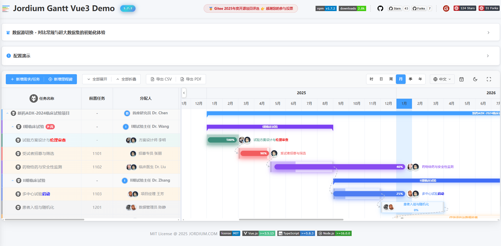
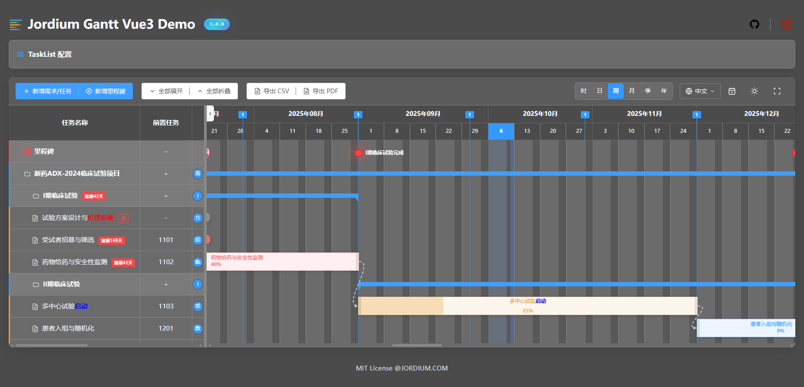

#  jordium-gantt-vue3

**🌐 Languages**: [📖 English Documentation](./README-EN.md) | [📖 中文文档](./README.md)

[](https://www.npmjs.com/package/jordium-gantt-vue3)
[](https://opensource.org/licenses/MIT)
[](https://vuejs.org/)
[](https://www.typescriptlang.org/)

> Modern Vue 3 Gantt chart component library providing complete solutions for project management and task scheduling

## 🌐 Online Demo

🎯 **[Try Github Live Demo →](https://nelson820125.github.io/jordium-gantt-vue3/)**

*The online demo includes full feature showcase: task management, milestones, theme switching, internationalization, etc.*

## 🎨 Theme Support

### Light Theme



### Dark Theme



## 🚀 Features

- 📊 **Complete Functionality**: Task management, milestone tracking, dependency relationships, progress visualization
- 🎨 **Theme Switching**: Built-in light/dark themes with customizable theme variables
- 🖱️ **Rich Interactions**: Drag adjustment, resizing, double-click editing, context menus
- 🌍 **Internationalization**: Built-in Chinese/English support with custom language pack capability
- 📱 **Responsive**: Desktop and mobile compatible with smooth touch experience
- ⚡ **High Performance**: Virtual scrolling, lazy loading, optimized rendering
- 🔧 **Extensible**: Rich API interfaces supporting custom components and events
- 💎 **Type Safe**: Complete TypeScript support for better development experience

## 📦 Installation

```bash
# npm
npm install jordium-gantt-vue3

# yarn  
yarn add jordium-gantt-vue3

# pnpm
pnpm add jordium-gantt-vue3
```

## 📄 License

[MIT License](./LICENSE) © 2025 JordiUM

---

## 📁 Project Structure

```
jordium-gantt-vue3/
├── src/                      # Source code directory
│   ├── components/           # Core components
│   │   ├── GanttChart.vue   # Main entry component
│   │   ├── TaskList.vue     # Task list
│   │   ├── Timeline.vue     # Timeline
│   │   ├── TaskBar.vue      # Task bar
│   │   ├── MilestonePoint.vue # Milestone
│   │   └── ...              # Other components
│   ├── models/              # Data models
│   │   ├── classes/         # Class definitions
│   │   └── configs/         # Configuration interfaces
│   ├── composables/         # Composable functions
│   ├── styles/              # Style files
│   └── index.ts             # Export entry
├── demo/                    # Development demo
├── dist/                    # Build output
├── docs/                    # Documentation
└── package.json
```

## 🔧 API Reference

### GanttChart Properties

| Property | Type | Default | Description |
|----------|------|---------|-------------|
| `tasks` | `Task[]` | `[]` | Task data array |
| `milestones` | `Task[]` | `[]` | Milestone data array |
| `editComponent` | `any` | - | Custom edit component |
| `useDefaultDrawer` | `boolean` | `true` | Use default edit drawer |
| `showToolbar` | `boolean` | `true` | Show toolbar |
| `toolbarConfig` | `ToolbarConfig` | `{}` | Toolbar configuration |
| `localeMessages` | `Partial<Messages['zh-CN']>` | - | Custom locale messages |
| `onTaskDoubleClick` | `(task: Task) => void` | - | Task double-click event callback |
| `onTaskDelete` | `(task: Task) => void` | - | Task delete event callback |
| `onTaskUpdate` | `(task: Task) => void` | - | Task update event callback |
| `onTaskAdd` | `(task: Task) => void` | - | Task add event callback |
| `onMilestoneSave` | `(milestone: Task) => void` | - | Milestone save event callback |
| `onMilestoneDelete` | `(milestoneId: number) => void` | - | Milestone delete event callback |
| `onMilestoneIconChange` | `(milestoneId: number, icon: string) => void` | - | Milestone icon change event callback |
| `onAddTask` | `() => void` | - | Add task toolbar event callback |
| `onAddMilestone` | `() => void` | - | Add milestone toolbar event callback |
| `onTodayLocate` | `() => void` | - | Locate today toolbar event callback |
| `onExportCsv` | `() => boolean \| void` | - | Export CSV toolbar event callback |
| `onExportPdf` | `() => void` | - | Export PDF toolbar event callback |
| `onLanguageChange` | `(lang: 'zh-CN' \| 'en-US') => void` | - | Language change toolbar event callback |
| `onThemeChange` | `(isDark: boolean) => void` | - | Theme change toolbar event callback |
| `onFullscreenChange` | `(isFullscreen: boolean) => void` | - | Fullscreen change toolbar event callback |

### GanttChart Events

| Event              | Parameters                  | Description                        |
|--------------------|----------------------------|------------------------------------|
| `taskbar-drag-end` | `task: Task` | Task bar drag end |
| `taskbar-resize-end` | `task: Task` | Task bar resize end |
| `milestone-drag-end` | `milestone: Task` | Milestone drag end |
| `predecessor-added`| `{ targetTask, newTask }`   | Triggered after adding predecessor.<br>Parameters:<br>• `targetTask`: The task to which a predecessor was added (Task object)<br>• `newTask`: The newly added predecessor task (Task object) |
| `successor-added`  | `{ targetTask, newTask }`   | Triggered after adding successor.<br>Parameters:<br>• `targetTask`: The task to which a successor was added (Task object)<br>• `newTask`: The newly added successor task (Task object) |
| `task-deleted`     | `{ task }`                  | Triggered after deleting a task    |
| `task-added`       | `{ task }`                  | Triggered after creating a task    |
| `task-updated`     | `{ task }`                  | Triggered after updating a task    |

#### Timer Event Usage Example

```vue
<GanttChart
  ...
  @timer-started="onTimerStarted"
  @timer-stopped="onTimerStopped"
/>

<script setup>
function onTimerStarted(task) {
  // Custom notification, logging, or business logic
  alert(`Task [${task.name}] started at: ${new Date(task.timerStartTime).toLocaleString()}`)
}
function onTimerStopped(task) {
  alert(`Task [${task.name}] stopped`)
}
</script>
```

#### Task Event Usage Example

```vue
<GanttChart
  ...
  @predecessor-added="onPredecessorAdded"
  @successor-added="onSuccessorAdded"
  @task-deleted="onTaskDeleted"
  @task-added="onTaskAdded"
  @task-updated="onTaskUpdated"
/>

<script setup>
function onPredecessorAdded(e) {
  // e: { targetTask: Task, newTask: Task }
  alert(`Task [${e.targetTask.name}] predecessor added [${e.newTask.name}]`)
}
function onSuccessorAdded(e) {
  // e: { targetTask: Task, newTask: Task }
  alert(`Task [${e.targetTask.name}] successor added [${e.newTask.name}]`)
}
function onTaskDeleted(e) {
  // e: { task: Task }
  alert(`Task [${e.task.name}] deleted`)
}
function onTaskAdded(e) {
  // e: { task: Task }
  alert(`Task [${e.task.name}] created`)
}
function onTaskUpdated(e) {
  // e: { task: Task }
  alert(`Task [${e.task.name}] updated`)
}
</script>
```

### Data Types

#### Core Types (src/models/classes)

**Task Type**
```typescript
export interface Task {
  id: number // Unique task ID
  name: string // Task name
  predecessor?: number[] // Predecessor task ID array
  assignee?: string // Assignee
  startDate?: string // Start date (ISO string)
  endDate?: string // End date (ISO string)
  progress?: number // Progress percentage 0-100
  estimatedHours?: number // Estimated hours
  actualHours?: number // Actual hours
  parentId?: number // Parent task ID
  children?: Task[] // Subtask array
  collapsed?: boolean // Collapsed state
  isParent?: boolean // Is parent task
  type?: string // Task type (e.g. task, story, milestone)
  description?: string // Task description
  icon?: string // Icon
  level?: number // Level
  // Timer related fields
  isTimerRunning?: boolean // Is timer running
  timerStartTime?: number // Timer start timestamp
  timerEndTime?: number // Timer end timestamp
  timerStartDesc?: string // Timer start description
  timerElapsedTime?: number // Accumulated timer duration (seconds)
}
```

**Milestone Type**
```typescript
// Milestone is actually a special usage of Task type
// Task object with type: 'milestone' property
interface Milestone extends Task {
  type: 'milestone'            // Must be 'milestone'
  startDate: string           // Milestone date (required)
  endDate?: string            // End date (optional, usually same as startDate)
}
```

**Language Type**
```typescript
type Language = 'zh' | 'en'   // Supported language types
type Locale = 'zh-CN' | 'en-US' // Complete language locale identifiers
```

#### Configuration Types (src/models/configs)

**TimelineConfig**
```typescript
interface TimelineConfig {
  startDate: Date              // Timeline start date
  endDate: Date                // Timeline end date
  zoomLevel: number            // Zoom level
}
```

**ToolbarConfig**
```typescript
interface ToolbarConfig {
  showAddTask?: boolean        // Show add task button
  showAddMilestone?: boolean   // Show add milestone button
  showTodayLocate?: boolean    // Show locate today button
  showExportCsv?: boolean      // Show export CSV button
  showExportPdf?: boolean      // Show export PDF button
  showLanguage?: boolean       // Show language switch button
  showTheme?: boolean          // Show theme switch button
  showFullscreen?: boolean     // Show fullscreen toggle button
  showTimeScale?: boolean      // Show time scale toggle buttons (Day|Week|Month)
}
```

#### Composable Functions (src/composables)

**useI18n Internationalization Tool**
```typescript
// Provides multi-language support
const { 
  locale,           // Current language
  setLocale,        // Switch language
  t,               // Translation function
  formatYearMonth  // Year-month formatting
} = useI18n()

// Supported languages
type Locale = 'zh-CN' | 'en-US'
```

**useMessage Message Tool**
```typescript
// Provides global message notifications
const { showMessage } = useMessage()

// Message types
type MessageType = 'success' | 'error' | 'warning' | 'info'

// Usage example
showMessage('Operation successful', 'success')
```

## 💻 Basic Usage

### Simple Example

```vue
<script setup lang="ts">
import { ref } from 'vue'
import { GanttChart } from 'jordium-gantt-vue3'
import 'jordium-gantt-vue3/dist/style.css'

const tasks = ref([
  {
    id: 1,
    name: 'Project Kickoff',
    startDate: '2025-01-01',
    endDate: '2025-01-15',
    progress: 80,
    assignee: 'John Doe'
  },
  {
    id: 2,
    name: 'Requirements Analysis',
    startDate: '2025-01-16',
    endDate: '2025-01-30',
    progress: 60,
    assignee: 'Jane Smith',
    predecessor: '1'
  }
])

const milestones = ref([
  {
    id: 1,
    name: 'Project Milestone',
    startDate: '2025-01-31',
    type: 'milestone'
  }
])
</script>

<template>
  <div style="height: 600px;">
    <GanttChart 
      :tasks="tasks" 
      :milestones="milestones"
    />
  </div>
</template>
```

### Custom Event Handling

```vue
<script setup lang="ts">
import { GanttChart } from 'jordium-gantt-vue3'

// Custom double-click handler
const handleTaskDoubleClick = (task) => {
  console.log('Task double-clicked:', task)
  // Open custom edit interface
  router.push(`/task/${task.id}/edit`)
}

// Custom delete handler
const handleTaskDelete = async (task) => {
  const confirmed = await showConfirm(`Are you sure to delete task "${task.name}"?`)
  if (confirmed) {
    await api.deleteTask(task.id)
    // Refresh task list
    refreshTasks()
  }
}

// Listen to drag events
const handleTaskDragEnd = (task) => {
  console.log('Task drag ended:', task)
  // Save task time changes
  api.updateTask(task)
}
</script>

<template>
  <GanttChart
    :tasks="tasks"
    :on-task-double-click="handleTaskDoubleClick"
    :on-task-delete="handleTaskDelete"
    :use-default-drawer="false"
    @taskbar-drag-end="handleTaskDragEnd"
  />
</template>
```

### Theme and Internationalization

```vue
<script setup lang="ts">
import { ref } from 'vue'
import { GanttChart } from 'jordium-gantt-vue3'

// Toolbar configuration
const toolbarConfig = {
  showLanguage: true,
  showTheme: true,
  showAddTask: true,
  showAddMilestone: true,
  showTodayLocate: true,
  showExportCsv: true,
  showExportPdf: true,
  showFullscreen: true,
  showTimeScale: true  // Control visibility of Day|Week|Month time scale toggle buttons
}

// Custom locale messages
const customLocaleMessages = {
  taskName: 'Custom Task Name',
  addTask: 'Custom Add Task'
}

// Handle toolbar events
const handleLanguageChange = (lang) => {
  console.log('Language changed to:', lang)
}

const handleThemeChange = (isDark) => {
  console.log('Theme changed to:', isDark ? 'dark' : 'light')
}
</script>

<template>
  <GanttChart
    :tasks="tasks"
    :milestones="milestones"
    :toolbar-config="toolbarConfig"
    :locale-messages="customLocaleMessages"
    :on-language-change="handleLanguageChange"
    :on-theme-change="handleThemeChange"
  />
</template>
```

## 🤝 Contributing & Collaboration

### Contributing

We welcome community contributions! If you want to participate in project development:

1. **Fork** this repository
2. **Create** your feature branch (`git checkout -b feature/AmazingFeature`)
3. **Commit** your changes (`git commit -m 'Add some AmazingFeature'`)
4. **Push** to the branch (`git push origin feature/AmazingFeature`)
5. **Open** a Pull Request

### Report Issues

If you find bugs or have feature suggestions:

- 📬 [Submit Github Issue](https://github.com/nelson820125/jordium-gantt-vue3/issues)
- 📬 [Submit Gitee Issue](https://gitee.com/jordium/jordium-gantt-vue3/issues)
- 📧 Send email to：ning.li@jordium.com / nelson820125@gmail.com / lining820125@163.com

### Business Collaboration

We provide professional technical support and custom development services:

- 🏢 **Enterprise Customization**: Custom Gantt chart features based on business needs
- 💼 **Technical Consulting**: Project management system architecture design consultation

**Contact Information**：
- 📧 Business Email：ning.li@jordium.com / nelson820125@gmail.com

### Development Environment

```bash
# Clone project
git clone https://github.com/nelson820125/jordium-gantt-vue3.git

# Install dependencies
npm install

# Start development server
npm run dev

# Build library
npm run build:lib

# Run tests
npm run test
```

---

**🔗 Related Links**
- [GitHub Repository](https://github.com/nelson820125/jordium-gantt-vue3)
- [Changelog](./CHANGELOG.md)

> 💡 **Tip**: If this project helps you, please give us a ⭐ Star!
