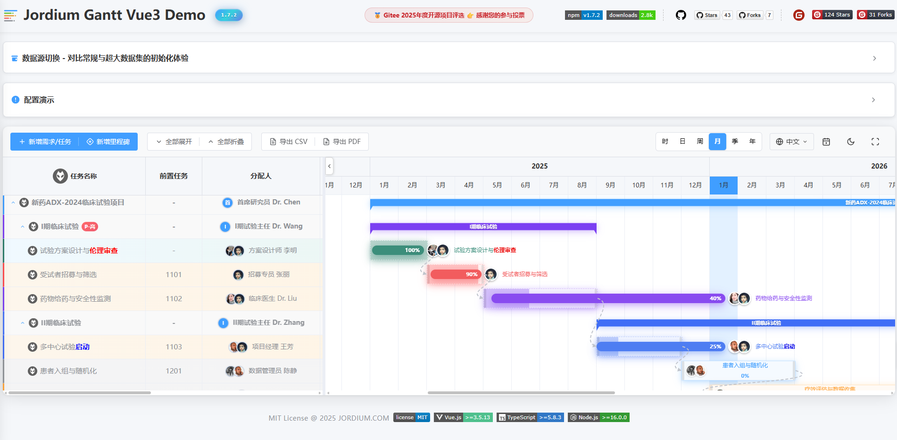
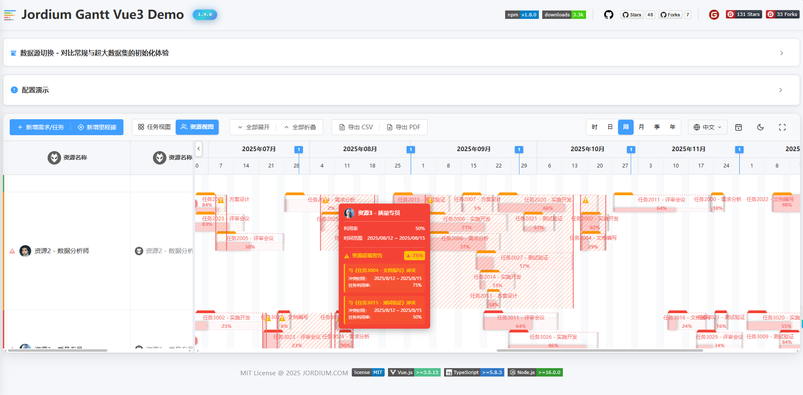
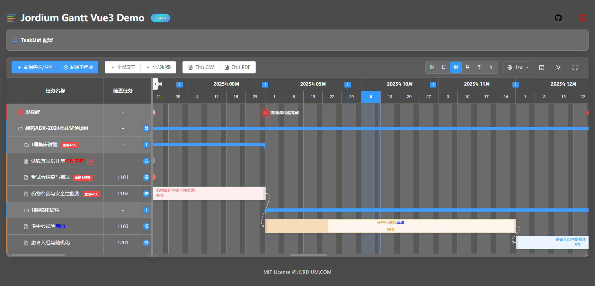
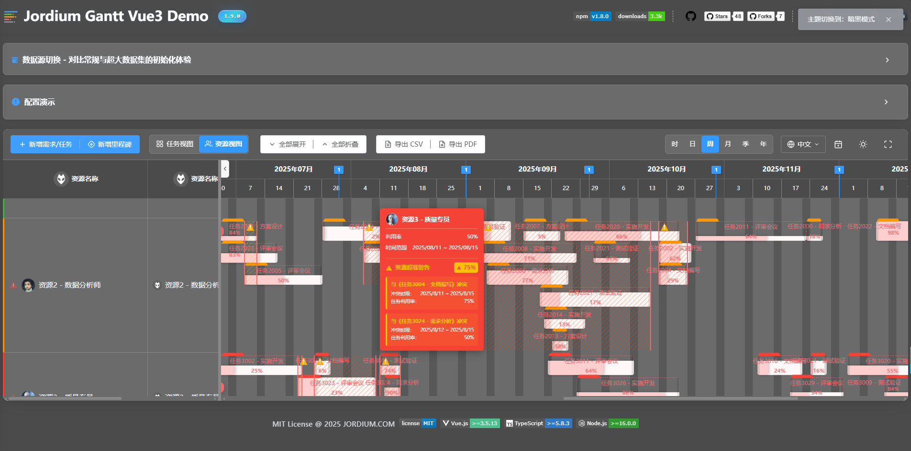

#  jordium-gantt-vue3

<p align="center">
  <a href="https://www.npmjs.com/package/jordium-gantt-vue3">
    
  </a>
  <a href="https://www.npmjs.com/package/jordium-gantt-vue3">
    
  </a>
  <a href="https://opensource.org/licenses/MIT">
    
  </a>
  <a href="https://vuejs.org/">
    =3.5.13-4FC08D?style=flat-square&logo=vue.js&logoColor=white" alt="Vue.js">
  </a>
  <a href="https://www.typescriptlang.org/">
    =5.8.3-3178C6?style=flat-square&logo=typescript&logoColor=white" alt="TypeScript">
  </a>
  <a href="https://nodejs.org/">
    =16.0.0-339933?style=flat-square&logo=node.js&logoColor=white" alt="Nodejs">
  </a>
</p>

<p align="center">
  <a href="./README.md">中文</a> | 
  <a href="./README-EN.md">English</a> | 
  <a href="./CHANGELOG.md">更新日志</a>
</p>

<p align="center">现代化的 Vue 3 甘特图组件库，为项目管理和任务调度提供完整解决方案</p>

<!-- <p align="center">
  <a href="https://gitee.com/activity/2025opensource?ident=IOUNZP" target="_blank">
    
  </a>
</p> -->

<p align="center">
  <a href="https://jordium.gitee.io/jordium-gantt-vue3/">
    <strong>📱 Gitee在线演示</strong>
  </a>
  &nbsp;&nbsp;|&nbsp;&nbsp;
  <a href="https://nelson820125.github.io/jordium-gantt-vue3/">
    <strong>📱 Github在线演示</strong>
  </a>
  &nbsp;&nbsp;|&nbsp;&nbsp;
  <a href="https://github.com/nelson820125/jordium-gantt-vue3">
    <strong>📦 GitHub</strong>
  </a>
  &nbsp;&nbsp;|&nbsp;&nbsp;
  <a href="https://www.npmjs.com/package/jordium-gantt-vue3">
    <strong>📚 npm</strong>
  </a>
</p>

---

## ✨ 简介

jordium-gantt-vue3 是一个现代化的 Vue3 甘特图组件，内置资源视图与资源规划能力。在统一界面中同时管理任务、时间线以及资源分配，适用于项目计划与资源调度场景。

### 核心特性

- 📊**资源计划视图** - Vue 3 生态唯一支持资源视图的甘特图，可按资源（人员/设备）展示任务分配与工时占用
- 📊 **功能完整** - 任务管理、里程碑、依赖关系、进度追踪
- 🎨 **主题系统** - 内置亮色/暗色主题，支持自定义样式
- 🖱️ **交互流畅** - 拖拽调整、缩放、双击编辑、右键菜单
- 🌍 **国际化** - 内置中英文，可扩展其他语言
- ⚡ **高性能** - 虚拟滚动、懒加载，轻松处理大量数据
- 💎 **类型安全** - 完整 TypeScript 支持

### 效果预览

#### 亮色主题





#### 暗色主题





---

## 📦 安装

使用你喜欢的包管理器安装：

```bash
# npm
npm install jordium-gantt-vue3

# yarn
yarn add jordium-gantt-vue3

# pnpm
pnpm add jordium-gantt-vue3
```

---

## 🚀 快速开始

### 组件引入

在组件中引入 `GanttChart` 组件和样式：

```vue
<script setup lang="ts">
import { GanttChart } from 'jordium-gantt-vue3'
import 'jordium-gantt-vue3/dist/assets/jordium-gantt-vue3.css'
</script>
```

> **提示**: 样式文件只需在项目中引入一次即可，建议在 `main.ts` 或根组件中引入。

### 第一个示例

创建你的第一个甘特图：

```vue
<template>
  <div style="height: 600px;">
    <GanttChart :tasks="tasks" :milestones="milestones" />
  </div>
</template>

<script setup lang="ts">
import { ref } from 'vue'
import { GanttChart } from 'jordium-gantt-vue3'
import 'jordium-gantt-vue3/dist/assets/jordium-gantt-vue3.css'

const tasks = ref([
  {
    id: 1,
    name: '项目启动',
    startDate: '2025-01-01',
    endDate: '2025-01-10',
    progress: 100,
  },
  {
    id: 2,
    name: '需求分析',
    startDate: '2025-01-11',
    endDate: '2025-01-20',
    progress: 80,
    predecessor: [1],
  },
  {
    id: 3,
    name: '系统设计',
    startDate: '2025-01-21',
    endDate: '2025-02-05',
    progress: 50,
    predecessor: [2],
  },
])

const milestones = ref([
  {
    id: 101,
    name: '项目立项',
    startDate: '2025-01-01',
    type: 'milestone',
  },
])
</script>
```

🎯 **[立即体验 Github在线Demo →](https://nelson820125.github.io/jordium-gantt-vue3/)**
<span><strong>推荐使用 <a href="https://dovee.cc/a.php?anaxjgyz1ozZq2B">DOVE</a> VPN，快速、稳定。</strong></span> <span style="color:red;">（注意：请合法使用 VPN 资源）</span>

## 🌞 NPM包使用示例

请参考项目下的npm-demo，这是一个独立的项目，可以使用IDE单独浏览和启动，运行前请安装element plus以及jordium-gantt-vue3插件包

```bash
# npm
npm install element-plus
npm install jordium-gantt-vue3
npm run dev
```

---

## 组件指南

### GanttChart 组件

`GanttChart` 是组件库的核心入口，提供了完整的甘特图功能。

#### 基础属性

| 属性名                      | 类型                                                                                      | 默认值  | 说明                                                           |
| --------------------------- | ----------------------------------------------------------------------------------------- | ------- | -------------------------------------------------------------- |
| `tasks`                     | `Task[]`                                                                                  | `[]`    | 任务数据数组                                                   |
| `milestones`                | `Task[]`                                                                                  | `[]`    | 里程碑数据数组（注意：类型为 Task[]，需设置 type='milestone'） |
| `resources`  | `Resource[]`                                                                              | `[]`    | 资源数据数组（资源计划视图使用）                               |
| `viewMode`  | `'task' \| 'resource'`                                                                    | `'task'` | 视图模式：'task' 任务计划视图 \| 'resource' 资源计划视图      |
| `showToolbar`               | `boolean`                                                                                 | `true`  | 是否显示工具栏                                                 |
| `useDefaultDrawer`          | `boolean`                                                                                 | `true`  | 是否使用内置任务编辑抽屉（TaskDrawer）                         |
| `useDefaultMilestoneDialog` | `boolean`                                                                                 | `true`  | 是否使用内置里程碑编辑对话框（MilestoneDialog）                |
| `autoSortByStartDate`       | `boolean`                                                                                 | `false` | 是否根据开始时间自动排序任务                                   |
| `allowDragAndResize`        | `boolean`                                                                                 | `true`  | 是否允许拖拽和调整任务/里程碑大小                              |
| `enableTaskRowMove`         | `boolean`                                                                                 | `false` | 是否允许拖拽和摆放TaskRow                                      |
| `enableTaskListContextMenu` | `boolean`                                                                                 | `true`  | 是否启用 TaskList（TaskRow）右键菜单功能。为 `true` 时：未声明 `task-list-context-menu` 插槽则使用内置菜单，声明了插槽则使用自定义菜单；为 `false` 时右键菜单完全禁用                     |
| `enableTaskBarContextMenu`  | `boolean`                                                                                 | `true`  | 是否启用 TaskBar 右键菜单功能。为 `true` 时：未声明 `task-bar-context-menu` 插槽则使用内置菜单，声明了插槽则使用自定义菜单；为 `false` 时右键菜单完全禁用                               |
| `assigneeOptions`           | `Array<{ key?: string \| number; value: string \| number; label: string }>`               | `[]`    | 任务编辑抽屉中负责人下拉菜单的选项列表          |
| `locale`  | `'zh-CN' \| 'en-US'`                                                                      | `'zh-CN'` | 语言设置（响应式）。设置后组件内部语言将跟随变化                |
| `theme`  | `'light' \| 'dark'`                                                                       | `'light'` | 主题模式（响应式）。设置后组件主题将跟随变化                    |
| `timeScale`  | `'hour' \| 'day' \| 'week' \| 'month' \| 'quarter' \| 'year'`                             | `'week'` | 时间刻度（响应式）。设置后时间线刻度将跟随变化                  |
| `fullscreen`  | `boolean`                                                                                 | `false` | 全屏状态控制（响应式）。设置后组件全屏状态将跟随变化            |
| `expandAll`  | `boolean`                                                                                 | `true` | 展开/收起所有任务（响应式）。设置后所有任务的展开状态将跟随变化  | 
| `enableLinkAnchor`  | `boolean`                                                                                 | `true` | 是否开启Taskbar的关系线锚点，默认值: true  |
| `pendingTaskBackgroundColor`  | `string`                                                                                 | `'#409eff'` | 待处理任务的TaskBar背景色。支持十六进制颜色值（如 `'#409eff'`）。**优先级**：高于系统默认，低于 Task 对象的 `barColor` 属性  |
| `delayTaskBackgroundColor`  | `string`                                                                                 | `'#f56c6c'` | 已逾期任务的TaskBar背景色。支持十六进制颜色值（如 `'#f56c6c'`）。**优先级**：高于系统默认，低于 Task 对象的 `barColor` 属性  |
| `completeTaskBackgroundColor`  | `string`                                                                                 | `'#909399'` | 已完成任务的TaskBar背景色。支持十六进制颜色值（如 `'#909399'`）。**优先级**：高于系统默认，低于 Task 对象的 `barColor` 属性  |
| `ongoingTaskBackgroundColor`  | `string`                                                                                 | `'#e6a23c'` | 进行中任务的TaskBar背景色。支持十六进制颜色值（如 `'#e6a23c'`）。**优先级**：高于系统默认，低于 Task 对象的 `barColor` 属性  |
| `showActualTaskbar`  | `boolean`                                                                                 | `false` | 是否显示实际TaskBar（在计划TaskBar下方显示实际执行进度）  |
| `enableTaskbarTooltip`  | `boolean`                                                                                 | `true` | 是否启用TaskBar悬停提示框（鼠标悬停显示任务详情）  |
| `enableMilestoneTooltip`  | `boolean`                                                                                 | `true` | 是否启用里程碑悬停提示框（鼠标悬停显示里程碑名称和日期）  |
| `showConflicts`  | `boolean`                                                                                 | `true` | 是否显示资源冲突可视化层（资源视图下显示斜纹背景标识超载区域） |
| `showTaskbarTab`  | `boolean`                                                                                 | `true` | 是否显示TaskBar上的资源Tab标签（资源视图下TaskBar的资源分配标签） |
| `enableTaskListCollapsible`  | `boolean`                                                                                 | `true` | 是否允许折叠/展开 TaskList 面板。`false` 时强制隐藏 TaskList、SplitterBar 及折叠按钮，Timeline 独占全宽 |
| `taskListVisible`  | `boolean`                                                                                 | `true` | 控制 TaskList 的显隐状态（响应式）。仅在 `enableTaskListCollapsible=true` 时有效 |
| `enableTaskDrawerAutoClose`  | `boolean`                                                                                 | `true` | 是否允许 TaskDrawer 自动关闭（外总点击或按 Esc 时自动关闭）。设为 `false` 时禁用自动关闭，仅可通过内部按钮手动关闭 |

#### TaskListColumn 属性

`TaskListColumn` 组件用于在声明式模式（`taskListColumnRenderMode="declarative"`）下定义任务列表的列。类似于 Element Plus 的 `el-table-column` 组件。

| 属性名     | 类型                           | 默认值   | 说明                                                                                                       |
| ---------- | ------------------------------ | -------- | ---------------------------------------------------------------------------------------------------------- |
| `prop`     | `string`                       | -        | 列的属性名，用于访问任务对象的字段。例如：`'name'`、`'assignee'`、`'progress'` 等                          |
| `label`    | `string`                       | -        | 列的显示标题文本                                                                                           |
| `width`    | `number \| string`             | -        | 列宽度。数字表示像素值（如 `200`），字符串支持百分比（如 `'20%'`）                                         |
| `align`    | `'left' \| 'center' \| 'right'` | `'left'` | 列内容对齐方式                                                                                             |
| `cssClass` | `string`                       | -        | 自定义 CSS 类名，用于列样式定制                                                                            |

**使用示例**：

```vue
<GanttChart 
  :tasks="tasks" 
  task-list-column-render-mode="declarative"
>
  <TaskListColumn prop="name" label="任务名称" width="300" />
  <TaskListColumn prop="assignee" label="负责人" width="150" align="center" />
  <TaskListColumn prop="progress" label="进度" width="100" align="center" />
  <TaskListColumn prop="startDate" label="开始日期" width="140" />
  <TaskListColumn prop="endDate" label="结束日期" width="140" />
</GanttChart>
```

> **💡 提示**：
> - `TaskListColumn` 组件本身不渲染任何内容，仅用于声明列配置
> - 必须在 `GanttChart` 组件内部使用，且设置 `task-list-column-render-mode="declarative"`
> - 列的显示顺序由 `TaskListColumn` 组件的声明顺序决定
> - 关于列内容自定义和插槽的详细使用方法，请参考 [插槽 (Slots)](#插槽-slots) 章节

#### TaskListContextMenu 属性

`TaskListContextMenu` 组件用于声明式定义 TaskList（TaskRow）的右键菜单。当 `enableTaskListContextMenu` 为 `true` 时生效。

| 属性名     | 类型                   | 默认值      | 说明                                                                                                                   |
| ---------- | ---------------------- | ----------- | ---------------------------------------------------------------------------------------------------------------------- |
| `taskType` | `string \| string[]`   | `undefined` | 指定哪些任务类型显示此右键菜单。不设置时遵循现有逻辑（所有任务都显示），设置后仅对指定类型任务显示。支持单个类型（如 `'task'`）或多个类型（如 `['task', 'milestone']`） |

**使用示例**：

```vue
<GanttChart 
  :tasks="tasks" 
  :enable-task-list-context-menu="true"
>
  <!-- 默认行为：所有任务都显示此右键菜单 -->
  <TaskListContextMenu>
    <template #default="scope">
      <div class="custom-menu">
        <div class="menu-item" @click="editTask(scope.row)">编辑</div>
        <div class="menu-item" @click="deleteTask(scope.row)">删除</div>
      </div>
    </template>
  </TaskListContextMenu>
  
  <!-- 仅对 type='task' 的任务显示此菜单 -->
  <TaskListContextMenu task-type="task">
    <template #default="scope">
      <div class="custom-menu">
        <div class="menu-item">任务专属菜单</div>
      </div>
    </template>
  </TaskListContextMenu>
  
  <!-- 对多种类型显示菜单 -->
  <TaskListContextMenu :task-type="['task', 'milestone']">
    <template #default="scope">
      <div class="custom-menu">
        <div class="menu-item">任务和里程碑菜单</div>
      </div>
    </template>
  </TaskListContextMenu>
</GanttChart>
```

> **💡 提示**：
> - `TaskListContextMenu` 组件本身不渲染任何内容，仅用于声明菜单配置
> - 必须在 `GanttChart` 组件内部使用，且设置 `enable-task-list-context-menu="true"`
> - 菜单定位和显示状态由内部自动管理，用户只需关心菜单内容的 HTML 结构
> - 菜单会在点击外部或滚动时自动关闭
> - 关于插槽的详细使用方法，请参考 [插槽 (Slots)](#插槽-slots) 章节

#### TaskBarContextMenu 属性

`TaskBarContextMenu` 组件用于声明式定义 TaskBar（时间线任务条）的右键菜单。当 `enableTaskBarContextMenu` 为 `true` 时生效。

| 属性名     | 类型                   | 默认值      | 说明                                                                                                                   |
| ---------- | ---------------------- | ----------- | ---------------------------------------------------------------------------------------------------------------------- |
| `taskType` | `string \| string[]`   | `undefined` | 指定哪些任务类型显示此右键菜单。不设置时遵循现有逻辑（所有任务都显示），设置后仅对指定类型任务显示。支持单个类型（如 `'task'`）或多个类型（如 `['task', 'milestone']`） |

**使用示例**：

```vue
<GanttChart 
  :tasks="tasks" 
  :enable-task-bar-context-menu="true"
>
  <!-- 默认行为：所有任务都显示此右键菜单 -->
  <TaskBarContextMenu>
    <template #default="scope">
      <div class="custom-menu">
        <div class="menu-item" @click="extendTask(scope.row)">延长任务</div>
        <div class="menu-item" @click="moveTask(scope.row)">移动任务</div>
      </div>
    </template>
  </TaskBarContextMenu>
  
  <!-- 仅对 type='task' 的任务显示此菜单 -->
  <TaskBarContextMenu task-type="task">
    <template #default="scope">
      <div class="custom-menu">
        <div class="menu-item">任务条专属菜单</div>
      </div>
    </template>
  </TaskBarContextMenu>
  
  <!-- 对多种类型显示菜单 -->
  <TaskBarContextMenu :task-type="['task', 'story']">
    <template #default="scope">
      <div class="custom-menu">
        <div class="menu-item">任务和故事菜单</div>
      </div>
    </template>
  </TaskBarContextMenu>
</GanttChart>
```

> **💡 提示**：
> - `TaskBarContextMenu` 组件本身不渲染任何内容，仅用于声明菜单配置
> - 必须在 `GanttChart` 组件内部使用，且设置 `enable-task-bar-context-menu="true"`
> - 菜单定位和显示状态由内部自动管理，用户只需关心菜单内容的 HTML 结构
> - 菜单会在点击外部或滚动时自动关闭
> - 关于插槽的详细使用方法，请参考 [插槽 (Slots)](#插槽-slots) 章节

#### 配置对象属性

完整的配置对象说明请参考 [⚙️ 配置与扩展](#⚙️-配置与扩展) 章节。

| 属性名           | 类型                         | 默认值                                                                  | 说明             |
| ---------------- | ---------------------------- | ----------------------------------------------------------------------- | ---------------- |
| `toolbarConfig`  | `ToolbarConfig`              | `{}`                                                                    | 工具栏配置       |
| `taskListConfig` | `TaskListConfig`             | `undefined`                                                             | 任务列表配置     |
| `resourceListConfig`  | `ResourceListConfig`         | `undefined`                                                             | 资源列表配置     |
| `taskBarConfig`  | `TaskBarConfig`              | `undefined`                                                             | 任务条样式配置   |
| `localeMessages` | `Partial<Messages['zh-CN']>` | `undefined`                                                             | 自定义多语言配置 |
| `workingHours`   | `WorkingHours`               | `{ morning: { start: 8, end: 11 }, afternoon: { start: 13, end: 17 } }` | 工作时间配置     |

#### 回调函数属性

| 属性名               | 类型                                 | 说明                                                     |
| -------------------- | ------------------------------------ | -------------------------------------------------------- |
| `onTodayLocate`      | `() => void`                         | 工具栏"今天"按钮点击回调                                 |
| `onExportCsv`        | `() => boolean \| void`              | 工具栏"导出CSV"按钮点击回调，返回 `false` 可阻止默认导出 |
| `onExportPdf`        | `() => void`                         | 工具栏"导出PDF"按钮点击回调                              |
| `onLanguageChange`   | `(lang: 'zh-CN' \| 'en-US') => void` | 语言切换回调                                             |
| `onThemeChange`      | `(isDark: boolean) => void`          | 主题切换回调                                             |
| `onFullscreenChange` | `(isFullscreen: boolean) => void`    | 全屏切换回调                                             |
| `onExpandAll`        | `() => void`                         | 工具栏"全部展开"按钮点击回调                             |
| `onCollapseAll`      | `() => void`                         | 工具栏"全部折叠"按钮点击回调                             |

#### 组件事件（Events）

完整的事件说明请分别参考：

- **任务相关事件**：参见下方 [任务管理](#任务管理) 章节
- **里程碑相关事件**：参见下方 [里程碑管理](#里程碑管理) 章节

**事件列表总览：**

| 事件名                   | 参数                              | 说明                       |
| ------------------------ | --------------------------------- | -------------------------- |
| `add-task`               | -                                 | 点击工具栏"添加任务"按钮   |
| `task-click`             | `(task: Task, event: MouseEvent)` | 点击任务                   |
| `task-double-click`      | `(task: Task)`                    | 双击任务                   |
| `task-added`             | `{ task: Task }`                  | 任务添加后触发             |
| `task-updated`           | `{ task: Task }`                  | 任务更新后触发             |
| `task-deleted`           | `{ task: Task }`                  | 任务删除后触发             |
| `taskbar-drag-end`       | `(task: Task)`                    | 拖拽任务结束               |
| `taskbar-resize-end`     | `(task: Task)`                    | 调整任务大小结束           |
| `predecessor-added`      | `{ targetTask, newTask }`         | 添加前置任务               |
| `successor-added`        | `{ targetTask, newTask }`         | 添加后置任务               |
| `timer-started`          | `(task: Task)`                    | 任务计时器启动             |
| `timer-stopped`          | `(task: Task)`                    | 任务计时器停止             |
| `add-milestone`          | -                                 | 点击工具栏"添加里程碑"按钮 |
| `milestone-saved`        | `(milestone: Task)`               | 里程碑保存                 |
| `milestone-deleted`      | `{ milestoneId: number }`         | 里程碑删除                 |
| `milestone-icon-changed` | `{ milestoneId, icon }`           | 里程碑图标变更             |
| `milestone-drag-end`     | `(milestone: Task)`               | 拖拽里程碑结束             |
| `task-row-moved`     | `payload: { draggedTask: Task, targetTask: Task, position: 'after' \| 'child', oldParent: Task \| null, newParent: Task \| null }` | 拖拽TaskRow结束（可选） |
| `taskbar-resource-change`  | `payload: { task: Task, oldResourceId: string \| number, newResourceId: string \| number }` | 任务跨资源移动事件（资源视图下拖拽任务到另一资源行） |

#### 示例1：最简单的甘特图

```vue
<template>
  <div style="height: 600px;">
    <GanttChart :tasks="tasks" :assignee-options="assigneeOptions" />
  </div>
</template>

<script setup lang="ts">
import { ref } from 'vue'
import { GanttChart } from 'jordium-gantt-vue3'
import 'jordium-gantt-vue3/dist/assets/jordium-gantt-vue3.css'

const tasks = ref([
  {
    id: 1,
    name: '任务1',
    startDate: '2025-01-01',
    endDate: '2025-01-10',
    progress: 100,
  },
])

const assigneeOptions = ref([
  { value: 'zhangsan', label: '张三' },
  { value: 'lisi', label: '李四' },
  { value: 'wangwu', label: '王五' },
])
</script>
```

#### 示例2：带里程碑的甘特图

```vue
<template>
  <div style="height: 600px;">
    <GanttChart :tasks="tasks" :milestones="milestones" :assignee-options="assigneeOptions" />
  </div>
</template>

<script setup lang="ts">
import { ref } from 'vue'
import { GanttChart } from 'jordium-gantt-vue3'
import 'jordium-gantt-vue3/dist/assets/jordium-gantt-vue3.css'

const tasks = ref([
  {
    id: 1,
    name: '项目启动',
    startDate: '2025-01-01',
    endDate: '2025-01-10',
    progress: 100,
  },
])

const milestones = ref([
  {
    id: 101,
    name: '项目立项',
    startDate: '2025-01-01',
    type: 'milestone',
    icon: 'diamond',
  },
])

const assigneeOptions = ref([
  { value: 'zhangsan', label: '张三' },
  { value: 'lisi', label: '李四' },
  { value: 'wangwu', label: '王五' },
])
</script>
```

#### 示例3：隐藏工具栏，自定义控制按钮绑定事件

```vue
<template>
  <div>
    <!-- 自定义控制栏 -->
    <div class="custom-toolbar">
      <button @click="addTask">新增任务</button>
      <button @click="addMilestone">新增里程碑</button>
    </div>

    <!-- 甘特图组件，隐藏内置工具栏 -->
    <div style="height: 600px;">
      <GanttChart
        :tasks="tasks"
        :milestones="milestones"
        :show-toolbar="false"
        :assignee-options="assigneeOptions"
        @task-added="handleTaskAdded"
        @milestone-saved="handleMilestoneSaved"
      />
    </div>
  </div>
</template>

<script setup lang="ts">
import { ref } from 'vue'
import { GanttChart } from 'jordium-gantt-vue3'
import 'jordium-gantt-vue3/dist/assets/jordium-gantt-vue3.css'

const tasks = ref([])
const milestones = ref([])

const assigneeOptions = ref([
  { value: 'zhangsan', label: '张三' },
  { value: 'lisi', label: '李四' },
  { value: 'wangwu', label: '王五' },
])

const addTask = () => {
  const newTask = {
    id: Date.now(),
    name: '新任务',
    startDate: new Date().toISOString().split('T')[0],
    endDate: new Date().toISOString().split('T')[0],
    progress: 0,
  }
  tasks.value.push(newTask)
}

const addMilestone = () => {
  const newMilestone = {
    id: Date.now(),
    name: '新里程碑',
    startDate: new Date().toISOString().split('T')[0],
    type: 'milestone',
  }
  milestones.value.push(newMilestone)
}

const handleTaskAdded = e => {
  console.log('任务已添加:', e.task)
}

const handleMilestoneSaved = milestone => {
  console.log('里程碑已保存:', milestone)
}
</script>
```

#### 示例4：外部组件控制状态（TimeScale、Fullscreen、Expand/Collapse、Locale、Theme）

通过响应式Props绑定来控制组件状态，组件状态会自动跟随Props变化。

```vue
<template>
  <div>
    <!-- 外部控制面板 -->
    <div class="control-panel">
      <button @click="propsFullscreen = !propsFullscreen">切换全屏</button>
      <button @click="propsExpandAll = !propsExpandAll">展开/收起所有</button>
      <button @click="propsLocale = 'zh-CN'">中文</button>
      <button @click="propsLocale = 'en-US'">English</button>
      <button @click="propsTimeScale = 'day'">日视图</button>
      <button @click="propsTimeScale = 'week'">周视图</button>
      <button @click="propsTimeScale = 'month'">月视图</button>
      <button @click="propsTheme = 'light'">亮色主题</button>
      <button @click="propsTheme = 'dark'">暗色主题</button>
    </div>

    <!-- 甘特图组件 -->
    <div style="height: 600px;">
      <GanttChart
        :tasks="tasks"
        :milestones="milestones"
        :locale="propsLocale"
        :theme="propsTheme"
        :time-scale="propsTimeScale"
        :fullscreen="propsFullscreen"
        :expand-all="propsExpandAll"
      />
    </div>
  </div>
</template>

<script setup lang="ts">
import { ref } from 'vue'
import { GanttChart } from 'jordium-gantt-vue3'
import 'jordium-gantt-vue3/dist/assets/jordium-gantt-vue3.css'

const tasks = ref([
  { id: 1, name: '任务1', startDate: '2025-01-01', endDate: '2025-01-10', progress: 50 },
  { id: 2, name: '任务2', startDate: '2025-01-05', endDate: '2025-01-15', progress: 30 },
])
const milestones = ref([])

// Props控制变量
const propsLocale = ref<'zh-CN' | 'en-US'>('zh-CN')
const propsTheme = ref<'light' | 'dark'>('light')
const propsTimeScale = ref<'hour' | 'day' | 'week' | 'month' | 'quarter' | 'year'>('week')
const propsFullscreen = ref(false)
const propsExpandAll = ref(false)
</script>
```

---

### 任务管理

任务是甘特图的核心元素，组件提供了完整的任务 CRUD 操作支持，包括添加、编辑、删除任务，以及丰富的交互事件。

#### Task 数据结构

| 字段名             | 类型       | 必填 | 默认值      | 说明                                                                                                                            |
| ------------------ | ---------- | ---- | ----------- | ------------------------------------------------------------------------------------------------------------------------------- |
| `id`               | `number`   | ✅   | -           | 任务唯一标识符                                                                                                                  |
| `name`             | `string`   | ✅   | -           | 任务名称                                                                                                                        |
| `startDate`        | `string`   | -    | -           | 开始日期，格式：'YYYY-MM-DD' 或 'YYYY-MM-DD HH:mm'                                                                              |
| `endDate`          | `string`   | -    | -           | 结束日期，格式：'YYYY-MM-DD' 或 'YYYY-MM-DD HH:mm'                                                                              |
| `progress`         | `number`   | -    | `0`         | 任务进度，范围 0-100                                                                                                            |
| `predecessor`      | `number[]` | -    | -           | 前置任务 ID 数组，标准格式：`[1, 2, 3]`<br/>**兼容格式**：也支持字符串 `'1,2,3'` 或字符串数组 `['1', '2', '3']`，组件会自动解析 |
| `assignee`         | `string` \| `string[]`    | -    | -           | 任务负责人，用作负责人下拉菜单的值绑定。支持单个负责人（字符串）或多个负责人（字符串数组）                                                                                                                      |
| `assigneeName`         | `string` \| `string[]`    | -    | -           | 任务负责人姓名，自动从绑定的数据集`assigneeOptions`中获取Label作为显示，如果需要自定义，可以在GanttChart回调事件`task-added`中自定义信息。支持单个姓名（字符串）或多个姓名（字符串数组）                                                                                                                      |
| `avatar`           | `string` \| `string[]`    | -    | -           | 任务负责人头像 URL。支持单个头像（字符串）或多个头像（字符串数组）                                                                                                              |
| `estimatedHours`   | `number`   | -    | -           | 预估工时（小时）                                                                                                                |
| `actualHours`      | `number`   | -    | -           | 实际工时（小时）                                                                                                                |
| `parentId`         | `number`   | -    | -           | 父任务 ID，用于任务分组                                                                                                         |
| `children`         | `Task[]`   | -    | -           | 子任务数组                                                                                                                      |
| `collapsed`        | `boolean`  | -    | `false`     | 子任务是否折叠                                                                                                                  |
| `isParent`         | `boolean`  | -    | -           | 是否为父任务                                                                                                                    |
| `type`             | `string`   | -    | -           | 任务类型，'milestone' 表示里程碑，'milestone-group' 表示里程碑分组                                                              |
| `description`      | `string`   | -    | -           | 任务描述                                                                                                                        |
| `icon`             | `string`   | -    | `'diamond'` | 任务图标（用于里程碑），可选值：'diamond', 'flag', 'star', 'rocket' 等                                                          |
| `level`            | `number`   | -    | `0`         | 任务层级（自动计算）                                                                                                            |
| `isTimerRunning`   | `boolean`  | -    | `false`     | 计时器是否运行中                                                                                                                |
| `timerStartTime`   | `number`   | -    | -           | 计时开始时间（时间戳）                                                                                                          |
| `timerEndTime`     | `number`   | -    | -           | 计时结束时间（时间戳）                                                                                                          |
| `timerStartDesc`   | `string`   | -    | -           | 计时开始时填写的描述                                                                                                            |
| `timerElapsedTime` | `number`   | -    | `0`         | 已计时的时长（毫秒）                                                                                                            |
| `isEditable`       | `boolean`  | -    | `true`      | 单个任务是否可编辑（可拖拽、拉伸），优先级高于全局 `allowDragAndResize`                                                         |
| `[key: string]`    | `unknown`  | -    | -           | 支持自定义属性扩展，可添加任意额外字段                                                                                          |

> **自定义属性扩展**：Task 接口支持添加任意自定义字段，例如：`priority`、`tags`、`status`、`department` 等业务相关字段。
>
> **前置任务字段说明**：
>
> - **标准格式**（推荐）：`predecessor: [1, 2, 3]` - number 数组
> - **兼容格式1**：`predecessor: '1,2,3'` - 逗号分隔的字符串
> - **兼容格式2**：`predecessor: ['1', '2', '3']` - 字符串数组
> - 组件内部会自动将所有格式统一解析为 number 数组
> - 无前置任务：使用空数组 `[]`、空字符串 `''` 或不设置该字段

#### 任务相关属性

| 属性名                | 类型             | 默认值      | 说明                                                           |
| --------------------- | ---------------- | ----------- | -------------------------------------------------------------- |
| `tasks`               | `Task[]`         | `[]`        | 任务数据数组                                                   |
| `useDefaultDrawer`    | `boolean`        | `true`      | 是否使用内置的任务编辑抽屉（TaskDrawer）                       |
| `taskBarConfig`       | `TaskBarConfig`  | `{}`        | 任务条样式配置，详见 [TaskBarConfig 配置](#taskbarconfig-配置) |
| `taskListConfig`      | `TaskListConfig` | `undefined` | 任务列表配置，详见 [TaskListConfig 配置](#tasklistconfig-配置) |
| `autoSortByStartDate` | `boolean`        | `false`     | 是否根据开始时间自动排序任务                                   |
| `enableTaskRowMove`        | `boolean` | `false`  | 是否允许拖拽和摆放TaskRow   |
| `assigneeOptions`           | `Array<{ key?: string \| number; value: string \| number; label: string }>`               | `[]`    | 任务编辑抽屉中负责人下拉菜单的选项列表          |
| `taskListColumnRenderMode` | `'default' \| 'declarative'` | `'default'` | 任务列表列渲染模式。`'default'`：使用 TaskListColumnConfig 配置（兼容模式，将逐渐废弃）；`'declarative'`：使用 TaskListColumn 组件声明式定义列（推荐）。详见 [TaskListColumn 声明式列定义](#tasklistcolumn-声明式列定义) |
| `taskListRowClassName` | `string \| ((task: Task) => string)` | `undefined` | 自定义任务行的 CSS 类名。可以是字符串或返回字符串的函数。**注意**：行的高度由组件内部统一管理，自定义高度样式不会生效 |
| `taskListRowStyle` | `CSSProperties \| ((task: Task) => CSSProperties)` | `undefined` | 自定义任务行的内联样式。可以是样式对象或返回样式对象的函数。**注意**：行的高度和宽度由组件内部统一管理，自定义宽高样式不会生效 | 

**配置说明**：

- **默认模式**：`useDefaultDrawer=true`（默认），双击任务自动打开内置 TaskDrawer
- **自定义编辑器**：`useDefaultDrawer=false` 禁用内置抽屉，监听 `@task-double-click` 事件打开自定义编辑器
- **只读模式**：`useDefaultDrawer=false` 且不监听 `@task-double-click` 事件，用户双击任务无反应

#### 任务事件

> **💡 事件驱动架构**：组件采用纯事件驱动设计，所有用户操作（添加、编辑、删除、拖拽等）都会触发对应事件，方便外部监听和处理。

| 事件名               | 参数                                      | 触发时机                   | 说明                                                                                                                       |
| -------------------- | ----------------------------------------- | -------------------------- | -------------------------------------------------------------------------------------------------------------------------- |
| `add-task`           | -                                         | 点击工具栏"添加任务"按钮时 | 可用于自定义新增任务逻辑。如 `useDefaultDrawer=true`，组件会自动打开内置 TaskDrawer                                        |
| `task-click`         | `(task: Task, event: MouseEvent) => void` | 点击任务条时               | 单击任务触发                                                                                                               |
| `task-double-click`  | `(task: Task) => void`                    | 双击任务条时               | 双击任务时**始终触发**。`useDefaultDrawer=true` 时组件会额外打开内置编辑器，`false` 时不打开。事件触发与属性值无关         |
| `task-added`         | `{ task: Task }`                          | 任务添加后                 | 通过内置 TaskDrawer 添加任务后触发。**注意**：组件已自动更新 `tasks` 数据，外部只需监听此事件做额外处理（如调用 API 保存） |
| `task-updated`       | `{ task: Task }`                          | 任务更新后                 | 通过内置 TaskDrawer 或拖拽更新任务后触发。**注意**：组件已自动更新 `tasks` 数据，外部只需监听此事件做额外处理              |
| `task-deleted`       | `{ task: Task }`                          | 任务删除后                 | 通过内置 TaskDrawer 删除任务后触发。**注意**：组件已自动更新 `tasks` 数据，外部只需监听此事件做额外处理                    |
| `taskbar-drag-end`   | `(task: Task) => void`                    | 拖拽任务条结束时           | 任务位置变化，startDate 和 endDate 已更新。**注意**：组件已自动更新 `tasks` 数据                                           |
| `taskbar-resize-end` | `(task: Task) => void`                    | 调整任务条大小结束时       | 任务时长变化，endDate 已更新。**注意**：组件已自动更新 `tasks` 数据                                                        |
| `predecessor-added`  | `{ targetTask: Task, newTask: Task }`     | 通过右键菜单添加前置任务后 | `targetTask` 是被添加前置任务的任务，`newTask` 是新创建的前置任务                                                          |
| `successor-added`    | `{ targetTask: Task, newTask: Task }`     | 通过右键菜单添加后置任务后 | `targetTask` 是原任务，`newTask` 是新创建的后置任务（其 predecessor 已包含 targetTask.id）                                 |
| `timer-started`      | `(task: Task) => void`                    | 任务计时器启动时           | 开始记录任务工时                                                                                                           |
| `timer-stopped`      | `(task: Task) => void`                    | 任务计时器停止时           | 停止记录任务工时                                                                                                           |
| `task-row-moved`     | `payload: { draggedTask: Task, targetTask: Task, position: 'after' \| 'child', oldParent: Task \| null, newParent: Task \| null }` | 拖拽TaskRow结束（可选） | 组件已自动完成数据移动和TaskList/Timeline同步。监听此事件为完全可选，仅用于显示提示、调用API保存等。`position`: 'after'=同级放置，'child'=作为子任务 |

**数据同步说明**：

- ✅ **组件内部自动更新**：所有任务的增删改操作，组件都会自动更新 `props.tasks` 数据
- ✅ **事件仅做通知**：外部监听事件主要用于：显示提示消息、调用后端 API、更新其他相关数据等
- ❌ **避免重复操作**：不要在事件处理器中再次修改 `tasks` 数据，否则会导致重复更新

#### 示例1：基础任务操作

```vue
<template>
  <div style="height: 600px;">
    <GanttChart
      :tasks="tasks"
      :assignee-options="assigneeOptions"
      @add-task="handleAddTask"
      @task-added="handleTaskAdded"
      @task-updated="handleTaskUpdated"
      @task-deleted="handleTaskDeleted"
      @task-click="handleTaskClick"
      @taskbar-drag-end="handleTaskDragEnd"
    />
  </div>
</template>

<script setup lang="ts">
import { ref } from 'vue'
import { GanttChart } from 'jordium-gantt-vue3'
import type { Task } from 'jordium-gantt-vue3'
import 'jordium-gantt-vue3/dist/assets/jordium-gantt-vue3.css'

const tasks = ref<Task[]>([
  {
    id: 1,
    name: '项目规划',
    startDate: '2025-01-01',
    endDate: '2025-01-10',
    progress: 100,
    assignee: '张三',
    estimatedHours: 40,
  },
  {
    id: 2,
    name: '需求分析',
    startDate: '2025-01-11',
    endDate: '2025-01-20',
    progress: 60,
    assignee: '李四',
    predecessor: [1], // 依赖任务1
  },
])

const assigneeOptions = ref([
  { value: 'zhangsan', label: '张三' },
  { value: 'lisi', label: '李四' },
  { value: 'wangwu', label: '王五' },
])

// 工具栏"添加任务"按钮点击事件
const handleAddTask = () => {
  console.log('准备新增任务...')
  // 组件会自动打开 TaskDrawer（如果 useDefaultDrawer=true）
  // 也可以在这里执行自定义逻辑，如显示提示消息
}

// 任务添加事件（通过内置抽屉添加）
const handleTaskAdded = (e: { task: Task }) => {
  console.log('新增任务:', e.task)
  // 注意：组件已自动将任务添加到 tasks 数组
  // 这里只需调用后端 API 保存即可
  // await api.createTask(e.task)
}

// 任务更新事件（通过内置抽屉或拖拽更新）
const handleTaskUpdated = (e: { task: Task }) => {
  console.log('更新任务:', e.task)
  // 注意：组件已自动更新 tasks 数组中的任务数据
  // 这里只需调用后端 API 更新即可
  // await api.updateTask(e.task.id, e.task)
}

// 任务删除事件
const handleTaskDeleted = (e: { task: Task }) => {
  console.log('删除任务:', e.task)
  // 注意：组件已自动从 tasks 数组中移除任务
  // 这里只需调用后端 API 删除即可
  // await api.deleteTask(e.task.id)
}

// 点击任务事件
const handleTaskClick = (task: Task) => {
  console.log('点击任务:', task.name)
}

// 拖拽任务结束事件
const handleTaskDragEnd = (task: Task) => {
  console.log('任务拖拽完成，新日期:', task.startDate, '至', task.endDate)
  // 可以在这里调用后端 API 保存新的日期
}
</script>
```

#### 示例2：任务依赖关系（前置任务/后置任务）

任务可以通过 `predecessor` 字段配置前置任务，组件会自动绘制依赖关系连线：

```vue
<template>
  <GanttChart
    :tasks="tasks"
    :assignee-options="assigneeOptions"
    @predecessor-added="handlePredecessorAdded"
    @successor-added="handleSuccessorAdded"
  />
</template>

<script setup lang="ts">
import { ref } from 'vue'
import { GanttChart } from 'jordium-gantt-vue3'
import type { Task } from 'jordium-gantt-vue3'
import 'jordium-gantt-vue3/dist/assets/jordium-gantt-vue3.css'

const tasks = ref<Task[]>([
  {
    id: 1,
    name: '需求分析',
    startDate: '2025-01-01',
    endDate: '2025-01-10',
    progress: 100,
    predecessor: [], // 无前置任务
  },
  {
    id: 2,
    name: '系统设计',
    startDate: '2025-01-11',
    endDate: '2025-01-20',
    progress: 80,
    predecessor: [1], // 依赖任务1（需求分析）
  },
  {
    id: 3,
    name: '数据库设计',
    startDate: '2025-01-11',
    endDate: '2025-01-18',
    progress: 90,
    predecessor: [1], // 依赖任务1
  },
  {
    id: 4,
    name: '前端开发',
    startDate: '2025-01-21',
    endDate: '2025-02-10',
    progress: 60,
    predecessor: [2], // 依赖任务2（系统设计）
  },
  {
    id: 5,
    name: '后端开发',
    startDate: '2025-01-19',
    endDate: '2025-02-08',
    progress: 70,
    predecessor: [2, 3], // 同时依赖任务2和3
  },
  {
    id: 6,
    name: '集成测试',
    startDate: '2025-02-11',
    endDate: '2025-02-20',
    progress: 30,
    predecessor: [4, 5], // 依赖前端和后端开发完成
  },
])

const assigneeOptions = ref([
  { value: 'zhangsan', label: '张三' },
  { value: 'lisi', label: '李四' },
  { value: 'wangwu', label: '王五' },
])

// 通过右键菜单添加前置任务时触发
const handlePredecessorAdded = (event: { targetTask: Task; newTask: Task }) => {
  console.log(`任务 [${event.targetTask.name}] 添加了前置任务 [${event.newTask.name}]`)
  // 组件会自动更新 targetTask 的 predecessor 数组（追加新任务 ID）
  // 这里可以调用后端 API 保存依赖关系
  // await api.addTaskDependency(event.targetTask.id, event.newTask.id)
}

// 通过右键菜单添加后置任务时触发
const handleSuccessorAdded = (event: { targetTask: Task; newTask: Task }) => {
  console.log(`任务 [${event.targetTask.name}] 添加了后置任务 [${event.newTask.name}]`)
  // 组件会自动更新 newTask 的 predecessor 数组（将 targetTask.id 添加进去）
  // 这里可以调用后端 API 保存依赖关系
  // await api.addTaskDependency(event.newTask.id, event.targetTask.id)
}
</script>
```

**依赖关系说明**：

- **`predecessor` 字段支持多种格式**：
  - 标准格式（推荐）：`[1, 2, 3]` - number 数组
  - 兼容格式1：`'1,2,3'` - 逗号分隔的字符串
  - 兼容格式2：`['1', '2', '3']` - 字符串数组
  - 组件会自动解析所有格式
- 前置任务：必须先完成的任务（例如：设计完成后才能开发）
- 后置任务：依赖当前任务的任务（当前任务是其他任务的前置任务）
- 组件会自动绘制依赖关系连线，从前置任务指向依赖它的任务
- 可以通过内置右键菜单添加/删除前置任务和后置任务
- 内置菜单删除任务时，组件会自动清理相关的依赖关系引用
- 无前置任务：使用空数组 `[]`、空字符串 `''` 或不设置 `predecessor` 字段

#### 示例3：隐藏工具栏，使用自定义按钮触发事件

适用于需要完全自定义控制栏的场景：

```vue
<template>
  <div>
    <!-- 自定义控制栏 -->
    <div class="custom-toolbar">
      <button @click="triggerAddTask">新增任务</button>
      <button @click="triggerAddMilestone">新增里程碑</button>
      <!-- 其他自定义按钮... -->
    </div>

    <!-- 甘特图组件，隐藏内置工具栏 -->
    <GanttChart
      :tasks="tasks"
      :milestones="milestones"
      :show-toolbar="false"
      :use-default-drawer="true"
      :use-default-milestone-dialog="true"
      :assignee-options="assigneeOptions"
      @add-task="handleAddTask"
      @add-milestone="handleAddMilestone"
      @task-added="handleTaskAdded"
    />
  </div>
</template>

<script setup lang="ts">
import { ref } from 'vue'
import { GanttChart } from 'jordium-gantt-vue3'
import 'jordium-gantt-vue3/dist/assets/jordium-gantt-vue3.css'

const tasks = ref([])
const milestones = ref([])

const assigneeOptions = ref([
  { value: 'zhangsan', label: '张三' },
  { value: 'lisi', label: '李四' },
  { value: 'wangwu', label: '王五' },
])

// 自定义按钮触发事件（组件会响应并打开内置编辑器）
const triggerAddTask = () => {
  // 直接触发组件的 add-task 事件
  // 由于 useDefaultDrawer=true，组件会自动打开 TaskDrawer
}

const triggerAddMilestone = () => {
  // 直接触发组件的 add-milestone 事件
  // 由于 useDefaultMilestoneDialog=true，组件会自动打开 MilestoneDialog
}

// 监听事件处理逻辑
const handleAddTask = () => {
  console.log('准备新增任务（由自定义按钮触发）')
}

const handleAddMilestone = () => {
  console.log('准备新增里程碑（由自定义按钮触发）')
}

const handleTaskAdded = e => {
  console.log('任务已添加:', e.task)
  // 调用 API 保存...
}
</script>
```

> **💡 灵活性设计**：
>
> - 显示工具栏 + 默认编辑器：最简单的开箱即用方式
> - 隐藏工具栏 + 自定义按钮 + 默认编辑器：自定义控制栏样式，保留默认编辑功能
> - 隐藏工具栏 + 自定义按钮 + 自定义编辑器：完全自定义所有交互逻辑

#### 示例4：任务行拖拽排序

允许用户通过拖拽 TaskRow 来调整任务的层级关系和前后顺序：

```vue
<template>
  <div style="height: 600px;">
    <GanttChart
      :tasks="tasks"
      :enable-task-row-move="true"
      :assignee-options="assigneeOptions"
      @task-row-moved="handleTaskRowMoved"
    />
  </div>
</template>

<script setup lang="ts">
import { ref } from 'vue'
import { GanttChart } from 'jordium-gantt-vue3'
import type { Task } from 'jordium-gantt-vue3'
import 'jordium-gantt-vue3/dist/assets/jordium-gantt-vue3.css'

const tasks = ref<Task[]>([
  {
    id: 1,
    name: '项目规划',
    startDate: '2025-01-01',
    endDate: '2025-01-10',
    progress: 100,
  },
  {
    id: 2,
    name: '需求分析',
    startDate: '2025-01-11',
    endDate: '2025-01-20',
    progress: 60,
    parentId: 1,
  },
  {
    id: 3,
    name: '系统设计',
    startDate: '2025-01-21',
    endDate: '2025-01-30',
    progress: 40,
  },
])

const assigneeOptions = ref([
  { value: 'zhangsan', label: '张三' },
  { value: 'lisi', label: '李四' },
  { value: 'wangwu', label: '王五' },
])

// 任务行拖拽完成事件（可选）
const handleTaskRowMoved = async (payload: {
  draggedTask: Task
  targetTask: Task
  position: 'after' | 'child'
  oldParent: Task | null
  newParent: Task | null
}) => {
  const { draggedTask, targetTask, position, oldParent, newParent } = payload
  
  // 组件已自动完成任务移动、parentId更新和TaskList/Timeline同步
  // 监听此事件为完全可选，仅用于：
  
  // 1. 显示自定义提示消息
  const oldParentName = oldParent?.name || '根目录'
  const newParentName = newParent?.name || '根目录'
  const positionText = position === 'after' ? '在目标任务之后' : '作为目标任务的子任务'
  showMessage(`任务 [${draggedTask.name}] 已从 [${oldParentName}] 移动到 [${newParentName}] (${positionText})`, 'success')
  
  // 2. 调用后端 API 保存新的任务层级关系
  try {
    await api.updateTaskHierarchy({
      taskId: draggedTask.id,
      targetTaskId: targetTask.id,
      position: position,
      oldParentId: oldParent?.id,
      newParentId: newParent?.id,
    })
  } catch (error) {
    console.error('保存任务层级失败:', error)
    showMessage('保存失败，请刷新页面', 'error')
  }
  
  // 3. 触发其他业务逻辑（如更新关联数据、记录操作日志等）
  // ...
}
</script>
```

**拖拽排序说明**：

- **启用拖拽**：设置 `enable-task-row-move="true"` 启用任务行拖拽功能（默认为 `false`）
- **拖拽算法**（组件内部自动执行）：
  - **算法1（放置在后面）**：当目标任务没有子任务时，被拖拽的任务会放置在目标任务之后（同级），`position='after'`
  - **算法2（作为子任务）**：当目标任务有子任务时，被拖拽的任务会成为目标任务的第一个子任务，`position='child'`
- **视觉反馈**：
  - 拖拽时会显示半透明的跟随元素
  - 悬停在有效目标任务上时显示蓝色边框提示
  - 无子任务的任务显示蓝色底部边框
  - 有子任务的任务显示蓝色四周边框
- **自动同步**：组件内部通过对象引用直接修改 `props.tasks`，自动完成任务移动、`parentId` 更新、`children` 数组调整以及 TaskList/Timeline 同步
- **事件监听（可选）**：
  - `task-row-moved` 事件为完全可选，仅用于显示提示、调用API保存、记录日志等额外处理
  - 无需手动更新 `tasks.value`，组件已自动完成数据同步
- **事件参数**：
  - `draggedTask`: 被拖拽的任务
  - `targetTask`: 目标任务
  - `position`: 放置位置（'after' 或 'child'）
  - `oldParent`: 原父任务（null 表示根目录）
  - `newParent`: 新父任务（null 表示根目录）
- **限制条件**：
  - 不能拖拽到自己身上
  - 不能拖拽到自己的子任务上（避免循环引用）
  - 里程碑和里程碑分组不能被拖拽

### 资源管理 

资源管理用于管理项目中的人力或设备资源，支持资源视图下的任务分配、资源负载分析、冲突检测等功能。通过 `viewMode="resource"` 属性切换到资源计划视图。

> **核心特性**：
> - 📊 **资源视图**：按资源维度展示任务分配情况
> - 🎯 **负载分析**：实时显示资源占用率和超载状态
> - ⚠️ **冲突检测**：自动检测资源时间冲突（如 A任务:40% + B任务:40% + C任务:30% = 110%超载）
> - 🎨 **可视化**：斜纹背景标识冲突区域，资源Tab显示占用比例
> - 🔄 **跨资源移动**：支持拖拽任务到不同资源行进行重新分配
>
> **视图限制**：
> - ❌ **任务关系线禁用**：资源视图下不显示任务之间的前后置关系线，因为资源视图关注资源分配而非任务依赖关系
> - ❌ **不支持实际TaskBar**：`showActualTaskbar` 属性在资源视图下无效，不会显示实际执行进度条

#### Resource 数据结构

| 字段名          | 类型                | 必填 | 默认值 | 说明                                                                                            |
| --------------- | ------------------- | ---- | ------ | ----------------------------------------------------------------------------------------------- |
| `id`            | `string \| number`  | ✅   | -      | 资源唯一标识符                                                                                  |
| `name`          | `string`            | ✅   | -      | 资源名称（如人名、设备名）                                                                      |
| `type`          | `string`            | -    | -      | 资源类型（如 'developer', 'designer', 'device' 等）                                              |
| `avatar`        | `string`            | -    | -      | 资源头像 URL                                                                                    |
| `description`   | `string`            | -    | -      | 资源描述                                                                                        |
| `department`    | `string`            | -    | -      | 所属部门                                                                                        |
| `skills`        | `string[]`          | -    | -      | 技能标签数组（如 `['Vue', 'React', 'TypeScript']`）                                             |
| `capacity`      | `number`            | -    | -      | 资源容量/利用率（0-100），可用于表示资源的整体负载水平                                           |
| `color`         | `string`            | -    | -      | 自定义资源行左边框颜色（如 `'#ff5733'`），若不设置则使用默认颜色方案                             |
| `tasks`         | `Task[]`            | -    | `[]`   | 分配给该资源的任务数组，**每个任务需包含 `resources` 字段标注资源占用比例**                      |
| `[key: string]` | `unknown`           | -    | -      | 支持自定义属性扩展，可添加任意额外字段                                                           |

> **自定义属性扩展**：Resource 接口支持添加任意自定义字段，例如：`email`、`phone`、`location`、`workHours` 等业务相关字段。
>
> **任务资源关联说明**：
>
> - 每个 Resource 包含一个 `tasks` 数组，存储分配给该资源的任务
> - 每个 Task 应包含 `resources` 字段，标注该任务使用了哪些资源及占用比例
> - 资源占用比例格式：`task.resources = [{ id: 'resource1', capacity: 60 }, { id: 'resource2', capacity: 40 }]`
> - `capacity` 范围：20-100，表示该任务占用该资源的百分比
> - 冲突检测：当同一资源在同一时间段的多个任务 `capacity` 总和 > 100% 时，会显示冲突警告

**Resource 数据示例**：

```typescript
import type { Resource, Task } from 'jordium-gantt-vue3'

const resources: Resource[] = [
  {
    id: 'dev-001',
    name: '张三',
    type: 'developer',
    avatar: '/avatars/zhangsan.jpg',
    department: '研发部',
    skills: ['Vue', 'TypeScript', 'Node.js'],
    capacity: 85, // 整体负载水平
    color: '#409eff',
    tasks: [
      {
        id: 1,
        name: '前端开发',
        startDate: '2026-02-01',
        endDate: '2026-02-10',
        progress: 50,
        resources: [
          { id: 'dev-001', capacity: 60 }, // 该任务占用张三60%的时间
          { id: 'dev-002', capacity: 40 }  // 同时占用李四40%的时间
        ]
      },
      {
        id: 2,
        name: '代码审查',
        startDate: '2026-02-05',
        endDate: '2026-02-08',
        progress: 0,
        resources: [
          { id: 'dev-001', capacity: 40 } // 该任务占用张三40%的时间
        ]
      }
      // 注意：如果两个任务时间重叠，张三在2月5-8日的总占用率为100%（60%+40%），临界值
    ]
  },
  {
    id: 'dev-002',
    name: '李四',
    type: 'developer',
    avatar: '/avatars/lisi.jpg',
    department: '研发部',
    skills: ['React', 'TypeScript'],
    tasks: []
  }
]
```

**资源冲突检测示例**：

```typescript
// 场景：张三在同一时间段被分配了3个任务
const resource = {
  id: 'dev-001',
  name: '张三',
  tasks: [
    {
      id: 1,
      name: '任务A',
      startDate: '2026-02-10',
      endDate: '2026-02-15',
      resources: [{ id: 'dev-001', capacity: 40 }] // 占用40%
    },
    {
      id: 2,
      name: '任务B',
      startDate: '2026-02-10',
      endDate: '2026-02-20',
      resources: [{ id: 'dev-001', capacity: 40 }] // 占用40%
    },
    {
      id: 3,
      name: '任务C',
      startDate: '2026-02-12',
      endDate: '2026-02-18',
      resources: [{ id: 'dev-001', capacity: 30 }] // 占用30%
    }
  ]
}

// 冲突分析：
// - 2月10-11日：A(40%) + B(40%) = 80%，未超载
// - 2月12-15日：A(40%) + B(40%) + C(30%) = 110%，超载！显示冲突警告
// - 2月16-18日：B(40%) + C(30%) = 70%，未超载
// - 2月19-20日：B(40%)，未超载
```

#### 资源相关属性

| 属性名                | 类型                  | 默认值       | 说明                                                                        |
| --------------------- | --------------------- | ------------ | --------------------------------------------------------------------------- |
| `resources`           | `Resource[]`          | `[]`         | 资源数据数组                                                                |
| `viewMode`            | `'task' \| 'resource'` | `'task'`     | 视图模式：'task' 任务计划视图，'resource' 资源计划视图                      |
| `resourceListConfig`  | `ResourceListConfig`  | `undefined`  | 资源列表配置，类似 TaskListConfig，用于配置资源列表的列定义、宽度等         |
| `showConflicts`       | `boolean`             | `true`       | 是否显示资源冲突可视化层（资源视图下显示斜纹背景标识超载区域）              |
| `showTaskbarTab`      | `boolean`             | `true`       | 是否显示TaskBar上的资源Tab标签（资源视图下TaskBar上的资源占用比例标签）     |

#### 资源事件

| 事件名                     | 参数                                                                                     | 触发时机                     | 说明                                                                         |
| -------------------------- | ---------------------------------------------------------------------------------------- | ---------------------------- | ---------------------------------------------------------------------------- |
| `taskbar-resource-change`  | `payload: { task: Task, oldResourceId: string \| number, newResourceId: string \| number }` | 任务跨资源拖拽结束时         | 资源视图下拖拽任务到另一资源行时触发，组件已自动更新任务的 `resources` 字段 |

**数据同步说明**：

- ✅ **组件内部自动更新**：资源相关操作（如任务跨资源移动）组件会自动更新 `props.resources` 和任务的 `resources` 字段
- ✅ **事件仅做通知**：外部监听事件主要用于：显示提示消息、调用后端 API、更新其他相关数据等
- ❌ **避免重复操作**：不要在事件处理器中再次修改数据，否则会导致重复更新

#### 示例：资源视图基础用法

```vue
<template>
  <div style="height: 600px;">
    <GanttChart
      :resources="resources"
      view-mode="resource"
      :show-conflicts="true"
      :show-taskbar-tab="true"
      @taskbar-resource-change="handleTaskbarResourceChange"
    />
  </div>
</template>

<script setup lang="ts">
import { ref } from 'vue'
import { GanttChart } from 'jordium-gantt-vue3'
import type { Resource } from 'jordium-gantt-vue3'
import 'jordium-gantt-vue3/dist/assets/jordium-gantt-vue3.css'

const resources = ref<Resource[]>([
  {
    id: 'dev-001',
    name: '张三',
    type: 'developer',
    department: '研发部',
    tasks: [
      {
        id: 1,
        name: '前端开发',
        startDate: '2026-02-01',
        endDate: '2026-02-10',
        progress: 50,
        resources: [{ id: 'dev-001', capacity: 60 }]
      }
    ]
  }
])

const handleTaskbarResourceChange = (payload: any) => {
  console.log('任务资源变更:', payload)
  // 调用后端API保存资源分配变更
  // api.updateTaskResource(payload.task.id, payload.newResourceId)
}
</script>
```

### 里程碑管理

里程碑用于标记项目中的重要时间节点，如项目启动、阶段完成、产品发布等。组件提供了灵活的里程碑编辑配置，默认使用内置的 MilestoneDialog，也支持完全自定义编辑行为。

> **注意**: 里程碑与任务是独立的数据集合，不存在直接关联关系。里程碑通过 `milestones` 属性独立管理。

#### Milestone 数据结构

| 字段名        | 类型     | 必填 | 默认值        | 说明                                                       |
| ------------- | -------- | ---- | ------------- | ---------------------------------------------------------- |
| `id`          | `number` | ✅   | -             | 里程碑唯一标识符                                           |
| `name`        | `string` | ✅   | -             | 里程碑名称                                                 |
| `startDate`   | `string` | ✅   | -             | 里程碑日期，格式：'YYYY-MM-DD' 或 'YYYY-MM-DD HH:mm'       |
| `endDate`     | `string` | -    | -             | 结束日期（通常里程碑不需要，自动设置为与 startDate 相同）  |
| `assignee`    | `string` | -    | -             | 负责人                                                     |
| `type`        | `string` | ✅   | `'milestone'` | 类型标识，必须设为 'milestone'                             |
| `icon`        | `string` | -    | `'diamond'`   | 里程碑图标，可选值：'diamond', 'flag', 'star', 'rocket' 等 |
| `description` | `string` | -    | -             | 里程碑描述                                                 |

> **注意**：`milestones` 属性的类型为 `Task[]`，需要确保每个里程碑对象的 `type` 字段设置为 `'milestone'`。

#### 里程碑相关属性

| 属性名                      | 类型      | 默认值 | 说明                                                     |
| --------------------------- | --------- | ------ | -------------------------------------------------------- |
| `milestones`                | `Task[]`  | `[]`   | 里程碑数据数组（类型为 Task[]，需确保 type='milestone'） |
| `useDefaultMilestoneDialog` | `boolean` | `true` | 是否使用内置的里程碑编辑对话框（MilestoneDialog）        |

**配置说明**：

- **默认模式**：`useDefaultMilestoneDialog=true`（默认），双击里程碑自动打开内置 MilestoneDialog
- **禁用编辑器**：`useDefaultMilestoneDialog=false`，双击里程碑无反应（组件不打开任何编辑器）
- **自定义编辑器**：可以监听 `onMilestoneDoubleClick` 回调或相关事件，实现自定义编辑逻辑

> **💡 里程碑与任务的区别**：
>
> - 里程碑数据通过 `milestones` 属性独立管理，与 `tasks` 分开
> - 里程碑对象的 `type` 字段必须设置为 `'milestone'`
> - 里程碑不支持子任务、依赖关系等复杂结构
> - 里程碑主要用于标记关键时间节点

#### 里程碑回调函数（向后兼容）

> **⚠️ 已废弃**：请使用新的事件驱动 API（见下方"里程碑事件"章节）

#### 里程碑事件

> **💡 事件驱动架构**：里程碑管理采用事件驱动设计，推荐使用事件 API 替代回调函数。

| 事件名                   | 参数                                    | 触发时机                     | 说明                                                                                                                                   |
| ------------------------ | --------------------------------------- | ---------------------------- | -------------------------------------------------------------------------------------------------------------------------------------- |
| `add-milestone`          | -                                       | 点击工具栏"添加里程碑"按钮时 | 可用于自定义新增里程碑逻辑。如 `useDefaultMilestoneDialog=true`，组件会自动打开内置 MilestoneDialog                                    |
| `milestone-saved`        | `(milestone: Task) => void`             | 里程碑保存后（新增或编辑）   | 通过内置 MilestoneDialog 保存里程碑后触发。**注意**：组件已自动更新 `milestones` 数据，外部只需监听此事件做额外处理（如调用 API 保存） |
| `milestone-deleted`      | `{ milestoneId: number }`               | 里程碑删除后                 | 通过内置 MilestoneDialog 删除里程碑后触发。**注意**：组件已自动更新 `milestones` 数据，外部只需监听此事件做额外处理                    |
| `milestone-icon-changed` | `{ milestoneId: number, icon: string }` | 里程碑图标变更后             | 通过内置 MilestoneDialog 修改图标后触发                                                                                                |
| `milestone-drag-end`     | `(milestone: Task) => void`             | 拖拽里程碑结束时             | 里程碑日期已更新。**注意**：组件已自动更新 `milestones` 数据                                                                           |

**数据同步说明**：

- ✅ **组件内部自动更新**：所有里程碑的增删改操作，组件都会自动更新 `props.milestones` 数据
- ✅ **事件仅做通知**：外部监听事件主要用于：显示提示消息、调用后端 API、更新其他相关数据等
- ❌ **避免重复操作**：不要在事件处理器中再次修改 `milestones` 数据，否则会导致重复更新

#### 示例1：使用事件驱动 API（推荐）

使用新的事件 API，组件会自动管理数据，更加简洁：

```vue
<template>
  <div style="height: 600px;">
    <GanttChart
      :milestones="milestones"
      @add-milestone="handleAddMilestone"
      @milestone-saved="handleMilestoneSaved"
      @milestone-deleted="handleMilestoneDeleted"
      @milestone-icon-changed="handleMilestoneIconChanged"
      @milestone-drag-end="handleMilestoneDrag"
    />
  </div>
</template>

<script setup lang="ts">
import { ref } from 'vue'
import { GanttChart } from 'jordium-gantt-vue3'
import type { Task } from 'jordium-gantt-vue3'
import 'jordium-gantt-vue3/dist/assets/jordium-gantt-vue3.css'

const milestones = ref<Task[]>([
  {
    id: 101,
    name: '项目启动',
    startDate: '2025-01-01',
    type: 'milestone',
    icon: 'diamond',
    assignee: '项目经理',
    description: '项目正式启动',
  },
  {
    id: 102,
    name: '需求评审',
    startDate: '2025-01-15',
    type: 'milestone',
    icon: 'flag',
  },
])

// 工具栏"添加里程碑"按钮点击事件
const handleAddMilestone = () => {
  console.log('准备新增里程碑...')
  // 组件会自动打开 MilestoneDialog（如果 useDefaultMilestoneDialog=true）
}

// 里程碑保存事件（添加或编辑）
const handleMilestoneSaved = (milestone: Task) => {
  console.log('里程碑已保存:', milestone)
  // 注意：组件已自动更新 milestones 数组
  // 这里只需调用后端 API 保存即可
  // await api.saveMilestone(milestone)
}

// 里程碑删除事件
const handleMilestoneDeleted = (e: { milestoneId: number }) => {
  console.log('里程碑已删除, ID:', e.milestoneId)
  // 注意：组件已自动从 milestones 数组中移除
  // 这里只需调用后端 API 删除即可
  // await api.deleteMilestone(e.milestoneId)
}

// 里程碑图标变更事件
const handleMilestoneIconChanged = (e: { milestoneId: number; icon: string }) => {
  console.log('里程碑图标已变更:', e.milestoneId, '->', e.icon)
  // 组件已自动更新图标，这里可以调用 API 保存
  // await api.updateMilestoneIcon(e.milestoneId, e.icon)
}

// 拖拽里程碑结束事件
const handleMilestoneDrag = (milestone: Task) => {
  console.log('里程碑拖拽完成，新日期:', milestone.startDate)
  // 组件已自动更新日期，这里可以调用 API 保存
  // await api.updateMilestoneDate(milestone.id, milestone.startDate)
}
</script>
```

#### 示例2：使用自定义里程碑编辑对话框

如果需要完全自定义里程碑编辑界面，可以禁用内置对话框并使用自己的组件：

```vue
<template>
  <div style="height: 600px;">
    <GanttChart
      :milestones="milestones"
      :use-default-milestone-dialog="false"
      @add-milestone="handleAddMilestone"
      @milestone-saved="handleMilestoneSaved"
      @milestone-deleted="handleMilestoneDeleted"
      @milestone-drag-end="handleMilestoneDrag"
    />

    <!-- 自定义里程碑编辑对话框 -->
    <CustomMilestoneDialog
      v-model:visible="customDialogVisible"
      :milestone="editingMilestone"
      :is-new="isNewMilestone"
      @save="handleCustomDialogSave"
      @delete="handleCustomDialogDelete"
    />
  </div>
</template>

<script setup lang="ts">
import { ref } from 'vue'
import { GanttChart } from 'jordium-gantt-vue3'
import 'jordium-gantt-vue3/dist/assets/jordium-gantt-vue3.css'
import CustomMilestoneDialog from './CustomMilestoneDialog.vue'
import type { Task } from 'jordium-gantt-vue3'

const milestones = ref<Task[]>([
  {
    id: 101,
    name: '项目启动',
    startDate: '2025-01-01',
    type: 'milestone',
    icon: 'diamond',
    assignee: '项目经理',
    description: '项目正式启动',
  },
])

const customDialogVisible = ref(false)
const editingMilestone = ref<Task | null>(null)
const isNewMilestone = ref(false)

// 点击工具栏"添加里程碑"按钮
const handleAddMilestone = () => {
  editingMilestone.value = null
  isNewMilestone.value = true
  customDialogVisible.value = true
}

// 双击里程碑时打开自定义对话框
// 注意：需要监听 Timeline 组件的里程碑双击事件
// 或者通过外部按钮/列表项触发编辑
const openEditDialog = (milestone: Task) => {
  editingMilestone.value = { ...milestone }
  isNewMilestone.value = false
  customDialogVisible.value = true
}

// 自定义对话框保存事件
const handleCustomDialogSave = (milestone: Task) => {
  if (isNewMilestone.value) {
    // 新增里程碑
    const newMilestone = {
      ...milestone,
      id: Date.now(), // 生成新 ID
      type: 'milestone',
    }
    milestones.value.push(newMilestone)

    // 调用后端 API 保存
    // await api.createMilestone(newMilestone)
  } else {
    // 更新现有里程碑
    const index = milestones.value.findIndex(m => m.id === milestone.id)
    if (index !== -1) {
      milestones.value[index] = { ...milestone }
    }

    // 调用后端 API 更新
    // await api.updateMilestone(milestone)
  }

  customDialogVisible.value = false
}

// 自定义对话框删除事件
const handleCustomDialogDelete = (milestoneId: number) => {
  const index = milestones.value.findIndex(m => m.id === milestoneId)
  if (index !== -1) {
    milestones.value.splice(index, 1)
  }

  // 调用后端 API 删除
  // await api.deleteMilestone(milestoneId)

  customDialogVisible.value = false
}

// 以下事件处理器仍然有效（用于拖拽等操作）
const handleMilestoneSaved = (milestone: Task) => {
  console.log('里程碑已保存（通过其他方式）:', milestone)
}

const handleMilestoneDeleted = (e: { milestoneId: number }) => {
  console.log('里程碑已删除（通过其他方式）:', e.milestoneId)
}

const handleMilestoneDrag = (milestone: Task) => {
  console.log('里程碑拖拽完成:', milestone.startDate)
  // 调用 API 更新日期
  // await api.updateMilestoneDate(milestone.id, milestone.startDate)
}
</script>
```

**自定义对话框组件示例** (`CustomMilestoneDialog.vue` - 使用 Element Plus)：

> **注意**：以下示例使用 Element Plus UI 框架。你也可以使用其他 UI 框架（如 Ant Design Vue、Naive UI 等）或原生 HTML 实现。

```vue
<template>
  <el-dialog
    v-model="dialogVisible"
    :title="isNew ? '新增里程碑' : '编辑里程碑'"
    width="500px"
    @close="handleClose"
  >
    <el-form :model="form" label-width="100px">
      <el-form-item label="里程碑名称">
        <el-input v-model="form.name" placeholder="请输入里程碑名称" />
      </el-form-item>

      <el-form-item label="日期">
        <el-date-picker
          v-model="form.startDate"
          type="date"
          placeholder="选择日期"
          value-format="YYYY-MM-DD"
        />
      </el-form-item>

      <el-form-item label="负责人">
        <el-input v-model="form.assignee" placeholder="请输入负责人" />
      </el-form-item>

      <el-form-item label="图标">
        <el-select v-model="form.icon" placeholder="选择图标">
          <el-option label="钻石" value="diamond" />
          <el-option label="旗帜" value="flag" />
          <el-option label="星星" value="star" />
          <el-option label="火箭" value="rocket" />
        </el-select>
      </el-form-item>

      <el-form-item label="描述">
        <el-input v-model="form.description" type="textarea" :rows="3" placeholder="请输入描述" />
      </el-form-item>
    </el-form>

    <template #footer>
      <div class="dialog-footer">
        <el-button v-if="!isNew" type="danger" @click="handleDelete"> 删除 </el-button>
        <el-button @click="handleClose">取消</el-button>
        <el-button type="primary" @click="handleSave">保存</el-button>
      </div>
    </template>
  </el-dialog>
</template>

<script setup lang="ts">
import { ref, watch } from 'vue'
import type { Task } from 'jordium-gantt-vue3'

interface Props {
  visible: boolean
  milestone: Task | null
  isNew: boolean
}

const props = defineProps<Props>()
const emit = defineEmits<{
  'update:visible': [value: boolean]
  save: [milestone: Task]
  delete: [milestoneId: number]
}>()

const dialogVisible = ref(false)
const form = ref({
  id: 0,
  name: '',
  startDate: '',
  assignee: '',
  icon: 'diamond',
  description: '',
  type: 'milestone',
})

watch(
  () => props.visible,
  val => {
    dialogVisible.value = val
    if (val) {
      if (props.milestone) {
        // 编辑模式，填充数据
        form.value = { ...props.milestone }
      } else {
        // 新增模式，重置表单
        form.value = {
          id: 0,
          name: '',
          startDate: new Date().toISOString().split('T')[0],
          assignee: '',
          icon: 'diamond',
          description: '',
          type: 'milestone',
        }
      }
    }
  }
)

watch(dialogVisible, val => {
  emit('update:visible', val)
})

const handleClose = () => {
  dialogVisible.value = false
}

const handleSave = () => {
  if (!form.value.name || !form.value.startDate) {
    alert('请填写必填项')
    return
  }
  emit('save', { ...form.value })
}

const handleDelete = () => {
  if (confirm('确定要删除这个里程碑吗？')) {
    emit('delete', form.value.id)
  }
}
</script>
```

> **💡 自定义对话框说明**：
>
> - 设置 `use-default-milestone-dialog="false"` 禁用内置对话框
> - 监听 `@add-milestone` 事件打开自定义对话框
> - 需要手动管理 `milestones` 数组的增删改
> - 仍然可以监听其他事件（如 `@milestone-drag-end`）处理拖拽等操作
> - 适合需要复杂表单验证、特殊 UI 设计或额外字段的场景

---

## ⚙️ 配置与扩展

本章节详细介绍 GanttChart 组件的配置选项和扩展能力，包括组件配置、主题与国际化、自定义扩展三个部分。

### 任务类型定义

任务类型（`type` 字段）用于区分不同类型的任务，组件内部会根据类型执行不同的逻辑判断。

#### 内置任务类型

| 类型值  | 说明       | 默认值 |
| ------- | ---------- | ------ |
| `story` | 用户故事   | -      |
| `task`  | 普通任务   | ✅     |
| `bug`   | 缺陷/问题  | -      |

#### 功能区分

不同任务类型在组件中具有不同的功能特性：

| 功能             | story | task | bug |
| ---------------- | ----- | ---- | --- |
| 可作为上级任务   | ✅    | ✅   | ❌  |
| 可作为前置任务   | ❌    | ✅   | ❌  |
| 支持计时器       | ❌    | ✅   | ✅  |
| 自动视为父任务   | ✅    | ❌   | ❌  |
| 删除时特殊提示   | ✅    | ❌   | ❌  |

#### 注意事项

> ⚠️ **重要提示**
>
> 1. 任务类型值为组件内置判断使用，**请勿随意修改**这些枚举值
> 2. 客制化 TaskDrawer 时，必须保持 `story`、`task`、`bug` 这三个枚举值
> 3. 如需添加其他业务标签，建议使用自定义属性字段，例如：`customType`、`category`、`label` 等

**示例：使用自定义标签**

```typescript
const tasks = ref([
  {
    id: 1,
    name: '需求分析',
    type: 'task', // 保持组件内置类型
    customType: 'requirement', // 自定义业务类型
    category: 'analysis', // 自定义分类
    startDate: '2025-01-01',
    endDate: '2025-01-10',
  },
])
```

### 组件配置

#### ToolbarConfig（工具栏配置）

自定义工具栏显示的功能按钮和时间刻度选项。

**类型定义：**

| 字段名                | 类型              | 默认值                                                | 说明                                                                                                  |
| --------------------- | ----------------- | ----------------------------------------------------- | ----------------------------------------------------------------------------------------------------- |
| `showAddTask`         | `boolean`         | `true`                                                | 显示"添加任务"按钮                                                                                    |
| `showAddMilestone`    | `boolean`         | `true`                                                | 显示"添加里程碑"按钮                                                                                  |
| `showTodayLocate`     | `boolean`         | `true`                                                | 显示"定位到今天"按钮                                                                                  |
| `showExportCsv`       | `boolean`         | `true`                                                | 显示"导出 CSV"按钮                                                                                    |
| `showExportPdf`       | `boolean`         | `true`                                                | 显示"导出 PDF"按钮                                                                                    |
| `showLanguage`        | `boolean`         | `true`                                                | 显示"语言切换"按钮（中/英文）                                                                         |
| `showTheme`           | `boolean`         | `true`                                                | 显示"主题切换"按钮（亮色/暗色）                                                                       |
| `showFullscreen`      | `boolean`         | `true`                                                | 显示"全屏"按钮                                                                                        |
| `showTimeScale`       | `boolean`         | `true`                                                | 显示时间刻度按钮组（控制整组按钮的显隐）                                                              |
| `timeScaleDimensions` | `TimelineScale[]` | `['hour', 'day', 'week', 'month', 'quarter', 'year']` | 设置时间刻度按钮组要显示的维度，可选值：`'hour'`、`'day'`、`'week'`、`'month'`、`'quarter'`、`'year'` |
| `defaultTimeScale`    | `TimelineScale`   | `'week'`                                              | 默认选中的时间刻度                                                                                    |
| `showExpandCollapse`  | `boolean`         | `true`                                                | 显示"全部展开/折叠"按钮（用于父子任务树形结构）                                                       |
| `showViewMode`  | `boolean`         | `true`                                                | 显示 Task / Resource 视图切换按钮组                                                                   |

**TimelineScale 类型说明：**

```typescript
type TimelineScale = 'hour' | 'day' | 'week' | 'month' | 'quarter' | 'year'

// 也可以使用常量形式
import { TimelineScale } from 'jordium-gantt-vue3'

TimelineScale.HOUR // 'hour' - 小时视图
TimelineScale.DAY // 'day' - 日视图
TimelineScale.WEEK // 'week' - 周视图
TimelineScale.MONTH // 'month' - 月视图
TimelineScale.QUARTER // 'quarter' - 季度视图
TimelineScale.YEAR // 'year' - 年视图
```

**示例1：完整配置（显示所有功能）**

```vue
<template>
  <GanttChart :tasks="tasks" :toolbar-config="toolbarConfig" />
</template>

<script setup lang="ts">
import { GanttChart } from 'jordium-gantt-vue3'
import 'jordium-gantt-vue3/dist/assets/jordium-gantt-vue3.css'
import type { ToolbarConfig } from 'jordium-gantt-vue3'

const toolbarConfig: ToolbarConfig = {
  showAddTask: true, // 显示添加任务按钮
  showAddMilestone: true, // 显示添加里程碑按钮
  showTodayLocate: true, // 显示定位到今天按钮
  showExportCsv: true, // 显示导出CSV按钮
  showExportPdf: true, // 显示导出PDF按钮
  showLanguage: true, // 显示语言切换按钮
  showTheme: true, // 显示主题切换按钮
  showFullscreen: true, // 显示全屏按钮
  showTimeScale: true, // 显示时间刻度按钮组
  timeScaleDimensions: [
    // 显示所有时间刻度维度
    'hour',
    'day',
    'week',
    'month',
    'quarter',
    'year',
  ],
  defaultTimeScale: 'week', // 默认选中周视图
  showExpandCollapse: true, // 显示展开/折叠按钮
}
</script>
```

**示例2：精简配置（只显示常用功能）**

```vue
<script setup lang="ts">
import type { ToolbarConfig } from 'jordium-gantt-vue3'

const toolbarConfig: ToolbarConfig = {
  showAddTask: true, // 保留添加任务
  showAddMilestone: true, // 保留添加里程碑
  showTodayLocate: true, // 保留定位今天
  showExportCsv: false, // 隐藏导出CSV
  showExportPdf: false, // 隐藏导出PDF
  showLanguage: false, // 隐藏语言切换（固定使用一种语言）
  showTheme: true, // 保留主题切换
  showFullscreen: true, // 保留全屏
  showTimeScale: true, // 显示时间刻度
  timeScaleDimensions: [
    // 只显示日/周/月三种刻度
    'day',
    'week',
    'month',
  ],
  defaultTimeScale: 'week', // 默认周视图
  showExpandCollapse: true, // 保留展开/折叠
}
</script>
```

**示例3：使用 TimelineScale 常量**

```vue
<script setup lang="ts">
import { TimelineScale } from 'jordium-gantt-vue3'
import type { ToolbarConfig } from 'jordium-gantt-vue3'

const toolbarConfig: ToolbarConfig = {
  showTimeScale: true,
  timeScaleDimensions: [
    TimelineScale.DAY,
    TimelineScale.WEEK,
    TimelineScale.MONTH,
    TimelineScale.QUARTER,
  ],
  defaultTimeScale: TimelineScale.MONTH, // 默认月视图
}
</script>
```

**示例4：极简配置（适合嵌入式使用）**

```vue
<script setup lang="ts">
import type { ToolbarConfig } from 'jordium-gantt-vue3'

const toolbarConfig: ToolbarConfig = {
  showAddTask: false, // 隐藏所有编辑按钮
  showAddMilestone: false,
  showTodayLocate: true, // 只保留导航功能
  showExportCsv: false,
  showExportPdf: false,
  showLanguage: false,
  showTheme: false,
  showFullscreen: false,
  showTimeScale: true, // 保留时间刻度切换
  timeScaleDimensions: ['week', 'month'],
  defaultTimeScale: 'month',
  showExpandCollapse: false, // 隐藏展开/折叠
}
</script>
```

> **💡 配置建议**：
>
> - **默认配置**：不传 `toolbar-config` 时，所有按钮默认显示
> - **按需显示**：根据业务需求隐藏不需要的功能按钮
> - **时间刻度**：`timeScaleDimensions` 控制显示哪些时间维度，建议选择 2-4 个常用维度
> - **响应式布局**：工具栏会自动适配容器宽度，按钮过多时会折叠到更多菜单中

#### TaskListConfig（任务列表配置）

自定义任务列表的显示列、宽度限制等。任务列表位于甘特图左侧，显示任务的详细信息。

**类型定义：**

| 字段名           | 类型                     | 默认值  | 说明                                                                           |
| ---------------- | ------------------------ | ------- | ------------------------------------------------------------------------------ |
| `columns`        | `TaskListColumnConfig[]` | 默认8列 | 任务列表的列配置数组，定义显示哪些列及其属性                                   |
| `showAllColumns` | `boolean`                | `true`  | 是否显示所有列。`true` 时忽略 `columns` 中的 `visible` 设置                    |
| `defaultWidth`   | `number \| string`       | `320`   | 默认展开宽度。支持像素数字（如 `320`）或百分比字符串（如 `'30%'`）             |
| `minWidth`       | `number \| string`       | `280`   | 最小宽度。支持像素数字（如 `280`）或百分比字符串（如 `'20%'`）。不能小于 280px |
| `maxWidth`       | `number \| string`       | `1160`  | 最大宽度。支持像素数字（如 `1160`）或百分比字符串（如 `'80%'`）                |
| `showTaskIcon`       | `boolean`       | `true`  | 是否展示任务图标                |

**TaskListColumnConfig 类型定义：**

| 字段名     | 类型      | 必填 | 说明                                                             |
| ---------- | --------- | ---- | ---------------------------------------------------------------- |
| `key`      | `string`  | ✅   | 列的唯一标识符，用于访问 Task 对象中的字段，也用于国际化         |
| `label`    | `string`  | -    | 列的显示标签（表头文字）                                         |
| `cssClass` | `string`  | -    | 自定义 CSS 类名                                                  |
| `width`    | `number`  | -    | 列宽度（单位：像素）                                             |
| `visible`  | `boolean` | -    | 是否显示该列，默认 `true`。当 `showAllColumns=true` 时此设置无效 |

**示例1：基础配置（调整宽度）**

```vue
<template>
  <GanttChart :tasks="tasks" :task-list-config="taskListConfig" />
</template>

<script setup lang="ts">
import { GanttChart } from 'jordium-gantt-vue3'
import 'jordium-gantt-vue3/dist/assets/jordium-gantt-vue3.css'
import type { TaskListConfig } from 'jordium-gantt-vue3'

const taskListConfig: TaskListConfig = {
  defaultWidth: 450, // 默认宽度450px（比默认值320px更宽）
  minWidth: 300, // 最小宽度300px
  maxWidth: 1200, // 最大宽度1200px
}
</script>
```

**示例2：使用百分比宽度**

```vue
<template>
  <GanttChart :tasks="tasks" :task-list-config="taskListConfig" />
</template>

<script setup lang="ts">
import { GanttChart } from 'jordium-gantt-vue3'
import 'jordium-gantt-vue3/dist/assets/jordium-gantt-vue3.css'
import type { TaskListConfig } from 'jordium-gantt-vue3'

const taskListConfig: TaskListConfig = {
  defaultWidth: '25%', // 默认占容器宽度的25%
  minWidth: '15%', // 最小占15%
  maxWidth: '60%', // 最大占60%
}
</script>
```

**示例3：自定义显示列（标准配置）**

根据业务需求，可以自定义要显示的列、列宽度和显示顺序。建议先定义列配置数组，再赋值给 `columns` 属性。

```vue
<template>
  <GanttChart :tasks="tasks" :task-list-config="taskListConfig" />
</template>

<script setup lang="ts">
import { GanttChart } from 'jordium-gantt-vue3'
import 'jordium-gantt-vue3/dist/assets/jordium-gantt-vue3.css'
import type { TaskListConfig, TaskListColumnConfig } from 'jordium-gantt-vue3'

// 定义要显示的列配置
const columns: TaskListColumnConfig[] = [
  { key: 'predecessor', label: '前置任务', visible: true },
  { key: 'assignee', label: '负责人', visible: true },
  { key: 'startDate', label: '开始日期', visible: true },
  { key: 'endDate', label: '结束日期', visible: true },
  { key: 'estimatedHours', label: '预估工时', visible: true },
  { key: 'actualHours', label: '实际工时', visible: true },
  { key: 'progress', label: '进度', visible: true },
]

const taskListConfig: TaskListConfig = {
  columns,
  defaultWidth: 450,
  minWidth: 300,
  maxWidth: 1200,
}
</script>
```

**示例4：精简列配置**

只显示核心信息列，适合空间有限或需要简洁展示的场景。

```vue
<script setup lang="ts">
import type { TaskListConfig, TaskListColumnConfig } from 'jordium-gantt-vue3'

// 定义精简列配置
const columns: TaskListColumnConfig[] = [
  { key: 'name', label: '任务', visible: true },
  { key: 'assignee', label: '负责人', width: 80, visible: true },
  { key: 'progress', label: '进度', width: 60, visible: true },
]

const taskListConfig: TaskListConfig = {
  columns,
  defaultWidth: 350,
  minWidth: 280,
  maxWidth: 500,
  showAllColumns: false, // 只显示 visible=true 的列
}
</script>
```

**示例5：自定义业务列**

添加业务相关的自定义列，需要确保 Task 对象中包含对应字段。

```vue
<script setup lang="ts">
import type { TaskListConfig, TaskListColumnConfig } from 'jordium-gantt-vue3'

// 定义包含自定义列的配置
const columns: TaskListColumnConfig[] = [
  { key: 'name', label: '任务名称', visible: true },
  { key: 'priority', label: '优先级', width: 80, visible: true }, // 自定义列
  { key: 'department', label: '部门', width: 100, visible: true }, // 自定义列
  { key: 'status', label: '状态', width: 80, visible: true }, // 自定义列
  { key: 'assignee', label: '负责人', visible: true },
  { key: 'startDate', label: '开始日期', visible: true },
  { key: 'endDate', label: '结束日期', visible: true },
  { key: 'progress', label: '进度', visible: true },
]

const taskListConfig: TaskListConfig = {
  columns,
}
</script>
```

**示例6：动态列配置**

配合 `ref` 和 `computed` 实现列的动态显示/隐藏和宽度调整。

```vue
<template>
  <GanttChart :tasks="tasks" :task-list-config="taskListConfig" />
</template>

<script setup lang="ts">
import { ref, computed } from 'vue'
import { GanttChart } from 'jordium-gantt-vue3'
import 'jordium-gantt-vue3/dist/assets/jordium-gantt-vue3.css'
import type { TaskListConfig, TaskListColumnConfig } from 'jordium-gantt-vue3'

// 定义可动态配置的列
const availableColumns = ref<TaskListColumnConfig[]>([
  { key: 'predecessor', label: '前置任务', visible: true },
  { key: 'assignee', label: '负责人', visible: true },
  { key: 'startDate', label: '开始日期', visible: true },
  { key: 'endDate', label: '结束日期', visible: true },
  { key: 'estimatedHours', label: '预估工时', visible: true },
  { key: 'actualHours', label: '实际工时', visible: true },
  { key: 'progress', label: '进度', visible: true },
  { key: 'custom', label: '自定义列', visible: true, width: 120 },
])

// 定义宽度配置
const taskListWidth = ref({
  defaultWidth: 450,
  minWidth: 300,
  maxWidth: 1200,
})

// 使用计算属性动态生成配置
const taskListConfig = computed<TaskListConfig>(() => ({
  columns: availableColumns.value,
  defaultWidth: taskListWidth.value.defaultWidth,
  minWidth: taskListWidth.value.minWidth,
  maxWidth: taskListWidth.value.maxWidth,
}))
</script>
```

> **💡 配置说明**：
>
> - **默认行为**：不传 `task-list-config` 时，显示所有 8 个默认列，宽度为 320px
> - **宽度单位**：支持像素（`number`）和百分比（`string`，如 `'30%'`）两种方式
> - **百分比计算**：基于甘特图容器的总宽度，响应式调整
> - **列顺序**：`columns` 数组的顺序决定列的显示顺序
> - **列配置规范**：建议先定义 `TaskListColumnConfig[]` 类型的列数组，再赋值给 `columns` 属性
> - **自定义列支持**：Task 接口通过 `[key: string]: unknown` 索引签名支持任意自定义字段，组件会通过 `task[column.key]` 动态读取列值，无需修改 Task 接口即可添加自定义列
> - **动态配置**：配合 `ref` 和 `computed` 可实现列的动态显示/隐藏和宽度调整
> - **最小宽度限制**：`minWidth` 不能小于 280px，这是保证基本可用性的最小值

#### TaskBarConfig（任务条配置）

控制任务条的显示内容和交互行为。

**配置字段：**

| 字段名              | 类型      | 默认值  | 说明                            |
| ------------------- | --------- | ------- | ------------------------------- |
| `showAvatar`        | `boolean` | `true`  | 是否展示头像                    |
| `showTitle`         | `boolean` | `true`  | 是否展示标题文字                |
| `showProgress`      | `boolean` | `true`  | 是否展示进度文字                |
| `dragThreshold`     | `number`  | `5`     | 拖拽触发阈值（像素）            |
| `resizeHandleWidth` | `number`  | `5`     | 拉伸手柄宽度（像素），最大 15px |
| `enableDragDelay`   | `boolean` | `false` | 是否启用拖拽延迟（防止误触）    |
| `dragDelayTime`     | `number`  | `150`   | 拖拽延迟时间（毫秒）            |

> **💡 编辑权限控制**：
>
> - **全局控制**：使用 `<GanttChart :allow-drag-and-resize="false" />` 禁用所有任务的拖拽/拉伸
> - **单个任务控制**：设置任务对象的 `isEditable: false` 属性单独控制某个任务

**示例1：完整配置**

```vue
<template>
  <GanttChart :tasks="tasks" :task-bar-config="taskBarConfig" />
</template>

<script setup lang="ts">
import { GanttChart } from 'jordium-gantt-vue3'
import 'jordium-gantt-vue3/dist/assets/jordium-gantt-vue3.css'
import type { TaskBarConfig } from 'jordium-gantt-vue3'

const taskBarConfig: TaskBarConfig = {
  showAvatar: true,
  showTitle: true,
  showProgress: true,
  dragThreshold: 8,
  resizeHandleWidth: 8,
  enableDragDelay: true,
  dragDelayTime: 200,
}
</script>
```

**示例2：全局只读模式**

禁用所有任务的编辑操作。

```vue
<template>
  <GanttChart :tasks="tasks" :allow-drag-and-resize="false" />
</template>
```

**示例3：单个任务只读**

仅某些任务不可编辑，其他任务正常。

```vue
<script setup lang="ts">
import type { Task } from 'jordium-gantt-vue3'

const tasks: Task[] = [
  {
    id: 1,
    name: '可编辑任务',
    startDate: '2025-01-01',
    endDate: '2025-01-10',
    // isEditable 默认为 true
  },
  {
    id: 2,
    name: '只读任务（已锁定）',
    startDate: '2025-01-05',
    endDate: '2025-01-15',
    isEditable: false, // 此任务不可拖拽/拉伸
  },
]
</script>
```

**示例4：精简显示**

仅显示任务条，隐藏头像、标题和进度文字。

```vue
<script setup lang="ts">
import type { TaskBarConfig } from 'jordium-gantt-vue3'

const taskBarConfig: TaskBarConfig = {
  showAvatar: false,
  showTitle: false,
  showProgress: false,
}
</script>
```

**示例5：防误触配置**

移动端或触摸屏场景下，增加拖拽阈值和延迟时间。

```vue
<script setup lang="ts">
import { computed, ref } from 'vue'
import type { TaskBarConfig } from 'jordium-gantt-vue3'

const isTouchDevice = ref('ontouchstart' in window)

const taskBarConfig = computed<TaskBarConfig>(() => ({
  dragThreshold: isTouchDevice.value ? 10 : 5,
  resizeHandleWidth: isTouchDevice.value ? 12 : 5,
  enableDragDelay: isTouchDevice.value,
  dragDelayTime: isTouchDevice.value ? 300 : 150,
}))
</script>
```

#### Timeline 容器自动填充配置

组件内置了智能的时间线范围计算逻辑，确保无论任务数据量多少、任务持续时间长短，时间线始终能够填充满容器宽度，提供最佳的视觉体验。

**核心设计思路：**

1. **基础缓冲机制**：在任务的实际时间范围基础上，根据不同视图添加固定的缓冲区

   - 小时视图：任务范围前后各 ±1 天
   - 日视图：任务范围前后各 ±30 天
   - 周视图：任务范围前后各 ±8 周（约2个月）
   - 月视图：任务范围前后各 ±1 年
   - 季度视图：任务范围前后各 ±1 年
   - 年视图：任务范围前后各 ±1 年

2. **容器宽度适配**：基础缓冲后，如果计算出的时间线宽度小于容器宽度，会自动扩展范围

   - 计算容器需要的时间单位数（天/周/月/季度/年）
   - 在基础范围两侧**对称扩展**，确保时间线填充满容器

3. **空数据处理**：当没有任务数据时，根据容器宽度和时间刻度计算合理的时间范围

   - 以当前日期为中心
   - 根据容器宽度动态计算需要显示的时间跨度
   - 确保最小显示范围（如日视图至少60天，周视图至少20周等）

4. **视图切换独立计算**：每次切换时间刻度时，都会独立重新计算该视图的最佳时间范围
   - 避免不同视图共享缓存导致的范围不合理
   - 每个视图都能获得最优的显示效果

**各视图计算模式对照表：**

| 视图     | 单位宽度             | 基础缓冲 | 空数据最小范围 | 容器自动填充？ |
| -------- | -------------------- | -------- | -------------- | -------------- |
| 小时视图 | 30px/时              | ±1天     | 3天            | ✅             |
| 日视图   | 30px/天              | ±30天    | 60天           | ✅             |
| 周视图   | 60px/周              | ±2月     | 20周           | ✅             |
| 月视图   | 60px/月              | ±1年     | 3年            | ✅             |
| 季度视图 | 60px/季度 (240px/年) | ±1年     | 5年            | ✅             |
| 年视图   | 360px/年             | ±1年     | 5年            | ✅             |

**实际应用场景：**

- **短期任务**（如1周项目， 分辨率1080）：

  - 不会导致时间线过窄，自动扩展到填充满容器
  - 日视图：1周(7天×30px=210px) → 扩展至 ≥1200px（约40天）
  - 周视图：1周(60px) → 扩展至 ≥1200px（约20周）

- **长期项目**（如2年项目）：

  - 添加固定缓冲后，自动适配容器
  - 月视图：24个月 + 缓冲 → 如需要则扩展至容器宽度
  - 季度视图：8个季度 + 缓冲 → 如需要则扩展至容器宽度

- **空白看板**（无任务数据）：
  - 日视图：以今天为中心，显示至少60天
  - 周视图：以今天为中心，显示至少20周
  - 月视图：显示至少3年
  - 季度/年视图：显示至少5年

> **💡 自动化优势**：
>
> - 无需手动设置 `startDate` 和 `endDate`，组件会自动计算最优范围
> - 响应式容器宽度变化，时间线自动重新计算
> - 不同视图独立优化，切换视图时自动调整到最佳显示效果
> - 避免出现时间线过窄或留白过多的问题
> - 适用不同分辨率展示

### Expose 方法

GanttChart 组件通过 `defineExpose` 暴露了一系列方法，允许父组件通过模板引用 (`ref`) 直接调用这些方法来控制组件行为。这种命令式的控制方式适合需要精确控制时机的场景。

#### 可用的 Expose 方法

| 方法名 | 参数 | 返回值 | 说明 |
| --- | --- | --- | --- |
| `setLocale`  | `locale: 'zh-CN' \| 'en-US'` | `void` | 设置组件语言 |
| `currentLocale`  | - | `'zh-CN' \| 'en-US'` | 获取当前语言设置 |
| `setTheme`  | `mode: 'light' \| 'dark'` | `void` | 设置主题模式 |
| `currentTheme`  | - | `'light' \| 'dark'` | 获取当前主题模式 |
| `setTimeScale`  | `scale: TimelineScale` | `void` | 设置时间刻度（`'hour' \| 'day' \| 'week' \| 'month' \| 'quarter' \| 'year'`） |
| `zoomIn`  | - | `void` | 缩小时间刻度（`'year' -> 'quarter' -> 'month' -> 'week' -> 'day' -> 'hour'`） |
| `zoomOut`  | - | `void` | 放大时间刻度（`'hour' -> 'day' -> 'week' -> 'month' -> 'quarter' -> 'year'`） |
| `currentScale`  | - | `TimelineScale` | 获取当前时间刻度 |
| `toggleFullscreen`  | - | `void` | 切换全屏状态 |
| `enterFullscreen`  | - | `void` | 进入全屏模式 |
| `exitFullscreen`  | - | `void` | 退出全屏模式 |
| `isFullscreen`  | - | `boolean` | 获取当前是否处于全屏状态 |
| `toggleExpandAll`  | - | `void` | 切换展开/收起所有任务 |
| `expandAll`  | - | `void` | 展开所有任务 |
| `collapseAll`  | - | `void` | 收起所有任务 |
| `isExpandAll`  | - | `boolean` | 获取当前是否全部展开 |
| `scrollToToday`  | - | `void` | 滚动到今天的位置 |
| `scrollToTask`  | `taskId: number \| string` | `void` | 滚动到指定任务（任务会自动展开到可见状态） |
| `scrollToDate`  | `date: string \| Date` | `void` | 滚动到指定日期位置（格式：`'YYYY-MM-DD'` 或 Date 对象） |
| `getTaskListVisible`  | - | `boolean` | 获取 TaskList 当前可见状态 |
| `setTaskListVisible`  | `visible: boolean` | `void` | 命令式设置 TaskList 显隐（仅 `enableTaskListCollapsible=true` 时生效） |
| `toggleTaskList`  | - | `void` | 带动画切换 TaskList 展开/收起状态 |

#### 使用示例

**基础用法：命令式控制**

```vue
<template>
  <div>
    <!-- 外部控制按钮 -->
    <div class="control-panel">
      <button @click="handleSetLocale('zh-CN')">中文</button>
      <button @click="handleSetLocale('en-US')">English</button>
      <button @click="handleSetTheme('light')">亮色主题</button>
      <button @click="handleSetTheme('dark')">暗色主题</button>
      <button @click="handleSetTimeScale('day')">日视图</button>
      <button @click="handleSetTimeScale('week')">周视图</button>
      <button @click="handleSetTimeScale('month')">月视图</button>
      <button @click="ganttRef?.toggleFullscreen()">切换全屏</button>
      <button @click="ganttRef?.toggleExpandAll()">展开/收起所有</button>
      <button @click="ganttRef?.scrollToToday()">定位到今天</button>
      <button @click="handleScrollToTask">滚动到任务2</button>
      <button @click="handleScrollToDate">滚动到2025-06-01</button>
    </div>

    <!-- 状态显示 -->
    <div class="status-panel">
      <p>当前语言: {{ currentLang }}</p>
      <p>当前主题: {{ currentThemeMode }}</p>
      <p>当前刻度: {{ currentTimeScale }}</p>
      <p>全屏状态: {{ isFullscreenMode ? '是' : '否' }}</p>
      <p>展开状态: {{ isAllExpanded ? '全部展开' : '部分收起' }}</p>
    </div>

    <!-- 甘特图组件 -->
    <div style="height: 600px;">
      <GanttChart
        ref="ganttRef"
        :tasks="tasks"
        :milestones="milestones"
      />
    </div>
  </div>
</template>

<script setup lang="ts">
import { ref } from 'vue'
import { GanttChart } from 'jordium-gantt-vue3'
import type { TimelineScale } from 'jordium-gantt-vue3'
import 'jordium-gantt-vue3/dist/assets/jordium-gantt-vue3.css'

// 组件引用
const ganttRef = ref<InstanceType<typeof GanttChart>>()

// 状态变量
const currentLang = ref<'zh-CN' | 'en-US'>('zh-CN')
const currentThemeMode = ref<'light' | 'dark'>('light')
const currentTimeScale = ref<TimelineScale>('week')
const isFullscreenMode = ref(false)
const isAllExpanded = ref(true)

// 任务数据
const tasks = ref([
  { id: 1, name: '任务1', startDate: '2025-01-01', endDate: '2025-01-10', progress: 50 },
  { id: 2, name: '任务2', startDate: '2025-01-05', endDate: '2025-01-15', progress: 30 },
])
const milestones = ref([])

// 语言控制
const handleSetLocale = (locale: 'zh-CN' | 'en-US') => {
  ganttRef.value?.setLocale(locale)
  currentLang.value = ganttRef.value?.currentLocale() || locale
}

// 主题控制
const handleSetTheme = (mode: 'light' | 'dark') => {
  ganttRef.value?.setTheme(mode)
  currentThemeMode.value = ganttRef.value?.currentTheme() || mode
}

// 时间刻度控制
const handleSetTimeScale = (scale: TimelineScale) => {
  ganttRef.value?.setTimeScale(scale)
  currentTimeScale.value = ganttRef.value?.currentScale() || scale
}

// 滚动到指定任务
const handleScrollToTask = () => {
  ganttRef.value?.scrollToTask(2)
}

// 滚动到指定日期
const handleScrollToDate = () => {
  ganttRef.value?.scrollToDate('2025-06-01')
}
</script>

<style scoped>
.control-panel {
  display: flex;
  gap: 10px;
  margin-bottom: 20px;
  flex-wrap: wrap;
}

.status-panel {
  padding: 10px;
  background-color: #f5f5f5;
  border-radius: 4px;
  margin-bottom: 20px;
}

.status-panel p {
  margin: 5px 0;
}
</style>
```

#### 最佳实践

1. **命令式 vs 响应式**
   - 使用 **Expose 方法**：需要精确控制调用时机，如按钮点击、特定事件触发
   - 使用 **Props 绑定**：状态需要跟随数据源自动更新，如与 URL 参数同步

2. **获取状态**
   - 提供了成对的 getter 方法（如 `currentLocale()`、`currentTheme()`）
   - 可在调用 setter 后立即获取最新状态进行验证

3. **错误处理**
   - 调用前检查 `ref` 是否已挂载：`ganttRef.value?.methodName()`
   - 在 `onMounted` 生命周期之后调用更安全

**完整示例可参考：**
- npm-demo 项目：`npm-demo/src/components/GanttTest.vue`
- npm-webpack-demo 项目：`npm-webpack-demo/src/App.vue`

---

### 主题与国际化

#### 主题切换

组件内置亮色和暗色两种主题，可通过工具栏按钮切换，也可监听切换事件：

```vue
<template>
  <GanttChart :tasks="tasks" :on-theme-change="handleThemeChange" />
</template>

<script setup lang="ts">
const handleThemeChange = (isDark: boolean) => {
  console.log('主题切换为:', isDark ? '暗色' : '亮色')
  // 可在此保存用户偏好设置到 localStorage
  localStorage.setItem('gantt-theme', isDark ? 'dark' : 'light')
}
</script>
```

#### 自定义主题变量

通过覆盖 CSS 变量实现主题自定义：

```css
/* 自定义亮色主题 */
:root {
  /* 主色调 */
  --gantt-primary-color: #409eff;
  --gantt-success-color: #67c23a;
  --gantt-warning-color: #e6a23c;
  --gantt-danger-color: #f56c6c;

  /* 背景色 */
  --gantt-bg-primary: #ffffff;
  --gantt-bg-secondary: #f5f7fa;
  --gantt-bg-hover: #ecf5ff;

  /* 文字颜色 */
  --gantt-text-primary: #303133;
  --gantt-text-secondary: #606266;
  --gantt-text-placeholder: #c0c4cc;

  /* 边框颜色 */
  --gantt-border-color: #dcdfe6;
  --gantt-border-color-light: #e4e7ed;

  /* 任务条颜色 */
  --gantt-task-bg: #409eff;
  --gantt-task-border: #66b1ff;
  --gantt-task-text: #ffffff;
}

/* 自定义暗色主题 */
.dark {
  --gantt-bg-primary: #1a1a1a;
  --gantt-bg-secondary: #2c2c2c;
  --gantt-bg-hover: #3a3a3a;

  --gantt-text-primary: #e5e5e5;
  --gantt-text-secondary: #b0b0b0;

  --gantt-border-color: #3a3a3a;
  --gantt-border-color-light: #4a4a4a;

  --gantt-task-bg: #409eff;
  --gantt-task-border: #66b1ff;
  --gantt-task-text: #ffffff;
}
```

#### 语言切换

组件内置中文（zh-CN）和英文（en-US）两种语言，可通过工具栏按钮切换：

```vue
<template>
  <GanttChart :tasks="tasks" :on-language-change="handleLanguageChange" />
</template>

<script setup lang="ts">
const handleLanguageChange = (lang: 'zh-CN' | 'en-US') => {
  console.log('语言切换为:', lang)
  // 可在此保存用户偏好设置到 localStorage
  localStorage.setItem('gantt-language', lang)
}
</script>
```

#### 自定义翻译

通过 `localeMessages` 属性传入自定义多语言文本，组件内部会自动合并到默认翻译中：

```vue
<template>
  <GanttChart :tasks="tasks" :locale-messages="customMessages" />
</template>

<script setup lang="ts">
const customMessages = {
  "zh-CN": {
    // 任务列表相关
    taskName: '任务名称（自定义）',
    startDate: '开始日期',
    endDate: '结束日期',
    duration: '工期',
    progress: '完成度',
    predecessor: '前置任务',
    assignee: '负责人',
    estimatedHours: '预估工时',
    actualHours: '实际工时',

    // 自定义字段（支持嵌套结构）
    department: '部门',
    status: '状态',
    gantt: {
      planEndDate: '计划结束时间',
      planStartDate: '计划开始时间'
    }
  },
  "en-US": {
    department: 'Department',
    status: 'Status',
    gantt: {
      planEndDate: 'Plan End Date',
      planStartDate: 'Plan Start Date'
    }
  }
}
</script>
```

> **💡 提示**：
>
> - `localeMessages` 采用**深度合并**策略，只需传递需要覆盖或新增的字段即可
> - 支持嵌套对象结构，如 `gantt.planEndDate`
> - 完整的内置翻译键请参考组件源码中的 `useI18n.ts`

##### 在自定义插槽中使用翻译

组件导出了 `useI18n` composable，可在自定义插槽中访问翻译文本，支持两种访问方式：

**方式一：引用式访问（`t.field`）**

通过响应式对象直接访问翻译文本，语法简洁，适合模板中使用：

```vue
<script setup>
import { GanttChart, TaskListColumn, useI18n } from 'jordium-gantt-vue3'

const { t } = useI18n()

const customMessages = {
  'zh-CN': {
    department: '部门'
  }
}
</script>

<template>
  <GanttChart :tasks="tasks" :locale-messages="customMessages" />
  
  <!-- 引用式：直接通过 t 对象访问 -->
  <TaskListColumn prop="startDate" label="开始时间" width="250">
    <template #header>
      <strong style="color: #1890ff;">{{ t.department }}</strong>
    </template>
  </TaskListColumn>
</template>
```

**方式二：函数式访问（`getTranslation()`）**

支持嵌套键和默认值，适合访问深层结构或动态键：

```vue
<script setup>
import { GanttChart, TaskListColumn, useI18n } from 'jordium-gantt-vue3'

const { getTranslation } = useI18n()

const customMessages = {
  'zh-CN': {
    gantt: {
      planEndDate: '计划结束时间'
    }
  }
}
</script>

<template>
  <GanttChart :tasks="tasks" :locale-messages="customMessages" />
  
  <!-- 函数式：支持嵌套键和默认值 -->
  <TaskListColumn prop="endDate" :label="getTranslation('gantt.planEndDate')" width="250" />
</template>
```

**完整示例（结合语言切换）：**

```vue
<script setup>
import { ref } from 'vue'
import { GanttChart, TaskListColumn, useI18n } from 'jordium-gantt-vue3'

// 自定义多语言配置
const customMessages = {
  'zh-CN': {
    department: '部门',
    gantt: {
      planEndDate: '计划结束时间'
    }
  },
  'en-US': {
    department: 'Department',
    gantt: {
      planEndDate: 'Plan End Date'
    }
  }
}

// 使用 useI18n 访问翻译
const { t, getTranslation, locale, setLocale } = useI18n()
const tasks = ref([...])

// 语言切换
const switchLanguage = () => {
  setLocale(locale.value === 'zh-CN' ? 'en-US' : 'zh-CN')
}
</script>

<template>
  <button @click="switchLanguage">切换语言</button>
  
  <GanttChart :tasks="tasks" :locale-messages="customMessages" />
  
  <!-- 引用式：直接通过 t 对象访问 -->
  <TaskListColumn prop="startDate" label="开始时间" width="250">
    <template #header>
      <strong style="color: #1890ff;">{{ t.department }}</strong>
    </template>
  </TaskListColumn>
  
  <!-- 函数式：支持嵌套键和默认值 -->
  <TaskListColumn prop="endDate" :label="getTranslation('gantt.planEndDate')" width="250" />
</template>
```

**`useI18n` API 说明：**

| 导出项 | 类型 | 说明 |
|--------|------|------|
| `t` | `Ref<object>` | 响应式翻译对象，通过 `t.key` 或 `t.nested.key` 访问翻译文本 |
| `getTranslation(key, defaultValue?)` | `Function` | 函数式访问翻译文本<br>• `key`: 翻译键，支持嵌套路径（如 `'gantt.planEndDate'`）<br>• `defaultValue`: 可选，找不到翻译时返回的默认值<br>• 返回：翻译文本、默认值或 key 本身 |
| `formatTranslation(key, params)` | `Function` | 格式化带参数的翻译文本<br>• `key`: 翻译键<br>• `params`: 参数对象，如 `{ name: '任务1' }`<br>• 返回：替换占位符后的文本（如 `'任务{name}'` → `'任务任务1'`） |
| `locale` | `Ref<string>` | 当前语言（`'zh-CN'` 或 `'en-US'`） |
| `setLocale(locale)` | `Function` | 切换语言，会自动更新所有使用 `useI18n` 的组件 |
| `formatYearMonth(year, month)` | `Function` | 格式化年月显示<br>• 中文：`formatYearMonth(2024, 3)` → `'2024年03月'`<br>• 英文：`formatYearMonth(2024, 3)` → `'2024/03'` |
| `formatMonth(month)` | `Function` | 格式化月份显示<br>• 中文：`formatMonth(3)` → `'3月'`<br>• 英文：`formatMonth(3)` → `'03'` |

**使用示例：**

```vue
<script setup>
import { useI18n } from 'jordium-gantt-vue3'

const { t, getTranslation, formatTranslation, formatYearMonth, formatMonth } = useI18n()

// 1. 基础访问
const text1 = t.taskName  // '任务名称'
const text2 = getTranslation('gantt.planEndDate', '计划结束')  // '计划结束时间' 或默认值

// 2. 带参数的翻译
const message = formatTranslation('taskNotFound', { id: '123' })  // '未找到要更新的任务，ID：123'

// 3. 日期格式化
const yearMonth = formatYearMonth(2024, 3)  // '2024年03月' (zh-CN) 或 '2024/03' (en-US)
const month = formatMonth(3)  // '3月' (zh-CN) 或 '03' (en-US)
</script>
```

> **💡 使用提示**：
>
> - **引用式** (`t.key`)：语法简洁，适合模板中直接使用
> - **函数式** (`getTranslation('nested.key', 'default')`)：支持嵌套键和默认值，适合访问深层结构
> - 通过 `localeMessages` 属性传入自定义翻译，再通过 `useI18n` 访问并翻译
> - 语言切换通过 `setLocale()` 实现，所有组件会自动响应更新

### 自定义扩展

#### 插槽 (Slots)

组件提供了插槽支持，允许自定义任务内容的渲染。

##### `taskbar-tooltip` 插槽 

用于完全替换 TaskBar 的内置悬停 Tooltip 内容。启用后内置样式不再渲染，由消费方完全控制。

> **前提条件**：需设置 `:enable-taskbar-tooltip="true"`（默认已开启）

**插槽作用域参数（`TaskbarTooltipSlotScope`）：**

> 组件通过 `<slot :task="..." :task-status="..." />` 提供数据，消费者可用整体对象 `scope` 接收，也可按需解构——所有参数均为**可选**。`task` 是完整的任务对象，自定义字段（如 `task.myField`）均可直接访问。

| 参数名 | 类型 | 说明 |
| --- | --- | --- |
| `task` | `Task` | 当前悬停的任务对象，包含完整的任务数据 |
| `taskStatus` | `{ color: string; label: string }` | 由组件计算好的任务状态（颜色 + 文本），辅助快速显示状态 |
| `resourcePercent` | `number \| null` | 资源占比百分比（资源视图有效，任务视图为 `null`） |

**三种写法完全等价：**

```vue
<!-- 写法一：整体 scope 对象接收 -->
<template #taskbar-tooltip="scope">
  {{ scope.task.name }}
</template>

<!-- 写法二：只解构需要的字段 -->
<template #taskbar-tooltip="{ task }">
  {{ task.name }}
</template>

<!-- 写法三：解构全部字段 -->
<template #taskbar-tooltip="{ task, taskStatus, resourcePercent }">
  ...
</template>
```

**示例——仅展示任务名称（最简用法）：**

```vue
<GanttChart :tasks="tasks">
  <template #taskbar-tooltip="{ task }">
    <div class="my-simple-tooltip">{{ task.name }}</div>
  </template>
</GanttChart>
```

**示例——利用全部作用域参数：**

```vue
<GanttChart :tasks="tasks">
  <template #taskbar-tooltip="{ task, taskStatus, resourcePercent }">
    <div class="my-tooltip">
      <div class="tooltip-title" :style="{ borderColor: taskStatus.color }">
        {{ task.name }}
      </div>
      <div>状态：{{ taskStatus.label }}</div>
      <div>开始：{{ task.startDate }}</div>
      <div>结束：{{ task.endDate }}</div>
      <div v-if="resourcePercent !== null">资源占比：{{ resourcePercent }}%</div>
    </div>
  </template>
</GanttChart>
```

---

##### `milestone-tooltip` 插槽 

用于完全替换里程碑的内置悬停 Tooltip 内容。启用后内置气泡样式不再渲染，由消费方完全控制。

> **前提条件**：需设置 `:enable-milestone-tooltip="true"`（默认已开启）

**插槽作用域参数（`MilestoneTooltipSlotScope`）：**

| 参数名 | 类型 | 说明 |
| --- | --- | --- |
| `milestone` | `Milestone` | 当前悬停的里程碑对象，包含里程碑完整数据 |

**示例：**

```vue
<GanttChart :tasks="tasks">
  <template #milestone-tooltip="{ milestone }">
    <div class="my-milestone-tooltip">
      <div class="title">{{ milestone.name }}</div>
      <div>目标日期：{{ milestone.startDate }}</div>
    </div>
  </template>
</GanttChart>
```

---

##### `custom-task-content` 插槽

用于自定义任务在任务列表（TaskRow）和时间轴（TaskBar）中的显示内容。

**插槽参数：**

| 参数名 | 类型                         | 来源 | 说明             |
| ------ | ---------------------------- | ---- | ---------------- |
| `type` | `'task-row'` \| `'task-bar'` | 通用 | 插槽调用位置标识 |
| `task` | `Task`                       | 通用 | 当前任务对象     |

**TaskRow 特有参数（当 `type === 'task-row'` 时）：**

| 参数名           | 类型                             | 说明             |
| ---------------- | -------------------------------- | ---------------- |
| `isRowContent`   | `boolean`                        | 标识为行内容     |
| `level`          | `number`                         | 任务层级         |
| `indent`         | `string`                         | 缩进样式         |
| `isHovered`      | `boolean`                        | 是否悬停         |
| `hoveredTaskId`  | `number \| null`                 | 当前悬停任务ID   |
| `isParent`       | `boolean`                        | 是否为父任务     |
| `hasChildren`    | `boolean`                        | 是否有子任务     |
| `collapsed`      | `boolean`                        | 是否折叠         |
| `formattedTimer` | `string`                         | 格式化的计时文本 |
| `timerRunning`   | `boolean`                        | 计时器是否运行   |
| `timerElapsed`   | `number`                         | 已计时时长       |
| `isOvertime`     | `number \| boolean \| undefined` | 是否超时         |
| `overdueDays`    | `number`                         | 逾期天数         |
| `overtimeText`   | `string`                         | 超时文本         |
| `overdueText`    | `string`                         | 逾期文本         |
| `daysText`       | `string`                         | 天数文本         |
| `progressClass`  | `string`                         | 进度CSS类名      |

**TaskBar 特有参数（当 `type === 'task-bar'` 时）：**

| 参数名             | 类型            | 说明                                                                               |
| ------------------ | --------------- | ---------------------------------------------------------------------------------- |
| `status`           | `object`        | 任务状态对象，包含 `type`, `color`, `bgColor`, `borderColor`                       |
| `statusType`       | `string`        | 状态类型：`'completed'`, `'delayed'`, `'in-progress'`, `'not-started'`, `'parent'` |
| `isParent`         | `boolean`       | 是否为父任务                                                                       |
| `progress`         | `number`        | 任务进度（0-100）                                                                  |
| `currentTimeScale` | `TimelineScale` | 当前时间刻度                                                                       |
| `rowHeight`        | `number`        | 行高（像素）                                                                       |
| `dayWidth`         | `number`        | 每天宽度（像素）                                                                   |

**使用示例：**

```vue
<template>
  <GanttChart :tasks="tasks">
    <template #custom-task-content="slotProps">
      <!-- 根据类型渲染不同内容 -->
      <CustomTaskContent :task="slotProps.task" :type="slotProps.type" :status="slotProps.status" />
    </template>
  </GanttChart>
</template>

<script setup lang="ts">
import { ref } from 'vue'
import { GanttChart } from 'jordium-gantt-vue3'
import 'jordium-gantt-vue3/dist/assets/jordium-gantt-vue3.css'
import type { Task } from 'jordium-gantt-vue3'
import CustomTaskContent from './CustomTaskContent.vue'

const tasks = ref<Task[]>([
  {
    id: 1,
    name: '<strong>重要任务</strong>',
    startDate: '2025-01-01',
    endDate: '2025-01-10',
    progress: 50,
  },
])
</script>
```

**自定义内容组件示例：**

```vue
<!-- CustomTaskContent.vue -->
<script setup lang="ts">
import type { Task } from 'jordium-gantt-vue3'

interface Props {
  task: Task
  type: 'task-row' | 'task-bar'
  status?: {
    type: string
    color: string
    bgColor: string
    borderColor: string
  }
}

const props = defineProps<Props>()
</script>

<template>
  <div class="custom-task-content">
    <!-- TaskRow 中的渲染 -->
    <div v-if="type === 'task-row'" class="task-row-content">
      <span v-html="task.name" />
    </div>

    <!-- TaskBar 中的渲染 -->
    <div v-else-if="type === 'task-bar'" class="task-bar-content">
      <div class="task-icon" :style="{ color: status?.color }">📌</div>
      <span class="task-title" v-html="task.name" />
    </div>
  </div>
</template>

<style scoped>
.custom-task-content {
  width: 100%;
  height: 100%;
}

.task-row-content {
  padding: 0 4px;
  overflow: hidden;
  text-overflow: ellipsis;
  white-space: nowrap;
}

.task-bar-content {
  display: flex;
  align-items: center;
  gap: 4px;
  padding: 0 8px;
  overflow: hidden;
}

.task-icon {
  flex-shrink: 0;
  font-size: 14px;
}

.task-title {
  flex: 1;
  overflow: hidden;
  text-overflow: ellipsis;
  white-space: nowrap;
}
</style>
```

> **💡 使用场景**：
>
> - 支持 HTML 格式的任务名称
> - 添加自定义图标、标签或徽章
> - 根据任务状态显示不同样式
> - 集成第三方富文本渲染
> - 显示额外的业务信息

> **⚠️ 注意事项**：
>
> - 插槽内容会同时在 TaskRow 和 TaskBar 中渲染
> - 需要根据 `type` 参数区分渲染位置
> - TaskRow 和 TaskBar 的可用空间不同，需要适配布局
> - 避免在插槽内容中使用过于复杂的组件，可能影响性能

##### TaskListContextMenu 插槽

用于自定义 TaskRow（任务列表行）的右键菜单内容。

**菜单显示逻辑：**
- 当 `enableTaskListContextMenu=true` 且**未声明** TaskListContextMenu 组件时 → 使用**系统内置**的右键菜单
- 当 `enableTaskListContextMenu=true` 且**声明了** TaskListContextMenu 组件时 → 使用**自定义**的右键菜单
- 当 `enableTaskListContextMenu=false` 时 → 右键菜单**完全禁用**（无论是否声明组件）

**插槽列表：**

| 插槽名    | 参数                              | 说明                                                                                           |
| --------- | --------------------------------- | ---------------------------------------------------------------------------------------------- |
| `default` | `scope: { row: Task, $index: number }`   | 自定义TaskRow的右键菜单。通过 `scope.row` 访问当前任务对象，通过 `scope.$index` 访问任务索引。 |

**使用示例：**

```vue
<template>
  <GanttChart 
    :tasks="tasks"
    :enable-task-list-context-menu="true"
  >
    <TaskListContextMenu>
      <template #default="scope">
        <div class="custom-menu">
          <div class="custom-item" @click="handleEdit('extend', scope.row)">
            ✏️ 编辑任务
          </div>
          <div class="custom-item" @click="handleDelete('move', scope.row)">
            🗑️ 删除任务
          </div>
          <div class="custom-divider"></div>
          <div class="custom-item" @click="handleDuplicate('copy', scope.row)">
            📄 复制任务
          </div>
        </div>
      </template>
    </TaskListContextMenu>
  </GanttChart>
</template>

<script setup lang="ts">
import { ref } from 'vue'
import { GanttChart, TaskListContextMenu } from 'jordium-gantt-vue3'
import 'jordium-gantt-vue3/dist/assets/jordium-gantt-vue3.css'
import type { Task } from 'jordium-gantt-vue3'

const tasks = ref<Task[]>([])

const handleEdit = (task: Task) => {
  console.log('编辑任务:', task)
}

const handleDelete = (task: Task) => {
  console.log('删除任务:', task)
}

const handleDuplicate = (task: Task) => {
  console.log('复制任务:', task)
}
</script>

<style scoped>
.custom-context-menu {
  position: fixed;
  background: white;
  border: 1px solid #e0e0e0;
  border-radius: 4px;
  box-shadow: 0 2px 8px rgba(0, 0, 0, 0.15);
  z-index: 9999;
  min-width: 120px;
}

.menu-item {
  padding: 8px 16px;
  cursor: pointer;
  transition: background-color 0.2s;
}

.menu-item:hover {
  background-color: #f5f5f5;
}

.menu-divider {
  height: 1px;
  background-color: #e0e0e0;
  margin: 4px 0;
}
</style>
```

##### TaskBarContextMenu 插槽

用于自定义 TaskBar（时间轴任务条）的右键菜单内容。

**菜单显示逻辑：**
- 当 `enableTaskBarContextMenu=true` 且**未声明** TaskBarContextMenu 组件时 → 使用**系统内置**的右键菜单
- 当 `enableTaskBarContextMenu=true` 且**声明了** TaskBarContextMenu 组件时 → 使用**自定义**的右键菜单
- 当 `enableTaskBarContextMenu=false` 时 → 右键菜单**完全禁用**（无论是否声明组件）

**插槽列表：**

| 插槽名    | 参数                              | 说明                                                                                           |
| --------- | --------------------------------- | ---------------------------------------------------------------------------------------------- |
| `default` | `scope: { row: Task, $index: number }`   | 自定义TaskBar的右键菜单。通过 `scope.row` 访问当前任务对象，通过 `scope.$index` 访问任务索引。 |

**使用示例：**

```vue
<template>
  <GanttChart 
    :tasks="tasks"
    :enable-task-bar-context-menu="true"
  >
    <TaskBarContextMenu>
      <template #default="scope">
        <div class="custom-context-menu">
          <div class="menu-item" @click="handleViewDetails(scope.row)">
            👁️ 查看详情
          </div>
          <div class="menu-item" @click="handleAdjustTime(scope.row)">
            ⏰ 调整时间
          </div>
          <div class="menu-divider"></div>
          <div class="menu-item" @click="handleSetDependency(scope.row)">
            🔗 设置依赖
          </div>
        </div>
      </template>
    </TaskBarContextMenu>
  </GanttChart>
</template>

<script setup lang="ts">
import { ref } from 'vue'
import { GanttChart, TaskBarContextMenu } from 'jordium-gantt-vue3'
import 'jordium-gantt-vue3/dist/assets/jordium-gantt-vue3.css'
import type { Task } from 'jordium-gantt-vue3'

const tasks = ref<Task[]>([])

const handleViewDetails = (task: Task) => {
  console.log('查看详情:', task)
}

const handleAdjustTime = (task: Task) => {
  console.log('调整时间:', task)
}

const handleSetDependency = (task: Task) => {
  console.log('设置依赖:', task)
}
</script>

<style scoped>
.custom-context-menu {
  position: fixed;
  background: white;
  border: 1px solid #e0e0e0;
  border-radius: 4px;
  box-shadow: 0 2px 8px rgba(0, 0, 0, 0.15);
  z-index: 9999;
  min-width: 120px;
}

.menu-item {
  padding: 8px 16px;
  cursor: pointer;
  transition: background-color 0.2s;
}

.menu-item:hover {
  background-color: #f5f5f5;
}

.menu-divider {
  height: 1px;
  background-color: #e0e0e0;
  margin: 4px 0;
}
</style>
```

> **💡 使用场景**：
>
> - 自定义右键菜单样式和布局
> - 添加业务特定的操作项
> - 根据任务状态动态显示菜单项
> - 添加权限控制逻辑
> - 集成第三方 UI 组件库的菜单组件

> **⚠️ 注意事项**：
>
> - 当 `enableTaskListContextMenu=false` 或 `enableTaskBarContextMenu=false` 时，即使声明了组件也不会显示菜单
> - 右键菜单会在滚动或点击菜单外部时自动关闭
> - 推荐使用 `<Teleport to="body">` 将菜单渲染到 body 下，避免定位和层级问题
> - 记得在菜单项点击后调用 `onClose()` 关闭菜单
> - TaskRow 和 TaskBar 的右键菜单是独立的，可以分别自定义
> - 默认情况下，系统会提供内置的右键菜单，包含常用操作
> - 声明式组件不会渲染任何内容，仅用于传递配置

##### TaskListColumn 插槽

`TaskListColumn` 组件提供了两个插槽，用于自定义任务列表的列头和单元格内容。必须在声明式模式（`taskListColumnRenderMode="declarative"`）下使用。

**插槽列表：**

| 插槽名    | 参数                              | 说明                                                                                           |
| --------- | --------------------------------- | ---------------------------------------------------------------------------------------------- |
| `header`  | -                                 | 自定义列表头内容。如果未提供此插槽，将显示 `label` 属性                                        |
| `default` | `scope: { row: Task, $index: number }`   | 自定义列单元格内容。通过 `scope.row` 访问当前任务对象，通过 `scope.$index` 访问任务索引。如果未提供此插槽，将显示 `prop` 对应的字段值 |

**使用示例：**

```vue
<template>
  <GanttChart 
    :tasks="tasks" 
    task-list-column-render-mode="declarative"
  >
    <!-- 基础列定义，不使用插槽 -->
    <TaskListColumn prop="name" label="任务名称" width="300" />
    
    <!-- 使用 header 插槽自定义列表头 -->
    <TaskListColumn prop="assignee" width="150" align="center">
      <template #header>
        <div style="display: flex; align-items: center; gap: 4px; color: #409eff;">
          <span>👤</span>
          <span>负责人</span>
        </div>
      </template>
    </TaskListColumn>
    
    <!-- 使用 default 插槽自定义单元格内容 -->
    <TaskListColumn prop="progress" label="进度" width="150" align="center">
      <template #default="scope">
        <div style="display: flex; align-items: center; gap: 8px;">
          <div 
            style="
              flex: 1; 
              height: 8px; 
              background: #f0f0f0; 
              border-radius: 4px; 
              overflow: hidden;
            "
          >
            <div 
              :style="{
                width: `${scope.row.progress || 0}%`,
                height: '100%',
                background: scope.row.progress >= 100 ? '#67c23a' : scope.row.progress >= 50 ? '#409eff' : '#e6a23c',
                transition: 'width 0.3s'
              }"
            ></div>
          </div>
          <span style="min-width: 40px; text-align: right; font-size: 12px;">
            {{ scope.row.progress || 0 }}%
          </span>
        </div>
      </template>
    </TaskListColumn>
    
    <!-- 同时使用 header 和 default 插槽 -->
    <TaskListColumn prop="startDate" width="160">
      <template #header>
        <div style="color: #67c23a; font-weight: bold;">📅 开始日期</div>
      </template>
      <template #default="scope">
        <div style="display: flex; align-items: center; gap: 4px;">
          <span style="color: #909399; font-size: 12px;">🕐</span>
          <span>{{ scope.row.startDate || '-' }}</span>
        </div>
      </template>
    </TaskListColumn>
    
    <!-- 根据数据动态渲染样式 -->
    <TaskListColumn prop="status" label="状态" width="120" align="center">
      <template #default="scope">
        <span 
          :style="{
            padding: '2px 8px',
            borderRadius: '4px',
            fontSize: '12px',
            color: 'white',
            background: scope.row.progress >= 100 ? '#67c23a' : 
                       scope.row.progress > 0 ? '#409eff' : '#909399'
          }"
        >
          {{ scope.row.progress >= 100 ? '已完成' : scope.row.progress > 0 ? '进行中' : '未开始' }}
        </span>
      </template>
    </TaskListColumn>
  </GanttChart>
</template>

<script setup lang="ts">
import { ref } from 'vue'
import { GanttChart, TaskListColumn } from 'jordium-gantt-vue3'
import 'jordium-gantt-vue3/dist/assets/jordium-gantt-vue3.css'
import type { Task } from 'jordium-gantt-vue3'

const tasks = ref<Task[]>([
  {
    id: 1,
    name: '项目规划',
    assignee: '张三',
    startDate: '2025-01-01',
    endDate: '2025-01-10',
    progress: 100,
  },
  {
    id: 2,
    name: '需求分析',
    assignee: '李四',
    startDate: '2025-01-11',
    endDate: '2025-01-20',
    progress: 60,
  },
  {
    id: 3,
    name: '开发实施',
    assignee: '王五',
    startDate: '2025-01-21',
    endDate: '2025-02-10',
    progress: 0,
  },
])
</script>
```

> **💡 使用场景**：
>
> - 自定义列表头图标、样式或排序按钮
> - 显示进度条、状态标签等可视化组件
> - 根据任务数据动态调整样式和内容
> - 添加操作按钮（编辑、删除等）
> - 集成第三方UI组件（如评分、标签选择器等）

> **⚠️ 注意事项**：
>
> - 插槽必须在 `task-list-column-render-mode="declarative"` 模式下使用
> - `default` 插槽接收 `scope` 参数，通过 `scope.row` 访问当前任务对象（Task类型），通过 `scope.$index` 访问索引
> - 推荐使用 `scope.row` 而不是解构 `{ row }`，以保持代码的清晰性和一致性
> - `scope.$index` 为当前任务在可见列表中的索引（非全局索引）
> - 插槽内容会在每个任务行中渲染，避免过于复杂的组件以保证性能
> - 列宽固定后，插槽内容应考虑溢出处理（如文本省略、自动换行等）

##### TaskListColumnConfig 列插槽（即将废弃）

> **⚠️ 重要提示**：此插槽方式基于 `TaskListColumnConfig` 配置，**即将废弃**。强烈建议使用上述 [TaskListColumn 插槽](#tasklistcolumn-插槽) 的声明式方式，以获得更好的类型提示和代码可维护性。

在默认模式（`taskListColumnRenderMode="default"`）下，可以通过插槽自定义 `TaskListColumnConfig` 中定义的列。插槽名称基于列配置中的 `key` 属性。

**插槽列表：**

| 插槽名模式      | 参数                                           | 说明                                                                                           |
| --------------- | ---------------------------------------------- | ---------------------------------------------------------------------------------------------- |
| `header-{key}`  | -                                              | 自定义指定列的表头内容。`{key}` 为 `TaskListColumnConfig` 中定义的 `key` 值                    |
| `column-{key}`  | `{ task: Task, column: TaskListColumnConfig, value: any }` | 自定义指定列的单元格内容。`task` 为当前任务对象，`column` 为列配置，`value` 为该列的值         |

**使用示例：**

```vue
<template>
  <GanttChart 
    :tasks="tasks"
    :task-list-config="taskListConfig"
    task-list-column-render-mode="default"
  >
    <!-- 自定义 'name' 列的表头 -->
    <template #header-name>
      <div style="display: flex; align-items: center; gap: 6px;">
        
        <strong style="font-size: 14px;">任务名称</strong>
      </div>
    </template>
    
    <!-- 自定义 'name' 列的单元格内容 -->
    <template #column-name="{ task, column, value }">
      <div style="display: flex; align-items: center; gap: 6px;">
        
        <span v-html="value"></span>
        <span
          v-if="task.priority"
          style="
            background: linear-gradient(135deg, #ff6b6b 0%, #ee5a6f 100%);
            color: white;
            padding: 2px 6px;
            border-radius: 10px;
            font-size: 11px;
            font-weight: 600;
          "
        >
          P-{{ task.priority }}
        </span>
      </div>
    </template>
    
    <!-- 自定义其他列，例如自定义字段 'custom' -->
    <template #column-custom="{ task, column, value }">
      <div style="display: flex; align-items: center; gap: 4px;">
        <span
          v-if="typeof value === 'number'"
          style="
            background: linear-gradient(135deg, #667eea 0%, #764ba2 100%);
            color: white;
            padding: 2px 8px;
            border-radius: 12px;
            font-size: 12px;
            font-weight: 600;
          "
        >
          💰 {{ value.toLocaleString() }}
        </span>
        <span
          v-else-if="typeof value === 'string'"
          style="
            background: #e8f5e9;
            color: #2e7d32;
            padding: 2px 8px;
            border-radius: 4px;
            font-size: 12px;
            border: 1px solid #81c784;
          "
        >
          📝 {{ value }}
        </span>
        <span v-else style="color: #999;">-</span>
      </div>
    </template>
  </GanttChart>
</template>

<script setup lang="ts">
import { ref } from 'vue'
import { GanttChart } from 'jordium-gantt-vue3'
import 'jordium-gantt-vue3/dist/assets/jordium-gantt-vue3.css'
import type { Task, TaskListConfig, TaskListColumnConfig } from 'jordium-gantt-vue3'

const tasks = ref<Task[]>([
  {
    id: 1,
    name: '项目规划',
    startDate: '2025-01-01',
    endDate: '2025-01-10',
    progress: 100,
    priority: 1,
    custom: 50000, // 自定义字段
  },
  {
    id: 2,
    name: '需求分析',
    startDate: '2025-01-11',
    endDate: '2025-01-20',
    progress: 60,
    custom: '重要', // 自定义字段
  },
])

// 定义列配置
const taskListConfig = ref<TaskListConfig>({
  columns: [
    { key: 'taskName', label: '任务名称', visible: true, width: 300 },
    { key: 'assignee', label: '负责人', visible: true, width: 150 },
    { key: 'progress', label: '进度', visible: true, width: 100 },
    { key: 'custom', label: '自定义', visible: true, width: 150 }, // 自定义列
  ],
})
</script>
```

> **💡 使用说明**：
>
> - 插槽名称格式：`header-{key}` 和 `column-{key}`，其中 `{key}` 对应 `TaskListColumnConfig.key`
> - `column-{key}` 插槽接收三个参数：
>   - `task`：当前任务对象（Task类型）
>   - `column`：当前列配置对象（TaskListColumnConfig类型）
>   - `value`：当前单元格的值（自动从 `task[column.key]` 获取）
> - 可以混合使用插槽和默认渲染，只为需要自定义的列定义插槽

> **⚠️ 迁移建议**：
>
> - **强烈建议迁移到声明式模式**：使用 `task-list-column-render-mode="declarative"` 和 `TaskListColumn` 组件
> - 声明式模式提供更好的类型提示、代码组织和可维护性
> - 此配置式插槽方式将在未来版本中移除，请尽快迁移
> - 迁移示例请参考 [TaskListColumn 插槽](#tasklistcolumn-插槽) 章节

---

## ❓ 常见问题

### 如何集成到现有项目？

1. 安装依赖
2. 引入组件和样式
3. 传入数据
4. 监听事件处理业务逻辑

详见 [快速开始](#-快速开始) 章节。

### 支持哪些浏览器？

- Chrome >= 90
- Firefox >= 88
- Safari >= 14
- Edge >= 90

---

## 📁 项目结构

```
jordium-gantt-vue3/
├── src/                           # 源代码
│   ├── components/                # Vue 组件
│   │   ├── GanttChart.vue         # 甘特图主组件
│   │   ├── GanttToolbar.vue       # 工具栏组件
│   │   ├── Timeline.vue           # 时间轴组件
│   │   ├── TaskBar.vue            # 任务条组件
│   │   ├── TaskRow.vue            # 任务行组件
│   │   ├── TaskDrawer.vue         # 任务编辑抽屉
│   │   ├── MilestonePoint.vue     # 里程碑点组件
│   │   ├── MilestoneDialog.vue    # 里程碑编辑对话框
│   │   ├── TaskContextMenu.vue    # 右键菜单组件
│   │   ├── TaskList/              # 任务列表模块（模块化重构）
│   │   │   ├── TaskList.vue       # 任务列表主组件
│   │   │   ├── TaskListColumn.vue # 声明式列组件
│   │   │   ├── index.ts           # 模块导出
│   │   │   └── composables/       # 任务列表相关组合式函数
│   │   │       ├── useTaskListLayout.ts          # 虚拟滚动和布局计算
│   │   │       ├── useTaskListColumns.ts         # 列配置管理
│   │   │       ├── useTaskListResize.ts          # 容器尺寸管理
│   │   │       ├── useTaskListEventHandlers.ts   # 事件处理逻辑
│   │   │       └── useTaskParentCalculation.ts   # 父任务数据计算
│   │   └── index.ts               # 组件统一导出
│   ├── models/                    # 数据模型
│   │   ├── classes/               # 类定义
│   │   │   ├── Task.ts            # 任务类
│   │   │   ├── Milestone.ts       # 里程碑类
│   │   │   └── Language.ts        # 语言配置类
│   │   ├── configs/               # 配置接口
│   │   │   ├── TaskListConfig.ts  # 任务列表配置
│   │   │   ├── TaskBarConfig.ts   # 任务条配置
│   │   │   ├── TimelineConfig.ts  # 时间轴配置
│   │   │   └── ToolbarConfig.ts   # 工具栏配置
│   │   └── types/                 # 类型定义
│   │       ├── TimelineDataTypes.ts # 时间轴数据类型
│   │       ├── TimelineScale.ts   # 时间刻度类型
│   │       └── TimelineCompat.ts  # 兼容性类型
│   ├── composables/               # 全局组合式函数
│   │   ├── useI18n.ts             # 国际化
│   │   ├── useMessage.ts          # 消息提示
│   │   ├── useTaskRowDrag.ts      # 任务行拖拽
│   │   └── useTaskListColumns.ts  # 列配置（已迁移至 TaskList/composables）
│   ├── styles/                    # 样式文件
│   │   ├── app.css                # 主样式
│   │   ├── list.css               # 列表样式
│   │   ├── theme-variables.css    # 主题变量
│   │   └── index.ts               # 样式导出
│   ├── utils/                     # 工具函数
│   │   ├── canvasUtils.ts         # Canvas 工具
│   │   ├── perfMonitor.ts         # 性能监控
│   │   ├── predecessorUtils.ts    # 前置任务工具
│   │   └── taskTreeUtils.ts       # 任务树工具
│   └── index.ts                   # 主入口文件
├── demo/                          # 在线演示代码
│   ├── App.vue                    # 演示应用
│   ├── data.json                  # 示例数据
│   ├── locales/                   # 多语言文件
│   └── ...
├── docs/                          # 文档
│   └── TaskList-重构测试清单.md   # 重构文档
├── npm-demo/                      # NPM 包使用示例
├── npm-webpack-demo/              # Webpack 集成示例
├── public/                        # 公共资源
│   └── assets/                    # 静态资源
└── package.json                   # 项目配置
```

### 模块化设计亮点

#### TaskList 模块化重构

TaskList 组件经过深度重构，采用模块化设计，提升了代码可维护性：

**重构成果：**
- 主组件从 686 行精简至 361 行（-47%）
- 逻辑按职责分离到 5 个专门的 composables
- 每个模块职责单一，便于测试和维护

**Composables 职责划分：**
- `useTaskListLayout` - 虚拟滚动和布局计算
- `useTaskListColumns` - 列配置管理和样式计算
- `useTaskListResize` - 容器尺寸监听和 ResizeObserver 管理
- `useTaskListEventHandlers` - 全局事件处理和滚动同步
- `useTaskParentCalculation` - 父任务数据计算和任务树遍历

---

## 🔗 相关链接

- **在线演示**: [https://nelson820125.github.io/jordium-gantt-vue3/](https://nelson820125.github.io/jordium-gantt-vue3/)
- **GitHub**: [https://github.com/nelson820125/jordium-gantt-vue3](https://github.com/nelson820125/jordium-gantt-vue3)
- **npm**: [https://www.npmjs.com/package/jordium-gantt-vue3](https://www.npmjs.com/package/jordium-gantt-vue3)
- **更新日志**: [CHANGELOG.md](./CHANGELOG.md)
- **贡献指南**: [CONTRIBUTING.md](./CONTRIBUTING.md)

---

## 🤝 贡献

欢迎提交 Issue 和 Pull Request！

详细的贡献指南请查看 [CONTRIBUTING.md](./CONTRIBUTING.md)。

### 贡献者

感谢所有为本项目做出贡献的开发者！

查看完整的 [贡献者名单](./CONTRIBUTORS.md)。

---

## � Troubleshooting

常见问题与解决方案请参阅 [Troubleshooting.md](./Troubleshooting.md)。

---

## �📄 开源协议

[MIT License](./LICENSE) © 2025 JORDIUM.COM

---

## ❤️ 赞助支持

请作者喝杯咖啡☕，作者更有动力持续维护！

<p align="center">
  <a href="https://afdian.com/a/nelsonli" target="_blank">
    
  </a>
  &nbsp;
  <a href="https://ko-fi.com/nelsonli" target="_blank">
    
  </a>
</p>

<p align="center">
  
  &nbsp;&nbsp;&nbsp;&nbsp;
  
</p>
<p align="center"><sub>微信 &nbsp;&nbsp;&nbsp;&nbsp;&nbsp;&nbsp;&nbsp;&nbsp;&nbsp;&nbsp;&nbsp;&nbsp;&nbsp;&nbsp;&nbsp;&nbsp;&nbsp;&nbsp;&nbsp;&nbsp;&nbsp;&nbsp;&nbsp;&nbsp;&nbsp;&nbsp;&nbsp;&nbsp;&nbsp;&nbsp;&nbsp;&nbsp;&nbsp;&nbsp;&nbsp;支付宝</sub></p>

> 🙏 也可以直接给项目点个 **⭐ Star**，对开源作者来说同样是很大的鼓励！

---

<p align="center">
  如果这个项目对你有帮助，请给一个 ⭐️ 支持一下！
</p>
